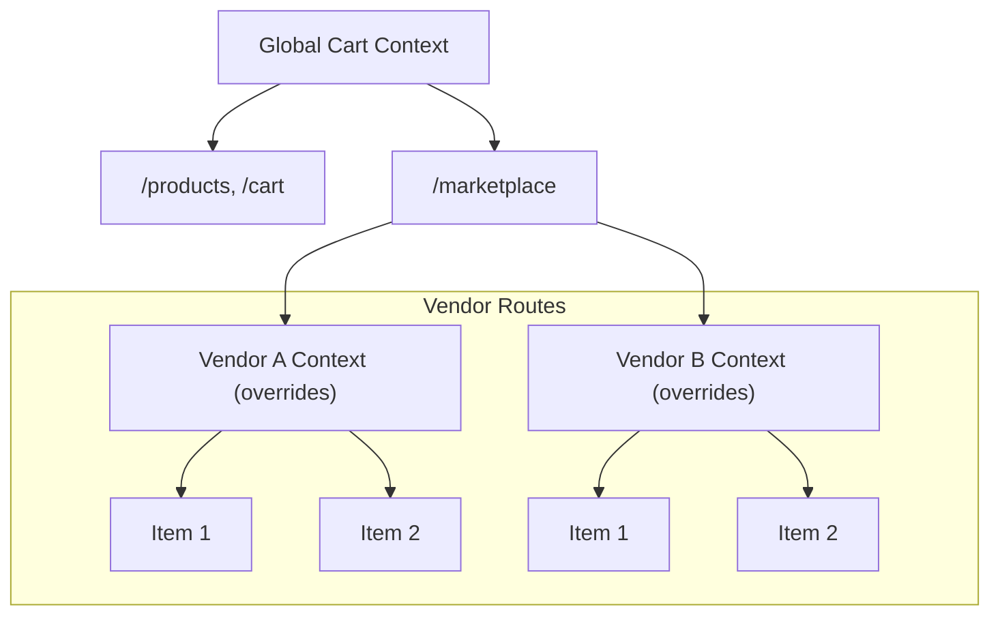

<script>
  import Callout from '$lib/components/Callout.svelte';
</script>
## Introduction

A shopping cart stresses state management: many pages read and write it, totals must stay reactive, and persistence must be reliable. Context gives you a clean, scalable model, but only if you avoid the naive global-store trap that breaks SSR isolation, multi-tenant scoping, and test reliability.

In this article, you'll build a production-ready cart with variants, reactive totals, persistence, discount validation, and scoped isolation, then extend it with server sync and performance patterns using `$state`, `$derived`, and `$effect`.


## Why Context for Carts?

Shopping carts seem like a perfect case for global state. Every page needs access, right? But here's what experience teaches: **global cart state creates more problems than it solves**.

Consider these real scenarios:

- **Marketplace platforms**: Multiple vendors, each with their own checkout flow
- **Multi-site e-commerce**: One app serves several storefronts
- **B2B portals**: Different departments with separate budgets
- **Wishlist vs cart**: Different "bags" with similar behavior
- **Server rendering**: Request isolation is mandatory

Context gives you scoped, isolated cart state that scales to these complexities. Let's build it properly.

---

## The Problem with Global Stores

Before diving into context, let's understand why global state, a seemingly natural choice for something as universal as a shopping cart, creates significant problems in production applications.

```
Global Store Problems:
═══════════════════════

┌──────────────────────────────────────────────────────────────────┐
│                      Global Cart Store                           │
│                                                                  │
│  Problem 1: SSR State Bleed                                      │
│  ┌────────────────────────────────────────────────────────────┐  │
│  │  Request A: User adds Widget to cart                       │  │
│  │  Request B: Different user sees Widget in their cart! 💥   │  │
│  │                                                            │  │
│  │  On the server, module-level state persists across         │  │
│  │  requests. Without request isolation, users see each       │  │
│  │  other's data.                                             │  │
│  └────────────────────────────────────────────────────────────┘  │
│                                                                  │
│  Problem 2: No Isolation                                         │
│  ┌────────────────────────────────────────────────────────────┐  │
│  │  Marketplace with multiple vendors:                        │  │
│  │  - Storefront A: Electronics                               │  │
│  │  - Storefront B: Groceries                                 │  │
│  │  Same cart? Different carts? Global stores can't scope. 💥 │  │
│  └────────────────────────────────────────────────────────────┘  │
│                                                                  │
│  Problem 3: Testing Nightmares                                   │
│  ┌────────────────────────────────────────────────────────────┐  │
│  │  Test 1: Adds item, expects count = 1 ✓                    │  │
│  │  Test 2: Runs next, cart already has item from Test 1 💥   │  │
│  │                                                            │  │
│  │  Tests must manually reset state, creating fragile         │  │
│  │  test suites that break in unexpected ways.                │  │
│  └────────────────────────────────────────────────────────────┘  │
│                                                                  │
└──────────────────────────────────────────────────────────────────┘
```

Context solves all three problems through its fundamental design:

**SSR Safety**: Each server request creates a fresh component tree with its own context instances. State cannot leak between requests because each request gets isolated context.

**Scoped Isolation**: Context flows downward through the component tree. Different sections of your app can have completely different cart contexts by nesting providers with different configurations.

**Test Independence**: Each test can render its own component tree with its own cart context. No shared state means no test pollution.

---

### Cart Patterns in the Wild

The most common cart pattern used in Marketplace is **unified** cart. Why? This is a simpler mental model that simplifies the user experience and backend processing by consolidating all items into a single cart. It's the default for most e-commerce sites and platforms like Shopify, Magento, and WooCommerce.

However, for this demo is intentionally chosen the **per-vendor** cart example to showcase **scoped context isolation**. In this demo, the app has a global cart context, and vendor routes override it with a vendor-specific context. Nested providers override parent contexts, so each vendor subtree gets its own cart instance while the rest of the app keeps the main cart.



You can see this pattern in action on platforms like DoorDash, Uber Eats, and Instacart, where each restaurant or store has its own cart and checkout flow, minimum order requirements, payment processing etc.

#### When it makes sense:

- **Food delivery:** You cannot order from McDonald's and Burger King in one delivery
- **Different fulfillment**: Each vendor ships separately with incompatible logistics
- **Different payment processors**: Each vendor handles their own payments
- **B2B wholesale:** Different terms, contracts, minimum orders per supplier
- **White-label storefronts:** Each vendor is essentially their own branded store

---

## Cart Architecture Overview

A well-architected cart system separates concerns cleanly. Here's how the pieces fit together:

```
Cart System Architecture:
═════════════════════════

┌──────────────────────────────────────────────────────────────────┐
│                          App Root                                │
│  ┌────────────────────────────────────────────────────────────┐  │
│  │                     CartProvider                           │  │
│  │  ┌──────────────────────────────────────────────────────┐  │  │
│  │  │  Reactive State ($state)                             │  │  │
│  │  │  ├── items: CartItem[]                               │  │  │
│  │  │  ├── appliedDiscount: AppliedDiscount | null         │  │  │
│  │  │  └── isLoading: boolean                              │  │  │
│  │  └──────────────────────────────────────────────────────┘  │  │
│  │                           │                                │  │
│  │                           ▼                                │  │
│  │  ┌──────────────────────────────────────────────────────┐  │  │
│  │  │  Derived Calculations ($derived)                     │  │  │
│  │  │  ├── itemCount, totalQuantity                        │  │  │
│  │  │  ├── subtotal, discountAmount                        │  │  │
│  │  │  ├── shipping, tax                                   │  │  │
│  │  │  └── total, isEmpty, summary                         │  │  │
│  │  └──────────────────────────────────────────────────────┘  │  │
│  │                           │                                │  │
│  │                           ▼                                │  │
│  │  ┌──────────────────────────────────────────────────────┐  │  │
│  │  │  Side Effects ($effect)                              │  │  │
│  │  │  └── Persistence to localStorage                     │  │  │
│  │  └──────────────────────────────────────────────────────┘  │  │
│  │                                                            │  │
│  │  Context API (actions):                                    │  │
│  │  ├── addItem(product, quantity, options)                   │  │
│  │  ├── updateQuantity(itemId, quantity)                      │  │
│  │  ├── removeItem(itemId)                                    │  │
│  │  ├── applyDiscount(code) → Promise<Result>                 │  │
│  │  ├── removeDiscount()                                      │  │
│  │  └── clearCart()                                           │  │
│  │                                                            │  │
│  │  ┌──────────────────────────────────────────────────────┐  │  │
│  │  │                   Consumer Components                │  │  │
│  │  │  ┌─────────────┐  ┌─────────────┐  ┌─────────────┐   │  │  │
│  │  │  │ ProductPage │  │  CartIcon   │  │  Checkout   │   │  │  │
│  │  │  │ addItem()   │  │ itemCount   │  │ totals      │   │  │  │
│  │  │  └─────────────┘  └─────────────┘  └─────────────┘   │  │  │
│  │  │  ┌─────────────┐  ┌─────────────┐  ┌─────────────┐   │  │  │
│  │  │  │  MiniCart   │  │ CartDrawer  │  │CartSummary  │   │  │  │
│  │  │  │ items, qty  │  │ full cart   │  │ breakdown   │   │  │  │
│  │  │  └─────────────┘  └─────────────┘  └─────────────┘   │  │  │
│  │  └──────────────────────────────────────────────────────┘  │  │
│  └────────────────────────────────────────────────────────────┘  │
└──────────────────────────────────────────────────────────────────┘
```

The architecture follows a clear data flow: `$state` holds the source of truth, `$derived` computes all secondary values, `$effect` handles side effects like persistence, and the context API exposes both state and actions to consumer components.

---

## Planning the Cart System

Before writing code, let's define what a production shopping cart needs to handle. Thinking through requirements upfront leads to better API design.

### Core Requirements

| Category             | Operations                     | Description                                       |
| -------------------- | ------------------------------ | ------------------------------------------------- |
| **Item Management**  | Add, update, remove            | Handle products with variants (size, color)       |
| **Quantity Control** | Increment, decrement, set      | Respect stock limits, validate ranges             |
| **Calculations**     | Subtotal, tax, shipping, total | Reactive, automatic recalculation                 |
| **Discounts**        | Apply, validate, remove        | Server-validated promotional codes                |
| **Persistence**      | Save, load, sync               | Survive page refreshes, optionally sync to server |
| **Queries**          | Check contents, get quantities | Efficient lookups for UI state                    |

### Data Modeling Decisions

Several decisions affect how we model cart data:

**Item Identity**: A product ID alone isn't sufficient when the same product has variants. A blue t-shirt in size Large is a different cart line than the same t-shirt in Medium. We generate composite identifiers from product ID plus variant options.

**Price Storage**: Storing prices in cents as integers avoids floating-point precision issues. A price of `$19.99` becomes `1999` cents. All calculations use integers, and we format to currency only for display.

**Stock Limits**: The cart enforces `maxQuantity` limits. Adding items beyond available stock fails gracefully with a typed error result.

**Calculations**: All derived values, subtotals, taxes, shipping, compute through `$derived`. Every component sees consistent, automatically synchronized values.

**Result Objects**: Cart operations return typed result objects instead of throwing errors. This makes error handling explicit and type-safe.

---

# Building a Production-Grade Shopping Cart with Svelte 5 Context API

In this tutorial, you'll build a full-featured shopping cart application using Svelte 5's Context API and runes. The project covers reactive state management, localStorage persistence, multi-vendor cart isolation, a wishlist system, and server-validated discount codes — all without any external state management library.

## What You'll Build

- A **shopping cart** with add/remove/update operations, quantity limits, and line totals
- A **wishlist** system that works alongside the cart
- A **multi-vendor marketplace** where each vendor has an isolated cart with its own currency, tax rate, and shipping rules
- A **discount code system** with server-side validation
- **Persistent state** using `localStorage` with automatic save/load via `$effect`
- **Reusable UI components** with Svelte 5 snippets and `$props()`

## Prerequisites

- Node.js 18+
- Basic knowledge of Svelte and TypeScript
- Familiarity with SvelteKit routing

---

## Table of Contents

1. [Project Setup](#1-project-setup)
2. [Define Types](#2-define-types)
3. [Create the Cart Context](#3-create-the-cart-context)
4. [Build the CartProvider Component](#4-build-the-cartprovider-component)
5. [Create the Wishlist Context](#5-create-the-wishlist-context)
6. [Build the WishlistProvider Component](#6-build-the-wishlistprovider-component)
7. [Product Data and Utilities](#7-product-data-and-utilities)
8. [Cart UI Components](#8-cart-ui-components)
9. [Wishlist UI Components](#9-wishlist-ui-components)
10. [Shared Components](#10-shared-components)
11. [Wire Up Layouts and Routes](#11-wire-up-layouts-and-routes)
12. [Build the Pages](#12-build-the-pages)
13. [Discount Code API](#13-discount-code-api)
14. [Multi-Vendor Marketplace](#14-multi-vendor-marketplace)
15. [Key Svelte 5 Patterns Recap](#15-key-svelte-5-patterns-recap)

---

## 1. Project Setup

Create a new SvelteKit project and install dependencies:

```bash
npx sv create sv-cart
cd sv-cart
pnpm install lucide-svelte
```

Choose the TypeScript template when prompted. Your `package.json` should include:

```json
{
  "devDependencies": {
    "@sveltejs/adapter-node": "^5.5.2",
    "@sveltejs/kit": "^2.50.2",
    "svelte": "^5.49.2",
    "typescript": "^5.9.3",
    "vite": "^7.3.1"
  },
  "dependencies": {
    "lucide-svelte": "^0.564.0"
  }
}
```

### Project Structure

Here's the file structure we'll build:

```
src/
├── lib/
│   ├── cart/
│   │   ├── types.ts                  # Cart type definitions
│   │   ├── cart-context.svelte.ts     # Cart state + context
│   │   ├── CartProvider.svelte        # Provider component
│   │   ├── AddToCartButton.svelte     # Add-to-cart with feedback
│   │   ├── CartIcon.svelte            # Header badge icon
│   │   ├── CartSummary.svelte         # Order summary + discounts
│   │   ├── QuantitySelector.svelte    # +/- quantity control
│   │   └── vendor-carts.svelte.ts     # Cross-vendor summary
│   ├── wishlist/
│   │   ├── types.ts                   # Wishlist types
│   │   ├── wishlist-context.svelte.ts # Wishlist state + context
│   │   ├── WishlistProvider.svelte    # Provider component
│   │   ├── WishlistButton.svelte      # Toggle heart button
│   │   └── WishlistIcon.svelte        # Header badge icon
│   ├── components/
│   │   ├── Header.svelte              # Site header
│   │   ├── ProductCard.svelte         # Reusable product card
│   │   ├── VendorHeader.svelte        # Vendor navigation
│   │   └── VendorLogo.svelte          # Dynamic icon renderer
│   ├── config/
│   │   └── routes.ts                  # Route constants
│   ├── data/
│   │   └── products.ts               # Product & vendor data
│   └── utils/
│       └── formatting.ts             # Price formatting
├── routes/
│   ├── +layout.svelte                # Root layout
│   ├── api/coupons/validate/
│   │   └── +server.ts                # Discount validation API
│   └── demo/
│       ├── +layout@.svelte           # Demo layout with Header
│       ├── +page.svelte              # Demo home
│       ├── products/+page.svelte     # All products
│       ├── cart/+page.svelte         # Cart page
│       ├── wishlist/+page.svelte     # Wishlist page
│       ├── marketplace/+page.svelte  # Vendor directory
│       └── (vendor)/                 # Vendor group
│           ├── +layout@.svelte
│           └── marketplace/[vendor]/
│               ├── +layout.server.ts
│               ├── +layout.svelte
│               ├── +page.svelte
│               ├── cart/+page.svelte
│               └── wishlist/+page.svelte
└── app.css                           # Global styles
```

---

## 2. Define Types

Start by defining the TypeScript interfaces that describe your cart's data model. Every monetary value is stored in **cents** to avoid floating-point issues.

Create `src/lib/cart/types.ts`:

```ts
// src/lib/cart/types.ts

/**
 * Product information required for cart operations.
 * This is the minimum data needed to add an item.
 */
export interface CartProduct {
	/** Unique product identifier from your catalog */
	id: string;

	/** Display name for the product */
	name: string;

	/** Price per unit in cents (e.g., 1999 = $19.99) */
	price: number;

	/** URL to product image for display in cart */
	image?: string;

	/** SKU for inventory tracking */
	sku?: string;

	/** Maximum allowed quantity (stock limit) */
	maxQuantity?: number;
}

/**
 * Options/variants for a cart item.
 * Supports arbitrary key-value pairs for flexibility.
 */
export interface CartItemOptions {
	size?: string;
	color?: string;
	[key: string]: string | undefined;
}

/**
 * A single item in the shopping cart.
 * Each item tracks a specific product variant and quantity.
 */
export interface CartItem {
	/** Unique identifier for this cart entry (product + options) */
	id: string;

	/** Reference to the original product data */
	product: CartProduct;

	/** How many of this item the user wants */
	quantity: number;

	/** Selected options/variants for this item */
	options: CartItemOptions;

	/** When this item was added to the cart */
	addedAt: Date;

	/** Computed: price x quantity for this line */
	lineTotal: number;
}

/**
 * Applied discount/coupon information.
 */
export interface AppliedDiscount {
	/** The discount code used */
	code: string;

	/** Type of discount calculation */
	type: 'percentage' | 'fixed';

	/** The discount value (percentage or cents) */
	value: number;

	/** The actual amount discounted in cents */
	appliedAmount: number;
}

/**
 * Calculated summary of the cart's current state.
 * All monetary values are in cents.
 */
export interface CartSummary {
	/** Number of unique items (different products/variants) */
	itemCount: number;

	/** Total number of units across all items */
	totalQuantity: number;

	/** Sum of (price x quantity) for all items */
	subtotal: number;

	/** Discount amount if a code is applied */
	discount: number;

	/** Calculated tax amount */
	tax: number;

	/** Shipping cost (may be zero for free shipping) */
	shipping: number;

	/** Final total: subtotal - discount + tax + shipping */
	total: number;
}

/**
 * Result of attempting to add an item to the cart.
 * Operations return result objects rather than throwing errors.
 */
export interface AddItemResult {
	success: boolean;
	error?: 'MAX_QUANTITY_EXCEEDED' | 'INVALID_QUANTITY' | 'INVALID_PRODUCT';
	item?: CartItem;
	message?: string;
}

/**
 * Result of attempting to update an item's quantity.
 */
export interface UpdateQuantityResult {
	success: boolean;
	error?: 'ITEM_NOT_FOUND' | 'MAX_QUANTITY_EXCEEDED' | 'INVALID_QUANTITY';
	message?: string;
}

/**
 * Result of attempting to apply a discount code.
 */
export interface DiscountResult {
	success: boolean;
	discount?: AppliedDiscount;
	error?: string;
}

/**
 * Configuration options for the cart provider.
 */
export interface CartOptions {
	/** Storage key for persistence (default: 'cart') */
	storageKey?: string;

	/** Currency code (default: 'USD') */
	currency?: string;

	/** Tax rate as a decimal (default: 0.08 for 8%) */
	taxRate?: number;

	/** Subtotal threshold for free shipping in cents (default: 5000) */
	freeShippingThreshold?: number;

	/** Standard shipping cost in cents (default: 599) */
	shippingCost?: number;

	/** Custom shipping calculation function */
	calculateShipping?: (subtotal: number, itemCount: number) => number;

	/** API endpoint for coupon validation */
	couponEndpoint?: string;
}

/**
 * The public API of the cart context.
 * This interface documents everything components can do with the cart.
 */
export interface CartContext {
	// Reactive state (readonly to consumers)
	readonly items: CartItem[];
	readonly summary: CartSummary;
	readonly isEmpty: boolean;
	readonly isLoading: boolean;
	readonly appliedDiscount: AppliedDiscount | null;
	readonly currency: string;

	// Convenience accessors
	readonly itemCount: number;
	readonly totalQuantity: number;

	// Item operations
	addItem(product: CartProduct, quantity?: number, options?: CartItemOptions): AddItemResult;
	updateQuantity(id: string, quantity: number): UpdateQuantityResult;
	removeItem(id: string): void;
	clearCart(): void;

	// Queries
	getItem(productId: string, options?: CartItemOptions): CartItem | undefined;
	hasItem(productId: string, options?: CartItemOptions): boolean;
	getQuantity(productId: string, options?: CartItemOptions): number;

	// Discounts
	applyDiscount(code: string): Promise<DiscountResult>;
	removeDiscount(): void;
}
```

### Why Result Objects Instead of Exceptions?

Notice that `addItem` returns `AddItemResult` instead of throwing. This pattern gives callers explicit control over error handling without try/catch, and makes the possible failure modes visible in the type system.

---

## 3. Create the Cart Context

This is the core of the application. The cart context uses Svelte 5 runes (`$state`, `$derived`, `$effect`) for reactive state, and the Context API (`setContext`/`getContext`) to make it available throughout the component tree.

Create `src/lib/cart/cart-context.svelte.ts`:

```ts
// src/lib/cart/cart-context.svelte.ts

import { browser } from '$app/environment';
import { getContext, hasContext, setContext } from 'svelte';
import { SvelteDate } from 'svelte/reactivity';
import type {
	AddItemResult,
	AppliedDiscount,
	CartContext,
	CartItem,
	CartItemOptions,
	CartOptions,
	CartProduct,
	CartSummary,
	DiscountResult,
	UpdateQuantityResult
} from './types';

/**
 * Symbol key ensures no collisions with other contexts.
 */
const CART_KEY = Symbol('cart');

/**
 * Creates and provides the cart context.
 * Call this in your root layout or a dedicated CartProvider component.
 */
export function createCartContext(options: CartOptions = {}): CartContext {
	const {
		storageKey = 'cart',
		currency = 'USD',
		taxRate = 0.08,
		freeShippingThreshold = 5000,
		shippingCost = 599,
		calculateShipping,
		couponEndpoint = '/api/coupons/validate'
	} = options;

	// ─── State Initialization ────────────────────────────────

	let items = $state<CartItem[]>([]);
	let appliedDiscount = $state<AppliedDiscount | null>(null);
	let isLoading = $state(false);
	let isInitialized = $state(false);

	// ─── Persistence - Load on Mount ─────────────────────────

	function loadFromStorage(): void {
		if (!browser) return;

		try {
			const stored = localStorage.getItem(storageKey);
			if (!stored) {
				isInitialized = true;
				return;
			}

			const data = JSON.parse(stored);

			if (!data || !Array.isArray(data.items)) {
				isInitialized = true;
				return;
			}

			// Restore items with proper Date objects
			items = data.items.map((item: CartItem) => ({
				...item,
				addedAt: new SvelteDate(item.addedAt)
			}));

			if (data.discount) {
				appliedDiscount = data.discount;
			}

			isInitialized = true;
		} catch (error) {
			console.warn('Failed to load cart from storage:', error);
			isInitialized = true;
		}
	}

	// Load on mount (client-side only)
	$effect.pre(() => {
		if (!browser || isInitialized) return;
		loadFromStorage();
	});

	// ─── Derived Calculations ────────────────────────────────

	const itemCount = $derived(items.length);

	const totalQuantity = $derived(
		items.reduce((sum, item) => sum + item.quantity, 0)
	);

	const subtotal = $derived(
		items.reduce((sum, item) => sum + item.lineTotal, 0)
	);

	const discountAmount = $derived.by(() => {
		if (!appliedDiscount) return 0;

		if (appliedDiscount.type === 'fixed') {
			return Math.min(appliedDiscount.value, subtotal);
		}

		// Percentage discount
		return Math.round(subtotal * (appliedDiscount.value / 100));
	});

	const afterDiscount = $derived(Math.max(0, subtotal - discountAmount));

	const shipping = $derived.by(() => {
		if (calculateShipping) {
			return calculateShipping(afterDiscount, itemCount);
		}
		return afterDiscount >= freeShippingThreshold ? 0 : shippingCost;
	});

	const tax = $derived(Math.round(afterDiscount * taxRate));

	const total = $derived(afterDiscount + shipping + tax);

	const isEmpty = $derived(items.length === 0);

	const summary = $derived<CartSummary>({
		itemCount,
		totalQuantity,
		subtotal,
		discount: discountAmount,
		tax,
		shipping,
		total
	});

	// ─── Persistence Effect ──────────────────────────────────

	$effect(() => {
		if (!browser || !isInitialized) return;

		const data = {
			items,
			discount: appliedDiscount,
			updatedAt: Date.now()
		};

		try {
			localStorage.setItem(storageKey, JSON.stringify(data));
		} catch (error) {
			console.warn('Failed to save cart to storage:', error);
		}
	});

	// ─── Helper Functions ────────────────────────────────────

	function generateItemId(productId: string, options: CartItemOptions): string {
		const optionsKey = Object.entries(options)
			.filter(([_, v]) => v !== undefined)
			.sort(([a], [b]) => a.localeCompare(b))
			.map(([k, v]) => `${k}:${v}`)
			.join('|');

		return optionsKey ? `${productId}__${optionsKey}` : productId;
	}

	function findItemById(id: string): CartItem | undefined {
		return items.find((item) => item.id === id);
	}

	function findItemByProduct(
		productId: string,
		options: CartItemOptions = {}
	): CartItem | undefined {
		const targetId = generateItemId(productId, options);
		return items.find((item) => item.id === targetId);
	}

	function findItemIndex(id: string): number {
		return items.findIndex((item) => item.id === id);
	}

	// ─── Context Object ──────────────────────────────────────

	const context: CartContext = {
		get items() {
			return items;
		},
		get summary() {
			return summary;
		},
		get isEmpty() {
			return isEmpty;
		},
		get isLoading() {
			return isLoading;
		},
		get appliedDiscount() {
			return appliedDiscount;
		},
		get currency() {
			return currency;
		},
		get itemCount() {
			return itemCount;
		},
		get totalQuantity() {
			return totalQuantity;
		},

		addItem(
			product: CartProduct,
			quantity = 1,
			options: CartItemOptions = {}
		): AddItemResult {
			// Validate product
			if (!product?.id || !product?.name || typeof product.price !== 'number') {
				return {
					success: false,
					error: 'INVALID_PRODUCT',
					message: 'Product must have id, name, and price'
				};
			}

			// Validate quantity
			if (quantity < 1 || !Number.isInteger(quantity)) {
				return {
					success: false,
					error: 'INVALID_QUANTITY',
					message: 'Quantity must be a positive integer'
				};
			}

			const itemId = generateItemId(product.id, options);
			const existing = findItemById(itemId);

			if (existing) {
				const newQuantity = existing.quantity + quantity;
				const maxQty = product.maxQuantity ?? Infinity;

				if (newQuantity > maxQty) {
					return {
						success: false,
						error: 'MAX_QUANTITY_EXCEEDED',
						message: `Maximum ${maxQty} allowed`
					};
				}

				existing.quantity = newQuantity;
				existing.lineTotal = newQuantity * existing.product.price;
				return { success: true, item: existing };
			}

			// Check stock limit for new items
			if (product.maxQuantity && quantity > product.maxQuantity) {
				return {
					success: false,
					error: 'MAX_QUANTITY_EXCEEDED',
					message: `Maximum ${product.maxQuantity} allowed`
				};
			}

			const newItem: CartItem = {
				id: itemId,
				product,
				quantity,
				options,
				addedAt: new SvelteDate(),
				lineTotal: quantity * product.price
			};

			items.push(newItem);
			return { success: true, item: newItem };
		},

		updateQuantity(id: string, quantity: number): UpdateQuantityResult {
			if (!Number.isInteger(quantity)) {
				return {
					success: false,
					error: 'INVALID_QUANTITY',
					message: 'Quantity must be an integer'
				};
			}

			const item = findItemById(id);

			if (!item) {
				return {
					success: false,
					error: 'ITEM_NOT_FOUND',
					message: 'Item not found in cart'
				};
			}

			if (quantity <= 0) {
				this.removeItem(id);
				return { success: true };
			}

			const maxQty = item.product.maxQuantity ?? Infinity;
			if (quantity > maxQty) {
				return {
					success: false,
					error: 'MAX_QUANTITY_EXCEEDED',
					message: `Maximum ${maxQty} allowed`
				};
			}

			item.quantity = quantity;
			item.lineTotal = quantity * item.product.price;
			return { success: true };
		},

		removeItem(id: string): void {
			const index = findItemIndex(id);
			if (index !== -1) {
				items.splice(index, 1);
			}
		},

		clearCart(): void {
			items.length = 0;
			appliedDiscount = null;
		},

		getItem(productId: string, options: CartItemOptions = {}): CartItem | undefined {
			return findItemByProduct(productId, options);
		},

		hasItem(productId: string, options: CartItemOptions = {}): boolean {
			return findItemByProduct(productId, options) !== undefined;
		},

		getQuantity(productId: string, options: CartItemOptions = {}): number {
			const item = findItemByProduct(productId, options);
			return item?.quantity ?? 0;
		},

		async applyDiscount(code: string): Promise<DiscountResult> {
			if (!code.trim()) {
				return {
					success: false,
					error: 'Please enter a discount code'
				};
			}

			isLoading = true;

			try {
				const response = await fetch(couponEndpoint, {
					method: 'POST',
					headers: { 'Content-Type': 'application/json' },
					body: JSON.stringify({
						code: code.trim().toUpperCase(),
						subtotal
					})
				});

				const data = await response.json();

				if (!response.ok) {
					return {
						success: false,
						error: data.message ?? 'Invalid discount code'
					};
				}

				appliedDiscount = {
					code: data.code,
					value: data.value,
					type: data.type,
					appliedAmount: data.appliedAmount
				};

				return { success: true, discount: appliedDiscount };
			} catch (error) {
				console.error('Discount validation error:', error);
				return {
					success: false,
					error: 'Unable to validate discount code. Please try again.'
				};
			} finally {
				isLoading = false;
			}
		},

		removeDiscount(): void {
			appliedDiscount = null;
		}
	};

	return setContext(CART_KEY, context);
}

/**
 * Retrieves the cart context.
 * Must be called from a component inside a CartProvider.
 */
export function getCartContext(): CartContext {
	if (!hasContext(CART_KEY)) {
		throw new Error(
			'Cart context not found. ' +
			'Ensure your component is inside a CartProvider or the root layout.'
		);
	}
	return getContext(CART_KEY);
}

/**
 * Checks if cart context is available.
 */
export function hasCartContext(): boolean {
	return hasContext(CART_KEY);
}
```

### Key Design Decisions

1. **`Symbol('cart')` as the context key** prevents collisions if other libraries also use context.
2. **Getter properties** on the context object (`get items()`) ensure consumers always read the latest reactive value.
3. **`$effect.pre`** loads persisted data before the first render to avoid a flash of empty content.
4. **`$effect`** for auto-save runs whenever `items` or `appliedDiscount` change — no manual save calls needed.
5. **`SvelteDate`** is used instead of `Date` because Svelte 5's reactivity system can track changes to `SvelteDate` instances.
6. **`generateItemId`** creates a deterministic ID from product ID + sorted options, so the same product with different variants (e.g., size:M vs size:L) gets separate cart entries.

---

## 4. Build the CartProvider Component

The `CartProvider` is a thin wrapper that calls `createCartContext` and renders its children. Using `untrack` ensures the context is created only once with the initial prop values.

Create `src/lib/cart/CartProvider.svelte`:

```svelte
<!-- src/lib/cart/CartProvider.svelte -->
<script lang="ts">
	import type { Snippet } from 'svelte';
	import { untrack } from 'svelte';
	import { createCartContext } from './cart-context.svelte';
	import type { CartOptions } from './types';

	interface Props extends CartOptions {
		children: Snippet;
	}

	let {
		storageKey,
		currency,
		taxRate,
		freeShippingThreshold,
		shippingCost,
		calculateShipping,
		couponEndpoint,
		children
	}: Props = $props();

	// Create context once with initial values
	untrack(() => {
		createCartContext({
			storageKey,
			currency,
			taxRate,
			freeShippingThreshold,
			shippingCost,
			calculateShipping,
			couponEndpoint
		});
	});
</script>

{@render children()}
```

### Why `untrack`?

Without `untrack`, Svelte's reactivity system would track the props inside the callback. If a parent re-rendered and passed new prop values, it could trigger the context creation again. `untrack` captures the initial values and ignores subsequent changes — the context is created exactly once.

---

## 5. Create the Wishlist Context

The wishlist is simpler than the cart — it just tracks products without quantities. It follows the same Context API pattern.

Create `src/lib/wishlist/types.ts`:

```ts
// src/lib/wishlist/types.ts

import type { CartProduct } from '$lib/cart/types';

export interface WishlistItem {
	product: CartProduct;
	addedAt: Date;
}

export interface WishlistContext {
	readonly items: WishlistItem[];
	readonly count: number;
	readonly isEmpty: boolean;

	add(product: CartProduct): void;
	remove(productId: string): void;
	has(productId: string): boolean;
	clear(): void;
	toggle(product: CartProduct): void;
}
```

Create `src/lib/wishlist/wishlist-context.svelte.ts`:

```ts
// src/lib/wishlist/wishlist-context.svelte.ts

import { browser } from '$app/environment';
import type { CartProduct } from '$lib/cart/types';
import { getContext, hasContext, setContext } from 'svelte';
import { SvelteDate } from 'svelte/reactivity';
import type { WishlistContext, WishlistItem } from './types';

const WISHLIST_KEY = Symbol('wishlist');

export function createWishlistContext(storageKey = 'wishlist'): WishlistContext {
	let items = $state<WishlistItem[]>([]);
	let isInitialized = $state(false);

	function loadFromStorage(): void {
		if (!browser) return;

		try {
			const stored = localStorage.getItem(storageKey);
			if (stored) {
				const data = JSON.parse(stored);
				items = data.map((item: WishlistItem) => ({
					...item,
					addedAt: new SvelteDate(item.addedAt)
				}));
			}
			isInitialized = true;
		} catch (error) {
			console.warn('Failed to load wishlist:', error);
			isInitialized = true;
		}
	}

	$effect.pre(() => {
		if (!browser || isInitialized) return;
		loadFromStorage();
	});

	const count = $derived(items.length);
	const isEmpty = $derived(items.length === 0);

	$effect(() => {
		if (!browser || !isInitialized) return;
		localStorage.setItem(storageKey, JSON.stringify(items));
	});

	const context: WishlistContext = {
		get items() {
			return items;
		},
		get count() {
			return count;
		},
		get isEmpty() {
			return isEmpty;
		},

		add(product: CartProduct): void {
			if (!items.some((i) => i.product.id === product.id)) {
				items.push({ product, addedAt: new SvelteDate() });
			}
		},

		remove(productId: string): void {
			const index = items.findIndex((i) => i.product.id === productId);
			if (index !== -1) {
				items.splice(index, 1);
			}
		},

		has(productId: string): boolean {
			return items.some((i) => i.product.id === productId);
		},

		toggle(product: CartProduct): void {
			if (this.has(product.id)) {
				this.remove(product.id);
			} else {
				this.add(product);
			}
		},

		clear(): void {
			items.length = 0;
		}
	};

	return setContext(WISHLIST_KEY, context);
}

export function getWishlistContext(): WishlistContext {
	if (!hasContext(WISHLIST_KEY)) {
		throw new Error('Wishlist context not found.');
	}
	return getContext(WISHLIST_KEY);
}
```

---

## 6. Build the WishlistProvider Component

Create `src/lib/wishlist/WishlistProvider.svelte`:

```svelte
<!-- src/lib/wishlist/WishlistProvider.svelte -->
<script lang="ts">
	import type { Snippet } from 'svelte';
	import { untrack } from 'svelte';
	import { createWishlistContext } from './wishlist-context.svelte';

	interface Props {
		storageKey?: string;
		children: Snippet;
	}

	let { storageKey = 'wishlist', children }: Props = $props();

	untrack(() => {
		createWishlistContext(storageKey);
	});
</script>

{@render children()}
```

---

## 7. Product Data and Utilities

### Route Constants

Create `src/lib/config/routes.ts`:

```ts
// src/lib/config/routes.ts

export const ROUTES = {
	HOME: '/',
	DEMO: '/demo',
	PRODUCTS: '/demo/products',
	MARKETPLACE: '/demo/marketplace',
	CART: '/demo/cart',
	WISHLIST: '/demo/wishlist',

	vendor: (slug: string) => `/demo/marketplace/${slug}`,
	vendorCart: (slug: string) => `/demo/marketplace/${slug}/cart`,
	vendorWishlist: (slug: string) => `/demo/marketplace/${slug}/wishlist`,

	apiValidateCoupon: '/api/coupons/validate'
} as const;
```

### Price Formatting

Create `src/lib/utils/formatting.ts`:

```ts
// src/lib/utils/formatting.ts

export function formatPrice(cents: number, currency = 'USD'): string {
	return new Intl.NumberFormat('en-US', {
		style: 'currency',
		currency
	}).format(cents / 100);
}
```

### Product and Vendor Data

Create `src/lib/data/products.ts`:

```ts
// src/lib/data/products.ts

export interface Vendor {
	id: string;
	name: string;
	slug: string;
	description: string;
	logo?: string;
	location?: string;
	currency: string;
	taxRate: number;
	shippingCost: number;
}

export interface Product {
	id: string;
	vendorId: string;
	name: string;
	description: string;
	price: number; // in cents
	image: string;
	category: string;
	sku: string;
	maxQuantity: number;
	inStock: boolean;
	tags: string[];
}

export const vendors: Vendor[] = [
	{
		id: 'vendor-1',
		name: 'TechGear Pro',
		slug: 'techgear-pro',
		description: 'Premium electronics and gadgets for tech enthusiasts',
		logo: 'headphones',
		location: 'San Francisco, CA',
		currency: 'USD',
		taxRate: 0.0875,
		shippingCost: 799
	},
	{
		id: 'vendor-2',
		name: 'Artisan Crafts Co',
		slug: 'artisan-crafts',
		description: 'Handmade artisanal products with care and quality',
		logo: 'palette',
		location: 'Portland, OR',
		currency: 'USD',
		taxRate: 0.08,
		shippingCost: 599
	},
	{
		id: 'vendor-3',
		name: 'FitLife Essentials',
		slug: 'fitlife-essentials',
		description: 'Health, fitness, and wellness products for active lifestyles',
		logo: 'zap',
		location: 'Austin, TX',
		currency: 'USD',
		taxRate: 0.0825,
		shippingCost: 499
	},
	{
		id: 'vendor-4',
		name: 'HomeStyle Living',
		slug: 'homestyle-living',
		description: 'Modern home decor and lifestyle accessories',
		logo: 'home',
		location: 'Seattle, WA',
		currency: 'USD',
		taxRate: 0.101,
		shippingCost: 699
	}
];

export const products: Product[] = [
	// TechGear Pro Products
	{
		id: 'prod-1',
		vendorId: 'vendor-1',
		name: 'Wireless Noise-Canceling Headphones',
		description: 'Premium over-ear headphones with active noise cancellation and 30-hour battery life',
		price: 29999,
		image: 'https://images.unsplash.com/photo-1505740420928-5e560c06d30e?w=500&q=80',
		category: 'Audio',
		sku: 'TGP-WH-001',
		maxQuantity: 10,
		inStock: true,
		tags: ['electronics', 'audio', 'wireless', 'premium']
	},
	{
		id: 'prod-2',
		vendorId: 'vendor-1',
		name: 'Smart Watch Pro',
		description: 'Fitness tracking smartwatch with heart rate monitor and GPS',
		price: 39999,
		image: 'https://images.unsplash.com/photo-1523275335684-37898b6baf30?w=500&q=80',
		category: 'Wearables',
		sku: 'TGP-SW-002',
		maxQuantity: 15,
		inStock: true,
		tags: ['electronics', 'wearables', 'fitness', 'smart']
	},
	{
		id: 'prod-3',
		vendorId: 'vendor-1',
		name: 'Portable Bluetooth Speaker',
		description: 'Waterproof speaker with 360-degree sound and 12-hour playtime',
		price: 7999,
		image: 'https://images.unsplash.com/photo-1608043152269-423dbba4e7e1?w=500&q=80',
		category: 'Audio',
		sku: 'TGP-SP-003',
		maxQuantity: 12,
		inStock: true,
		tags: ['electronics', 'audio', 'portable', 'waterproof']
	},

	// Artisan Crafts Co Products
	{
		id: 'prod-4',
		vendorId: 'vendor-2',
		name: 'Handwoven Ceramic Mug Set',
		description: 'Set of 4 artisan-crafted ceramic mugs with unique glaze patterns',
		price: 5999,
		image: 'https://images.unsplash.com/photo-1514228742587-6b1558fcca3d?w=500&q=80',
		category: 'Kitchenware',
		sku: 'ACC-MUG-004',
		maxQuantity: 8,
		inStock: true,
		tags: ['handmade', 'ceramic', 'kitchenware', 'artisan']
	},
	{
		id: 'prod-5',
		vendorId: 'vendor-2',
		name: 'Macrame Wall Hanging',
		description: 'Bohemian-style macrame wall art, handcrafted with natural cotton',
		price: 8999,
		image: 'https://images.unsplash.com/photo-1632761644913-0da6105863cb?w=500&q=80',
		category: 'Home Decor',
		sku: 'ACC-MAC-005',
		maxQuantity: 5,
		inStock: true,
		tags: ['handmade', 'decor', 'bohemian', 'wall-art']
	},
	{
		id: 'prod-6',
		vendorId: 'vendor-2',
		name: 'Leather Journal with Brass Clasp',
		description: 'Genuine leather-bound journal with hand-stitched binding and brass closure',
		price: 4999,
		image: 'https://images.unsplash.com/photo-1531346878377-a5be20888e57?w=500&q=80',
		category: 'Stationery',
		sku: 'ACC-JRN-006',
		maxQuantity: 2,
		inStock: true,
		tags: ['handmade', 'leather', 'journal', 'stationery']
	},

	// FitLife Essentials Products
	{
		id: 'prod-7',
		vendorId: 'vendor-3',
		name: 'Premium Yoga Mat',
		description: 'Eco-friendly TPE yoga mat with alignment marks and carrying strap',
		price: 6999,
		image: 'https://images.unsplash.com/photo-1601925260368-ae2f83cf8b7f?w=500&q=80',
		category: 'Fitness',
		sku: 'FLE-YGA-007',
		maxQuantity: 5,
		inStock: true,
		tags: ['fitness', 'yoga', 'eco-friendly', 'exercise']
	},
	{
		id: 'prod-8',
		vendorId: 'vendor-3',
		name: 'Resistance Bands Set',
		description: 'Set of 5 resistance bands with different tension levels and door anchor',
		price: 2999,
		image: 'https://images.unsplash.com/photo-1598289431512-b97b0917affc?w=500&q=80',
		category: 'Fitness',
		sku: 'FLE-RES-008',
		maxQuantity: 3,
		inStock: true,
		tags: ['fitness', 'resistance', 'exercise', 'portable']
	},
	{
		id: 'prod-9',
		vendorId: 'vendor-3',
		name: 'Stainless Steel Water Bottle',
		description: '32oz insulated water bottle keeps drinks cold for 24 hours',
		price: 3499,
		image: 'https://images.unsplash.com/photo-1602143407151-7111542de6e8?w=500&q=80',
		category: 'Hydration',
		sku: 'FLE-BTL-009',
		maxQuantity: 4,
		inStock: true,
		tags: ['fitness', 'hydration', 'insulated', 'eco-friendly']
	},

	// HomeStyle Living Products
	{
		id: 'prod-10',
		vendorId: 'vendor-4',
		name: 'Scented Candle Collection',
		description: 'Set of 3 soy wax candles with essential oils in modern concrete vessels',
		price: 4499,
		image: 'https://images.unsplash.com/photo-1643122966676-29e8597257f7?w=500&q=80',
		category: 'Home Fragrance',
		sku: 'HSL-CND-010',
		maxQuantity: 8,
		inStock: true,
		tags: ['home', 'candles', 'fragrance', 'soy']
	},
	{
		id: 'prod-11',
		vendorId: 'vendor-4',
		name: 'Minimalist Table Lamp',
		description: 'Modern desk lamp with touch dimming and warm LED light',
		price: 7999,
		image: 'https://images.unsplash.com/photo-1507473885765-e6ed057f782c?w=500&q=80',
		category: 'Lighting',
		sku: 'HSL-LMP-011',
		maxQuantity: 4,
		inStock: true,
		tags: ['home', 'lighting', 'modern', 'minimalist']
	},
	{
		id: 'prod-12',
		vendorId: 'vendor-4',
		name: 'Throw Pillow Set',
		description: 'Set of 2 decorative throw pillows with geometric patterns',
		price: 5499,
		image: 'https://images.unsplash.com/photo-1584100936595-c0654b55a2e2?w=500&q=80',
		category: 'Textiles',
		sku: 'HSL-PIL-012',
		maxQuantity: 5,
		inStock: true,
		tags: ['home', 'textiles', 'decor', 'pillows']
	}
];

// Helper Functions

export function getVendor(slug: string): Vendor | undefined {
	return vendors.find((v) => v.slug === slug);
}

export function getProductsByVendor(vendorId: string): Product[] {
	return products.filter((p) => p.vendorId === vendorId);
}

export function getProductsByVendorSlug(slug: string): Product[] {
	const vendor = getVendor(slug);
	if (!vendor) return [];
	return getProductsByVendor(vendor.id);
}

export function getProduct(id: string): Product | undefined {
	return products.find((p) => p.id === id);
}

export function getAllVendors(): Vendor[] {
	return vendors;
}

export function getAllProducts(): Product[] {
	return products;
}
```

---

## 8. Cart UI Components

### AddToCartButton

This button provides visual feedback through multiple states: idle, adding, added, and error.

Create `src/lib/cart/AddToCartButton.svelte`:

```svelte
<!-- src/lib/cart/AddToCartButton.svelte -->
<script lang="ts">
	import { getCartContext } from './cart-context.svelte';
	import type { CartProduct, CartItemOptions } from './types';

	interface Props {
		product: CartProduct;
		quantity?: number;
		options?: CartItemOptions;
		class?: string;
	}

	let { product, quantity = 1, options = {}, class: className = '' }: Props = $props();

	const cart = getCartContext();

	type ButtonState = 'idle' | 'adding' | 'added' | 'error';
	let buttonState = $state<ButtonState>('idle');
	let errorMessage = $state('');

	let isInCart = $derived(cart.hasItem(product.id, options));
	let cartQuantity = $derived(cart.getQuantity(product.id, options));

	async function handleAdd() {
		buttonState = 'adding';

		// Small delay for visual feedback
		await new Promise((resolve) => setTimeout(resolve, 200));

		const result = cart.addItem(product, quantity, options);

		if (result.success) {
			buttonState = 'added';
			setTimeout(() => {
				buttonState = 'idle';
			}, 2000);
		} else {
			buttonState = 'error';
			errorMessage = result.message ?? 'Could not add to cart';
			setTimeout(() => {
				buttonState = 'idle';
				errorMessage = '';
			}, 3000);
		}
	}
</script>

<button
	type="button"
	class="add-to-cart {className}"
	class:adding={buttonState === 'adding'}
	class:added={buttonState === 'added'}
	class:error={buttonState === 'error'}
	class:in-cart={isInCart && buttonState === 'idle'}
	onclick={handleAdd}
	disabled={buttonState === 'adding'}
>
	{#if buttonState === 'adding'}
		<span class="spinner" aria-hidden="true"></span>
		<span>Adding...</span>
	{:else if buttonState === 'added'}
		<svg viewBox="0 0 24 24" fill="none" stroke="currentColor" stroke-width="2" aria-hidden="true">
			<polyline points="20 6 9 17 4 12" />
		</svg>
		<span>Added!</span>
	{:else if buttonState === 'error'}
		<span>{errorMessage}</span>
	{:else if isInCart}
		<span>In Cart ({cartQuantity})</span>
	{:else}
		<span>Add to Cart</span>
	{/if}
</button>

<style>
	.add-to-cart {
		display: inline-flex;
		align-items: center;
		justify-content: center;
		gap: 0.5rem;
		padding: 0.75rem 1.5rem;
		min-width: 140px;
		font-size: 0.9375rem;
		font-weight: 500;
		color: white;
		background-color: var(--color-primary, #3b82f6);
		border: none;
		border-radius: 8px;
		cursor: pointer;
		transition: all 0.2s ease;
	}

	.add-to-cart:hover:not(:disabled) {
		background-color: var(--color-primary-hover, #2563eb);
	}

	.add-to-cart:disabled {
		cursor: not-allowed;
		opacity: 0.8;
	}

	.add-to-cart.added {
		background-color: var(--color-success, #16a34a);
	}

	.add-to-cart.error {
		background-color: var(--color-error, #dc2626);
	}

	.add-to-cart.in-cart {
		background-color: var(--color-muted, #64748b);
	}

	.add-to-cart svg {
		width: 18px;
		height: 18px;
	}

	.spinner {
		width: 18px;
		height: 18px;
		border: 2px solid rgba(255, 255, 255, 0.3);
		border-top-color: white;
		border-radius: 50%;
		animation: spin 0.8s linear infinite;
	}

	@keyframes spin {
		to {
			transform: rotate(360deg);
		}
	}
</style>
```

### CartIcon

A header icon with a badge showing the total quantity.

Create `src/lib/cart/CartIcon.svelte`:

```svelte
<!-- src/lib/cart/CartIcon.svelte -->
<script lang="ts">
	import { ShoppingCart } from 'lucide-svelte';
	import { getCartContext } from './cart-context.svelte';

	interface Props {
		onclick?: () => void;
	}

	let { onclick }: Props = $props();

	const cart = getCartContext();

	let badgeText = $derived(cart.totalQuantity > 99 ? '99+' : String(cart.totalQuantity));
</script>

<button
	type="button"
	class="cart-icon"
	{onclick}
	aria-label="Shopping cart with {cart.totalQuantity} items"
>
	<ShoppingCart size={24} stroke-width={2} aria-hidden="true" />

	{#if cart.totalQuantity > 0}
		<span class="badge" aria-hidden="true">
			{badgeText}
		</span>
	{/if}
</button>

<style>
	.cart-icon {
		position: relative;
		display: flex;
		align-items: center;
		justify-content: center;
		width: 44px;
		height: 44px;
		padding: 0;
		border: none;
		background: transparent;
		cursor: pointer;
		color: var(--color-foreground, #1e293b);
		transition: color 0.2s;
	}

	.cart-icon:hover {
		color: var(--color-primary, #3b82f6);
	}

	.cart-icon:focus-visible {
		outline: 2px solid var(--color-primary, #3b82f6);
		outline-offset: 2px;
		border-radius: 4px;
	}

	.badge {
		position: absolute;
		top: 4px;
		right: 4px;
		min-width: 18px;
		height: 18px;
		padding: 0 5px;
		font-size: 11px;
		font-weight: 600;
		line-height: 18px;
		text-align: center;
		color: white;
		background-color: var(--color-primary, #3b82f6);
		border-radius: 9px;
	}
</style>
```

### QuantitySelector

A reusable +/- control with input validation and clamping.

Create `src/lib/cart/QuantitySelector.svelte`:

```svelte
<!-- src/lib/cart/QuantitySelector.svelte -->
<script lang="ts">
	interface Props {
		value?: number;
		min?: number;
		max?: number;
		onchange?: (quantity: number) => void;
		disabled?: boolean;
		compact?: boolean;
	}

	let {
		value = $bindable(1),
		min = 1,
		max,
		onchange,
		disabled = false,
		compact = false
	}: Props = $props();

	let canDecrement = $derived(value > min && !disabled);
	let canIncrement = $derived((!max || value < max) && !disabled);

	function decrement() {
		if (canDecrement) {
			value -= 1;
			onchange?.(value);
		}
	}

	function increment() {
		if (canIncrement) {
			value += 1;
			onchange?.(value);
		}
	}

	function handleInput(event: Event) {
		const input = event.target as HTMLInputElement;
		let newValue = parseInt(input.value, 10);

		if (isNaN(newValue) || newValue < min) {
			newValue = min;
		} else if (max && newValue > max) {
			newValue = max;
		}

		value = newValue;
		onchange?.(value);
	}
</script>

<div class="quantity-selector" class:disabled class:compact>
	<button
		type="button"
		class="qty-btn"
		onclick={decrement}
		disabled={!canDecrement}
		aria-label="Decrease quantity"
	>
		<svg viewBox="0 0 24 24" fill="none" stroke="currentColor" stroke-width="2">
			<line x1="5" y1="12" x2="19" y2="12" />
		</svg>
	</button>

	<input
		type="number"
		class="qty-input"
		bind:value
		{min}
		{max}
		{disabled}
		oninput={handleInput}
		aria-label="Quantity"
	/>

	<button
		type="button"
		class="qty-btn"
		onclick={increment}
		disabled={!canIncrement}
		aria-label="Increase quantity"
	>
		<svg viewBox="0 0 24 24" fill="none" stroke="currentColor" stroke-width="2">
			<line x1="12" y1="5" x2="12" y2="19" />
			<line x1="5" y1="12" x2="19" y2="12" />
		</svg>
	</button>
</div>

<style>
	.quantity-selector {
		display: inline-flex;
		align-items: center;
		border: 1px solid var(--color-border, #e2e8f0);
		border-radius: 8px;
		overflow: hidden;
	}

	.quantity-selector.disabled {
		opacity: 0.5;
	}

	.qty-btn {
		display: flex;
		align-items: center;
		justify-content: center;
		width: 36px;
		height: 36px;
		padding: 0;
		border: none;
		background: var(--color-surface, #f8fafc);
		cursor: pointer;
		transition: background-color 0.2s;
	}

	.compact .qty-btn {
		width: 28px;
		height: 28px;
	}

	.qty-btn:hover:not(:disabled) {
		background: var(--color-surface-hover, #e2e8f0);
	}

	.qty-btn:disabled {
		cursor: not-allowed;
		opacity: 0.4;
	}

	.qty-btn svg {
		width: 16px;
		height: 16px;
		color: var(--color-foreground, #1e293b);
	}

	.qty-input {
		width: 48px;
		height: 36px;
		padding: 0;
		border: none;
		border-left: 1px solid var(--color-border, #e2e8f0);
		border-right: 1px solid var(--color-border, #e2e8f0);
		text-align: center;
		font-size: 0.9375rem;
		font-weight: 500;
		background: white;
		appearance: textfield;
		-moz-appearance: textfield;
	}

	.qty-input::-webkit-outer-spin-button,
	.qty-input::-webkit-inner-spin-button {
		-webkit-appearance: none;
		margin: 0;
	}

	.qty-input:focus {
		outline: none;
		background: var(--color-primary-ring, rgba(59, 130, 246, 0.1));
	}
</style>
```

Note the use of `$bindable` — this enables two-way binding with `bind:value` from the parent while also allowing the component to update the value internally.

### CartSummary

The order summary component with discount code input.

Create `src/lib/cart/CartSummary.svelte`:

```svelte
<!-- src/lib/cart/CartSummary.svelte -->
<script lang="ts">
	import { formatPrice } from '$lib/utils/formatting';
	import { Lightbulb } from 'lucide-svelte';
	import { getCartContext } from './cart-context.svelte';

	interface Props {
		showShipping?: boolean;
		showDiscountInput?: boolean;
		showBreakdown?: boolean;
		showHints?: boolean;
	}

	let {
		showShipping = true,
		showDiscountInput = true,
		showBreakdown = true,
		showHints = true
	}: Props = $props();

	const cart = getCartContext();

	let discountCode = $state('');
	let discountError = $state('');
	let showAllHints = $state(false);

	const discountHints = [
		{ code: 'SAVE10', description: '10% off' },
		{ code: 'SAVE20', description: '20% off orders $50+' },
		{ code: 'FLAT5', description: '$5 off' },
		{ code: 'WELCOME', description: '15% off' },
		{ code: 'FREESHIP', description: 'Free shipping' }
	];

	async function handleApplyDiscount() {
		discountError = '';
		const result = await cart.applyDiscount(discountCode);

		if (result.success) {
			discountCode = '';
		} else {
			discountError = result.error ?? 'Invalid code';
		}
	}

	function applyHintCode(code: string) {
		discountCode = code;
		handleApplyDiscount();
	}
</script>

<div class="cart-summary">
	<h2 class="summary-title">Order Summary</h2>

	<dl class="summary-rows">
		{#if showBreakdown}
			<div class="summary-row">
				<dt>Subtotal ({cart.summary.totalQuantity} items)</dt>
				<dd>{formatPrice(cart.summary.subtotal)}</dd>
			</div>
		{/if}

		{#if cart.appliedDiscount}
			<div class="summary-row discount-row">
				<dt>
					Discount
					<span class="discount-code">({cart.appliedDiscount.code})</span>
					<button
						type="button"
						class="remove-discount"
						onclick={() => cart.removeDiscount()}
						aria-label="Remove discount"
					>
						x
					</button>
				</dt>
				<dd class="discount-amount">-{formatPrice(cart.summary.discount)}</dd>
			</div>
		{/if}

		{#if showShipping}
			<div class="summary-row">
				<dt>Shipping</dt>
				<dd>
					{#if cart.summary.shipping === 0}
						<span class="free-shipping">Free</span>
					{:else}
						{formatPrice(cart.summary.shipping)}
					{/if}
				</dd>
			</div>
		{/if}

		{#if showBreakdown}
			<div class="summary-row">
				<dt>Tax</dt>
				<dd>{formatPrice(cart.summary.tax)}</dd>
			</div>
		{/if}

		<div class="summary-row total-row">
			<dt>Total</dt>
			<dd class="total-amount">{formatPrice(cart.summary.total)}</dd>
		</div>
	</dl>

	{#if showDiscountInput && !cart.appliedDiscount}
		<div class="discount-form">
			<label for="discount-code" class="visually-hidden">Discount code</label>

			<div class="discount-input-group">
				<input
					type="text"
					id="discount-code"
					bind:value={discountCode}
					placeholder="Discount code"
					disabled={cart.isLoading}
				/>
				<button
					type="button"
					onclick={handleApplyDiscount}
					disabled={cart.isLoading || !discountCode.trim()}
				>
					{cart.isLoading ? 'Applying...' : 'Apply'}
				</button>
			</div>

			{#if discountError}
				<p class="discount-error" role="alert">{discountError}</p>
			{/if}

			{#if showHints}
				<div class="discount-hints">
					<button
						type="button"
						class="hints-toggle"
						onclick={() => (showAllHints = !showAllHints)}
					>
						<span class="hints-icon"><Lightbulb size={16} /></span>
						{showAllHints ? 'Hide' : 'Show'} demo codes
					</button>

					{#if showAllHints}
						<div class="hints-list">
							{#each discountHints as hint (hint.code)}
								<button
									type="button"
									class="hint-chip"
									onclick={() => applyHintCode(hint.code)}
								>
									<span class="hint-code">{hint.code}</span>
									<span class="hint-desc">{hint.description}</span>
								</button>
							{/each}
						</div>
					{/if}
				</div>
			{/if}
		</div>
	{/if}
</div>
```

> **Styling note:** Each component above includes scoped `<style>` blocks. For brevity in this article, some CSS is omitted. See the full source code for complete styles.

---

## 9. Wishlist UI Components

### WishlistButton

A toggle button with a heart icon.

Create `src/lib/wishlist/WishlistButton.svelte`:

```svelte
<!-- src/lib/wishlist/WishlistButton.svelte -->
<script lang="ts">
	import type { CartProduct } from '$lib/cart/types';
	import { Heart } from 'lucide-svelte';
	import { getWishlistContext } from './wishlist-context.svelte';

	interface Props {
		product: CartProduct;
		showLabel?: boolean;
	}

	let { product, showLabel = false }: Props = $props();

	const wishlist = getWishlistContext();

	let isInWishlist = $derived(wishlist.has(product.id));
</script>

<button
	type="button"
	class="wishlist-btn"
	class:active={isInWishlist}
	onclick={() => wishlist.toggle(product)}
	aria-label={isInWishlist ? 'Remove from wishlist' : 'Add to wishlist'}
>
	<Heart
		size={20}
		fill={isInWishlist ? 'currentColor' : 'none'}
		stroke-width={2}
		aria-hidden="true"
	/>

	{#if showLabel}
		<span>{isInWishlist ? 'Saved' : 'Save'}</span>
	{/if}
</button>

<style>
	.wishlist-btn {
		display: inline-flex;
		align-items: center;
		gap: 0.5rem;
		padding: 0.5rem;
		border: 1px solid #e2e8f0;
		background: white;
		border-radius: 8px;
		cursor: pointer;
		color: #64748b;
		transition: all 0.2s;
	}

	.wishlist-btn:hover,
	.wishlist-btn.active {
		color: #dc2626;
		border-color: #dc2626;
		background: #fef2f2;
	}
</style>
```

### WishlistIcon

Create `src/lib/wishlist/WishlistIcon.svelte`:

```svelte
<!-- src/lib/wishlist/WishlistIcon.svelte -->
<script lang="ts">
	import { Heart } from 'lucide-svelte';
	import { getWishlistContext } from './wishlist-context.svelte';

	interface Props {
		onclick?: () => void;
	}

	let { onclick }: Props = $props();

	const wishlist = getWishlistContext();
</script>

<button
	type="button"
	class="wishlist-icon"
	{onclick}
	aria-label="Wishlist with {wishlist.count} items"
>
	<Heart
		size={24}
		fill={wishlist.count > 0 ? 'currentColor' : 'none'}
		stroke-width={2}
		aria-hidden="true"
	/>

	{#if wishlist.count > 0}
		<span class="badge" aria-hidden="true">
			{wishlist.count}
		</span>
	{/if}
</button>

<style>
	.wishlist-icon {
		position: relative;
		display: flex;
		align-items: center;
		justify-content: center;
		width: 44px;
		height: 44px;
		padding: 0;
		border: none;
		background: transparent;
		cursor: pointer;
		color: var(--color-foreground, #1e293b);
		transition: color 0.2s;
	}

	.wishlist-icon:hover {
		color: var(--color-error, #dc2626);
	}

	.badge {
		position: absolute;
		top: 4px;
		right: 4px;
		min-width: 18px;
		height: 18px;
		padding: 0 5px;
		font-size: 11px;
		font-weight: 600;
		line-height: 18px;
		text-align: center;
		color: white;
		background-color: var(--color-error, #dc2626);
		border-radius: 9px;
	}
</style>
```

---

## 10. Shared Components

### ProductCard

A flexible card component that uses **Svelte 5 snippets** for customizable slots.

Create `src/lib/components/ProductCard.svelte`:

```svelte
<!-- src/lib/components/ProductCard.svelte -->
<script lang="ts">
	import type { CartProduct } from '$lib/cart/types';
	import type { Snippet } from 'svelte';

	type ProductLike = CartProduct & {
		category?: string;
		description?: string;
		tags?: string[];
	};

	interface Props {
		product: ProductLike;
		price: string;
		variant?: 'product' | 'wishlist';
		category?: string;
		description?: string;
		tags?: string[];
		showTags?: boolean;
		maxTags?: number;
		image?: Snippet;
		meta?: Snippet;
		actions?: Snippet;
	}

	let {
		product,
		price,
		variant = 'product',
		category = product.category,
		description = product.description,
		tags = product.tags ?? [],
		showTags = false,
		maxTags = 3,
		image,
		meta,
		actions
	}: Props = $props();

	const isWishlist = $derived(variant === 'wishlist');
	const visibleTags = $derived(showTags ? tags.slice(0, maxTags) : []);
</script>

<article class={isWishlist ? 'wishlist-card' : 'product-card'}>
	<div class={isWishlist ? 'card-image' : 'product-image'}>
		{@render image?.()}
	</div>

	<div class={isWishlist ? 'card-content' : 'product-info'}>
		{#if !isWishlist && category}
			<div class="product-category">{category}</div>
		{/if}

		<h3 class="product-name">{product.name}</h3>

		{#if isWishlist}
			{@render meta?.()}
		{:else}
			{#if description}
				<p class="product-description">{description}</p>
			{/if}
			{#if visibleTags.length > 0}
				<div class="product-tags">
					{#each visibleTags as tag (tag)}
						<span class="tag">{tag}</span>
					{/each}
				</div>
			{/if}
		{/if}

		{#if isWishlist}
			<div class="product-price wishlist-price">{price}</div>
			{#if actions}
				<div class="card-actions">
					{@render actions()}
				</div>
			{/if}
		{:else}
			<div class="product-footer">
				<div class="product-price">{price}</div>
				{@render actions?.()}
			</div>
		{/if}
	</div>
</article>
```

### Snippets Explained

Snippets are Svelte 5's replacement for slots. They let parents pass renderable content to children:

```svelte
<!-- Parent usage -->
<ProductCard {product} price={formatPrice(product.price)}>
	{#snippet image()}
		
		<div class="wishlist-action">
			<WishlistButton {product} />
		</div>
	{/snippet}

	{#snippet actions()}
		<AddToCartButton {product} />
	{/snippet}
</ProductCard>
```

The child renders them with `{@render image?.()}` — the `?.()` ensures it doesn't error if the snippet wasn't provided.

### Header

Create `src/lib/components/Header.svelte`:

```svelte
<!-- src/lib/components/Header.svelte -->
<script lang="ts">
	import { goto } from '$app/navigation';
	import CartIcon from '$lib/cart/CartIcon.svelte';
	import { ROUTES } from '$lib/config/routes';
	import WishlistIcon from '$lib/wishlist/WishlistIcon.svelte';
	import { ShoppingBag } from 'lucide-svelte';
</script>

<header class="site-header">
	<div class="header-content">
		<a href={ROUTES.HOME} class="logo">
			<ShoppingBag size={24} />
			<span>Hackpile Chronicles</span>
		</a>

		<nav class="main-nav">
			<a href={ROUTES.HOME}>Home</a>
			<a href={ROUTES.DEMO}>Demo</a>
		</nav>

		<div class="header-actions">
			<WishlistIcon onclick={() => goto(ROUTES.WISHLIST)} />
			<CartIcon onclick={() => goto(ROUTES.CART)} />
		</div>
	</div>
</header>

<style>
	.site-header {
		background: white;
		border-bottom: 1px solid var(--color-border, #e2e8f0);
		position: sticky;
		top: 0;
		z-index: 30;
	}

	.header-content {
		max-width: 1280px;
		margin: 0 auto;
		padding: 0 1.5rem;
		display: flex;
		align-items: center;
		justify-content: space-between;
		height: 64px;
	}

	.logo {
		display: flex;
		align-items: center;
		gap: 0.5rem;
		font-size: 1.25rem;
		font-weight: 700;
		color: var(--color-foreground, #1e293b);
		text-decoration: none;
	}

	.logo:hover {
		color: var(--color-primary, #3b82f6);
	}

	.main-nav {
		display: flex;
		gap: 2rem;
	}

	.main-nav a {
		color: var(--color-muted, #64748b);
		text-decoration: none;
		font-weight: 500;
	}

	.main-nav a:hover {
		color: var(--color-foreground, #1e293b);
	}

	.header-actions {
		display: flex;
		align-items: center;
		gap: 0.75rem;
	}

	@media (max-width: 640px) {
		.main-nav {
			display: none;
		}
	}
</style>
```

---

## 11. Wire Up Layouts and Routes

### Root Layout

The root layout wraps the entire application with both providers.

Create `src/routes/+layout.svelte`:

```svelte
<!-- src/routes/+layout.svelte -->
<script lang="ts">
	import CartProvider from '$lib/cart/CartProvider.svelte';
	import WishlistProvider from '$lib/wishlist/WishlistProvider.svelte';
	import '../app.css';

	let { children } = $props();
</script>

<CartProvider taxRate={0.08} freeShippingThreshold={7500} currency="USD">
	<WishlistProvider>
		<main>
			{@render children()}
		</main>
	</WishlistProvider>
</CartProvider>
```

### Demo Layout

The demo section uses a **layout reset** (`+layout@.svelte`) to break out of the root layout and provide its own isolated context with a header.

Create `src/routes/demo/+layout@.svelte`:

```svelte
<!-- src/routes/demo/+layout@.svelte -->
<script lang="ts">
	import CartProvider from '$lib/cart/CartProvider.svelte';
	import Header from '$lib/components/Header.svelte';
	import WishlistProvider from '$lib/wishlist/WishlistProvider.svelte';
	import '../../app.css';

	let { children } = $props();
</script>

<CartProvider taxRate={0.08} freeShippingThreshold={7500} currency="USD">
	<WishlistProvider>
		<Header />
		<main class="demo-layout">
			{@render children()}
		</main>
	</WishlistProvider>
</CartProvider>

<style>
	.demo-layout {
		max-width: 1280px;
		margin: 0 auto;
		padding: 1.5rem;
	}
</style>
```

The `@` suffix in the filename tells SvelteKit to reset the layout chain — this page and its children won't inherit the root layout.

---

## 12. Build the Pages

### Products Page

Create `src/routes/demo/products/+page.svelte`:

```svelte
<!-- src/routes/demo/products/+page.svelte -->
<script lang="ts">
	import AddToCartButton from '$lib/cart/AddToCartButton.svelte';
	import ProductCard from '$lib/components/ProductCard.svelte';
	import { getAllProducts } from '$lib/data/products';
	import { formatPrice } from '$lib/utils/formatting';
	import WishlistButton from '$lib/wishlist/WishlistButton.svelte';

	const products = getAllProducts();
</script>

<svelte:head>
	<title>Products - Hackpile Store</title>
</svelte:head>

<div class="products-page">
	<div class="page-header">
		<h1>All Products</h1>
		<p>Browse our complete collection from all vendors</p>
	</div>

	<div class="products-grid">
		{#each products as product (product.id)}
			<ProductCard {product} price={formatPrice(product.price)} showTags={false}>
				{#snippet image()}
					
					<div class="wishlist-action">
						<WishlistButton {product} />
					</div>
				{/snippet}

				{#snippet actions()}
					<AddToCartButton {product} />
				{/snippet}
			</ProductCard>
		{/each}
	</div>
</div>

<style>
	.products-page {
		max-width: 1280px;
		margin: 0 auto;
		padding: 2rem 1.5rem;
	}

	.page-header {
		margin-bottom: 3rem;
		text-align: center;
	}

	.page-header h1 {
		font-size: 2.5rem;
		font-weight: 700;
		margin-bottom: 0.5rem;
	}

	.page-header p {
		font-size: 1.125rem;
		color: var(--color-muted, #64748b);
	}

	.products-grid {
		display: grid;
		grid-template-columns: repeat(auto-fill, minmax(300px, 1fr));
		gap: 2rem;
	}
</style>
```

### Cart Page

Create `src/routes/demo/cart/+page.svelte`:

```svelte
<!-- src/routes/demo/cart/+page.svelte -->
<script lang="ts">
	import { getCartContext } from '$lib/cart/cart-context.svelte';
	import CartSummary from '$lib/cart/CartSummary.svelte';
	import QuantitySelector from '$lib/cart/QuantitySelector.svelte';
	import { ShoppingCart } from 'lucide-svelte';

	const cart = getCartContext();

	function formatPrice(cents: number): string {
		return new Intl.NumberFormat('en-US', {
			style: 'currency',
			currency: cart.currency
		}).format(cents / 100);
	}

	function handleQuantityChange(itemId: string, quantity: number) {
		if (quantity <= 0) {
			cart.removeItem(itemId);
		} else {
			cart.updateQuantity(itemId, quantity);
		}
	}
</script>

<svelte:head>
	<title>Shopping Cart - Hackpile Store</title>
</svelte:head>

<div class="cart-page">
	<div class="page-header">
		<h1>Shopping Cart</h1>
		{#if !cart.isEmpty}
			<p class="item-count">
				{cart.totalQuantity} {cart.totalQuantity === 1 ? 'item' : 'items'}
			</p>
		{/if}
	</div>

	{#if cart.isEmpty}
		<div class="empty-state">
			<div class="empty-icon">
				<ShoppingCart size={48} />
			</div>
			<h2>Your cart is empty</h2>
			<p>Browse products to get started</p>
			<a href="/demo/products" class="browse-btn">Browse Products</a>
		</div>
	{:else}
		<div class="cart-content">
			<div class="cart-items">
				<div class="items-header">
					<h2>Items</h2>
					<button class="clear-btn" onclick={() => cart.clearCart()}>
						Clear Cart
					</button>
				</div>

				<div class="items-list">
					{#each cart.items as item (item.id)}
						<article class="cart-item">
							<div class="item-image">
								{#if item.product.image}
									
								{:else}
									<div class="image-placeholder">
										{item.product.name.charAt(0)}
									</div>
								{/if}
							</div>

							<div class="item-details">
								<h3 class="item-name">{item.product.name}</h3>
								{#if item.product.sku}
									<p class="item-sku">SKU: {item.product.sku}</p>
								{/if}
								{#if Object.keys(item.options).length > 0}
									<div class="item-options">
										{#each Object.entries(item.options).filter(([_, v]) => v) as [key, value] (key)}
											<span class="option">{key}: {value}</span>
										{/each}
									</div>
								{/if}
								<p class="item-price">{formatPrice(item.product.price)} each</p>
							</div>

							<div class="item-actions">
								<QuantitySelector
									bind:value={item.quantity}
									max={item.product.maxQuantity}
									onchange={(qty) => handleQuantityChange(item.id, qty)}
								/>
								<div class="item-total">{formatPrice(item.lineTotal)}</div>
								<button
									class="remove-btn"
									onclick={() => cart.removeItem(item.id)}
									aria-label="Remove {item.product.name}"
								>
									Remove
								</button>
							</div>
						</article>
					{/each}
				</div>
			</div>

			<div class="cart-sidebar">
				<CartSummary showHints={true} />

				<div class="checkout-actions">
					<button class="checkout-btn">Proceed to Checkout</button>
					<a href="/demo/products" class="continue-shopping">
						&larr; Continue Shopping
					</a>
				</div>
			</div>
		</div>
	{/if}
</div>
```

### Wishlist Page

Create `src/routes/demo/wishlist/+page.svelte`:

```svelte
<!-- src/routes/demo/wishlist/+page.svelte -->
<script lang="ts">
	import { getCartContext } from '$lib/cart/cart-context.svelte';
	import ProductCard from '$lib/components/ProductCard.svelte';
	import { formatPrice } from '$lib/utils/formatting';
	import { getWishlistContext } from '$lib/wishlist/wishlist-context.svelte';
	import WishlistButton from '$lib/wishlist/WishlistButton.svelte';
	import { Heart } from 'lucide-svelte';

	const wishlist = getWishlistContext();
	const cart = getCartContext();

	function moveToCart(productId: string) {
		const item = wishlist.items.find((i) => i.product.id === productId);
		if (item) {
			cart.addItem(item.product);
			wishlist.remove(productId);
		}
	}
</script>

<svelte:head>
	<title>My Wishlist - Hackpile Store</title>
</svelte:head>

<div class="wishlist-page">
	<div class="page-header">
		<h1>Your Wishlist</h1>
		<p>Your saved items from all vendors</p>
	</div>

	{#if wishlist.isEmpty}
		<div class="empty-state">
			<div class="empty-icon">
				<Heart size={48} />
			</div>
			<h2>Your wishlist is empty</h2>
			<p>Save your favorite products to come back to them later</p>
			<a href="/demo/products" class="browse-btn">Browse Products</a>
		</div>
	{:else}
		<div class="wishlist-header">
			<p class="item-count">
				{wishlist.count} {wishlist.count === 1 ? 'item' : 'items'}
			</p>
			<button class="clear-btn" onclick={() => wishlist.clear()}>
				Clear All
			</button>
		</div>

		<div class="wishlist-grid">
			{#each wishlist.items as { product } (product.id)}
				<ProductCard {product} price={formatPrice(product.price)} variant="wishlist">
					{#snippet image()}
						{#if product.image}
							
						{:else}
							<div class="image-placeholder">
								{product.name.charAt(0)}
							</div>
						{/if}
						<div class="wishlist-action">
							<WishlistButton {product} />
						</div>
					{/snippet}

					{#snippet meta()}
						{#if product.sku}
							<p class="product-sku">SKU: {product.sku}</p>
						{/if}
					{/snippet}

					{#snippet actions()}
						<button class="add-to-cart-btn" onclick={() => moveToCart(product.id)}>
							Add to Cart
						</button>
						<button
							class="view-btn"
							onclick={() => (window.location.href = '/demo/products')}
						>
							View Product
						</button>
					{/snippet}
				</ProductCard>
			{/each}
		</div>
	{/if}
</div>
```

---

## 13. Discount Code API

Create a SvelteKit API endpoint for server-side discount validation.

Create `src/routes/api/coupons/validate/+server.ts`:

```ts
// src/routes/api/coupons/validate/+server.ts

import { json } from '@sveltejs/kit';
import type { RequestHandler } from './$types';

/**
 * Demo discount codes.
 * In a real app, these would come from a database.
 */
const DISCOUNT_CODES: Record<
	string,
	{
		type: 'percentage' | 'fixed';
		value: number;
		minOrder?: number;
		description: string;
	}
> = {
	SAVE10: {
		type: 'percentage',
		value: 10,
		description: '10% off your order'
	},
	SAVE20: {
		type: 'percentage',
		value: 20,
		minOrder: 5000, // $50 minimum
		description: '20% off orders over $50'
	},
	FLAT5: {
		type: 'fixed',
		value: 500, // $5 off
		description: '$5 off your order'
	},
	WELCOME: {
		type: 'percentage',
		value: 15,
		description: '15% off for new customers'
	},
	FREESHIP: {
		type: 'fixed',
		value: 599, // Covers standard shipping
		description: 'Free shipping ($5.99 value)'
	}
};

export const POST: RequestHandler = async ({ request }) => {
	try {
		const { code, subtotal } = await request.json();

		if (!code || typeof code !== 'string') {
			return json({ message: 'Please enter a discount code' }, { status: 400 });
		}

		const normalizedCode = code.trim().toUpperCase();
		const discount = DISCOUNT_CODES[normalizedCode];

		if (!discount) {
			return json(
				{
					message:
						'Invalid discount code. Try: SAVE10, SAVE20, FLAT5, WELCOME, or FREESHIP'
				},
				{ status: 400 }
			);
		}

		// Check minimum order requirement
		if (discount.minOrder && subtotal < discount.minOrder) {
			const minOrderFormatted = (discount.minOrder / 100).toFixed(2);
			return json(
				{ message: `This code requires a minimum order of $${minOrderFormatted}` },
				{ status: 400 }
			);
		}

		// Calculate the applied amount
		let appliedAmount: number;
		if (discount.type === 'percentage') {
			appliedAmount = Math.round(subtotal * (discount.value / 100));
		} else {
			appliedAmount = Math.min(discount.value, subtotal);
		}

		return json({
			code: normalizedCode,
			type: discount.type,
			value: discount.value,
			appliedAmount,
			description: discount.description
		});
	} catch {
		return json({ message: 'Failed to validate discount code' }, { status: 500 });
	}
};
```

---

## 14. Multi-Vendor Marketplace

The marketplace demonstrates the most powerful pattern in this app: **nested context providers**. Each vendor page wraps its content in a new `CartProvider` with vendor-specific configuration, completely isolating its cart from the global one.

### Vendor Layout Server Load

Create `src/routes/demo/(vendor)/marketplace/[vendor]/+layout.server.ts`:

```ts
// src/routes/demo/(vendor)/marketplace/[vendor]/+layout.server.ts

import { error } from '@sveltejs/kit';
import { getVendor } from '$lib/data/products';
import type { LayoutServerLoad } from './$types';

export const load: LayoutServerLoad = ({ params }) => {
	const vendor = getVendor(params.vendor);

	if (!vendor) {
		throw error(404, `Vendor "${params.vendor}" not found`);
	}

	return { vendor };
};
```

### Vendor Layout (Nested Context)

This is where the magic happens. The vendor layout creates **new** `CartProvider` and `WishlistProvider` instances with vendor-specific storage keys and configuration. These override the parent contexts for all child components.

Create `src/routes/demo/(vendor)/marketplace/[vendor]/+layout.svelte`:

```svelte
<!-- src/routes/demo/(vendor)/marketplace/[vendor]/+layout.svelte -->
<script lang="ts">
	import CartProvider from '$lib/cart/CartProvider.svelte';
	import VendorHeader from '$lib/components/VendorHeader.svelte';
	import WishlistProvider from '$lib/wishlist/WishlistProvider.svelte';
	import type { LayoutData } from './$types';

	let { data, children }: { data: LayoutData; children: any } = $props();
</script>

<!-- Vendor-specific cart AND wishlist (nested, overrides parent contexts) -->
<CartProvider
	storageKey="{data.vendor.id}-cart"
	currency={data.vendor.currency}
	taxRate={data.vendor.taxRate}
	shippingCost={data.vendor.shippingCost}
>
	<WishlistProvider storageKey="{data.vendor.id}-wishlist">
		<VendorHeader vendor={data.vendor} />

		<div class="vendor-layout">
			<div class="vendor-info-banner">
				<span class="vendor-badge">{data.vendor.currency}</span>
				<span class="vendor-detail">
					Tax: {(data.vendor.taxRate * 100).toFixed(1)}%
				</span>
				<span class="vendor-detail">
					Shipping: ${(data.vendor.shippingCost / 100).toFixed(2)}
				</span>
			</div>

			{@render children()}
		</div>
	</WishlistProvider>
</CartProvider>

<style>
	.vendor-layout {
		max-width: 1280px;
		margin: 0 auto;
		padding: 1.5rem;
	}

	.vendor-info-banner {
		display: flex;
		align-items: center;
		gap: 1rem;
		padding: 0.75rem 1rem;
		background: var(--color-surface, #f8fafc);
		border: 1px solid var(--color-border, #e2e8f0);
		border-radius: 8px;
		margin-bottom: 1.5rem;
		font-size: 0.875rem;
	}

	.vendor-badge {
		padding: 0.25rem 0.5rem;
		background: var(--color-primary, #3b82f6);
		color: white;
		border-radius: 4px;
		font-weight: 600;
		font-size: 0.75rem;
	}

	.vendor-detail {
		color: var(--color-muted, #64748b);
	}
</style>
```

### How Context Isolation Works

When you nest `CartProvider` components, the inner provider creates a **new** context using the same `Symbol('cart')` key. Svelte's Context API uses the nearest ancestor, so all child components calling `getCartContext()` will receive the vendor's cart — not the global one.

```
Root Layout
└── CartProvider (storageKey="cart")         ← Global cart
    └── WishlistProvider (storageKey="wishlist")
        └── Demo Layout
            └── Products Page               ← Uses global cart
            └── Cart Page                   ← Uses global cart
            └── Vendor Layout
                └── CartProvider (storageKey="vendor-1-cart")  ← Vendor cart
                    └── WishlistProvider (storageKey="vendor-1-wishlist")
                        └── Vendor Products ← Uses vendor-1 cart
                        └── Vendor Cart     ← Uses vendor-1 cart
```

Each vendor's data persists independently in localStorage under keys like `vendor-1-cart`, `vendor-2-cart`, etc.

### Vendor Carts Summary Utility

To show a cross-vendor overview (e.g., on the marketplace index), we read directly from localStorage since the vendor contexts aren't mounted on that page.

Create `src/lib/cart/vendor-carts.svelte.ts`:

```ts
// src/lib/cart/vendor-carts.svelte.ts

import { browser } from '$app/environment';
import { vendors, type Vendor } from '$lib/data/products';
import type { CartItem } from './types';
import type { WishlistItem } from '$lib/wishlist/types';

export interface VendorSummary {
	vendor: Vendor;
	cart: {
		items: CartItem[];
		itemCount: number;
		totalQuantity: number;
		subtotal: number;
	};
	wishlist: {
		items: WishlistItem[];
		count: number;
	};
}

export function createVendorSummaries() {
	let summaries = $state<VendorSummary[]>([]);
	let isLoaded = $state(false);

	function loadFromStorage() {
		if (!browser) return;

		const result: VendorSummary[] = [];

		for (const vendor of Object.values(vendors)) {
			let cartItems: CartItem[] = [];
			try {
				const cartData = localStorage.getItem(`${vendor.id}-cart`);
				if (cartData) {
					const parsed = JSON.parse(cartData);
					cartItems = Array.isArray(parsed.items) ? parsed.items : [];
				}
			} catch {
				// Invalid data, skip
			}

			let wishlistItems: WishlistItem[] = [];
			try {
				const wishlistData = localStorage.getItem(`${vendor.id}-wishlist`);
				if (wishlistData) {
					wishlistItems = JSON.parse(wishlistData) || [];
				}
			} catch {
				// Invalid data, skip
			}

			const totalQuantity = cartItems.reduce((sum, item) => sum + item.quantity, 0);
			const subtotal = cartItems.reduce((sum, item) => sum + item.lineTotal, 0);

			result.push({
				vendor,
				cart: {
					items: cartItems,
					itemCount: cartItems.length,
					totalQuantity,
					subtotal
				},
				wishlist: {
					items: wishlistItems,
					count: wishlistItems.length
				}
			});
		}

		summaries = result;
		isLoaded = true;
	}

	if (browser) {
		loadFromStorage();
		window.addEventListener('storage', loadFromStorage);
	}

	return {
		get summaries() {
			return summaries;
		},
		get isLoaded() {
			return isLoaded;
		},
		get totalCartItems() {
			return summaries.reduce((sum, s) => sum + s.cart.totalQuantity, 0);
		},
		get totalWishlistItems() {
			return summaries.reduce((sum, s) => sum + s.wishlist.count, 0);
		},
		get vendorsWithItems() {
			return summaries.filter((s) => s.cart.itemCount > 0 || s.wishlist.count > 0);
		},
		refresh: loadFromStorage
	};
}
```

---

## 15. Key Svelte 5 Patterns Recap

### 1. `$state` — Reactive Variables

```ts
let items = $state<CartItem[]>([]);
let isLoading = $state(false);
```

Replaces Svelte 4's `let` reactive declarations. Any mutation to `$state` variables triggers UI updates.

### 2. `$derived` — Computed Values

```ts
const itemCount = $derived(items.length);
const isEmpty = $derived(items.length === 0);
```

Replaces `$:` reactive statements. Automatically recomputes when dependencies change.

### 3. `$derived.by` — Complex Derived Logic

```ts
const discountAmount = $derived.by(() => {
	if (!appliedDiscount) return 0;
	if (appliedDiscount.type === 'fixed') {
		return Math.min(appliedDiscount.value, subtotal);
	}
	return Math.round(subtotal * (appliedDiscount.value / 100));
});
```

Use `.by()` when the derivation needs more than a single expression.

### 4. `$effect` — Side Effects

```ts
$effect(() => {
	if (!browser || !isInitialized) return;
	localStorage.setItem(storageKey, JSON.stringify(data));
});
```

Runs whenever its tracked dependencies change. Perfect for persistence, logging, or DOM manipulation.

### 5. `$effect.pre` — Pre-render Effects

```ts
$effect.pre(() => {
	if (!browser || isInitialized) return;
	loadFromStorage();
});
```

Runs before DOM updates. Used here to load persisted data before the first paint.

### 6. `$props()` and `$bindable`

```ts
let { value = $bindable(1), min = 1, max, onchange }: Props = $props();
```

`$props()` declares component props. `$bindable` enables two-way binding with `bind:value`.

### 7. Context API with Symbols

```ts
const CART_KEY = Symbol('cart');

// In provider
setContext(CART_KEY, context);

// In consumer
getContext(CART_KEY);
```

Symbols prevent key collisions. `getContext` returns the value from the nearest ancestor that called `setContext` with the same key.

### 8. Getter Properties for Reactive Context

```ts
const context = {
	get items() { return items; },
	get isEmpty() { return isEmpty; },
	// ...
};
```

Getters ensure consumers always read the current reactive value rather than a stale snapshot.

### 9. Snippets (Replaces Slots)

```svelte
<!-- Parent -->
<ProductCard {product} price={formatPrice(product.price)}>
	{#snippet image()}
		
	{/snippet}
</ProductCard>

<!-- Child -->
{@render image?.()}
```

Snippets are typed, composable, and more flexible than Svelte 4 slots.

### 10. `untrack` — Prevent Dependency Tracking

```ts
untrack(() => {
	createCartContext({ storageKey, currency, taxRate });
});
```

Prevents reactive tracking inside the callback. Used to ensure the context is created once with initial values.

---

## Running the App

```bash
pnpm dev
```

Navigate to `http://localhost:5173/demo` to explore:

- **/demo/products** — Browse all products, add to cart, toggle wishlist
- **/demo/cart** — View cart, adjust quantities, apply discount codes
- **/demo/wishlist** — View saved items, move to cart
- **/demo/marketplace** — Browse vendors with isolated carts
- **/demo/marketplace/techgear-pro** — Vendor-specific cart experience

---

## 16. Server-Side Cart Synchronization

For logged-in users, you'll want to synchronize the cart with your backend. This enables cross-device cart persistence and abandoned cart recovery.

The key challenge is handling the merge when a user logs in. They might have items in their local cart (added while logged out) and items on the server (added from another device). You need a strategy for reconciling these two sources.

Create an enhanced cart context factory that adds server sync capabilities:

```typescript
// Enhanced cart context with server sync
import { browser } from '$app/environment';

interface SyncOptions {
	userId?: string | null;
	syncEndpoint?: string;
	debounceMs?: number;
}

export function createSyncedCartContext(
	cartOptions: CartOptions = {},
	syncOptions: SyncOptions = {}
): CartContext {
	const {
		userId,
		syncEndpoint = '/api/cart',
		debounceMs = 1000
	} = syncOptions;

	// ... existing cart implementation ...

	// Debounced server sync
	let syncTimeout: ReturnType<typeof setTimeout> | null = null;

	$effect(() => {
		if (!browser || !userId) return;

		// Track items and discount for sync
		const currentItems = items;
		const currentDiscount = appliedDiscount;

		// Cancel pending sync
		if (syncTimeout) {
			clearTimeout(syncTimeout);
		}

		// Debounce sync to server
		syncTimeout = setTimeout(async () => {
			try {
				await fetch(syncEndpoint, {
					method: 'POST',
					headers: { 'Content-Type': 'application/json' },
					body: JSON.stringify({
						items: currentItems,
						discount: currentDiscount
					})
				});
			} catch (error) {
				console.error('Failed to sync cart to server:', error);
			}
		}, debounceMs);
	});

	// Load from server on mount (for logged-in users)
	$effect(() => {
		if (!browser || !userId) return;

		async function loadServerCart() {
			try {
				const response = await fetch(syncEndpoint);
				if (response.ok) {
					const serverCart = await response.json();
					mergeServerCart(serverCart);
				}
			} catch (error) {
				console.error('Failed to load cart from server:', error);
			}
		}

		loadServerCart();
	});

	function mergeServerCart(serverCart: {
		items: CartItem[];
		discount?: AppliedDiscount | null;
	}) {
		// Strategy: Server wins for conflicts, keep local-only items
		const serverIds = new Set(serverCart.items.map((i) => i.id));
		const localOnly = items.filter((i) => !serverIds.has(i.id));

		items = [
			...serverCart.items.map((item) => ({
				...item,
				addedAt: new Date(item.addedAt)
			})),
			...localOnly
		];

		if (serverCart.discount) {
			appliedDiscount = serverCart.discount;
		}
	}

	// ... rest of context implementation ...
}
```

### Why This Merge Strategy?

The merge function above uses a "server wins for conflicts, keep local additions" strategy:

- **Items on both server and local**: Server version wins (it may have more recent quantity changes from another device)
- **Items only on server**: Kept (added from another device)
- **Items only in local**: Kept (added while logged out, the user expects them to persist)

This is a good default because it preserves user intent — anything they added locally stays, and remote changes are respected. For production use, you'd likely add timestamps to each item and use "last write wins" for conflicts, or prompt the user to resolve differences.

### Why Debounce?

Without debouncing, every single quantity change would fire a network request. If a user clicks the "+" button five times quickly, that's five POST requests. The 1-second debounce batches these into a single request, reducing server load and avoiding race conditions where an older request arrives after a newer one.

---

## 17. Common Mistakes and Anti-Patterns

### Mistake 1: Using Product ID Alone as Cart Item ID

```typescript
// WRONG: Same product with different options overwrites
items.push({
	id: product.id, // Collision when same product, different size!
	product,
	options: { size: 'Large' },
	quantity: 1
});
```

```typescript
// CORRECT: Generate unique ID from product + options
const itemId = generateItemId(product.id, options);
// "shirt-123__size:Large|color:Blue"
```

**Why it matters**: In any store with variants, the same product in different sizes or colors should be separate cart lines. The user expects "Blue T-Shirt (L)" and "Blue T-Shirt (M)" to be tracked independently. Using only the product ID merges them into one line, silently losing the variant information.

### Mistake 2: Mutating Product Objects

```typescript
// WRONG: Mutates the original product
function addItem(product) {
	product.quantity = 1; // Modifies original!
	product.addedAt = new Date();
	items.push(product);
}
```

```typescript
// CORRECT: Store product as reference, metadata separately
function addItem(product) {
	items.push({
		id: generateItemId(product.id, {}),
		product, // Reference only — never modified
		quantity: 1,
		addedAt: new Date(),
		lineTotal: product.price
	});
}
```

**Why it matters**: If you mutate the product object, every component that holds a reference to that product sees the mutation. A product listing card suddenly has a `quantity` property on it. A search result now has `addedAt`. This creates hard-to-trace bugs where unrelated parts of the UI behave unexpectedly.

### Mistake 3: Manual Total Tracking

```typescript
// WRONG: Manual tracking gets out of sync
let total = $state(0);

function addItem(product) {
	items.push(product);
	total += product.price; // Breaks when quantity changes!
}

function removeItem(id) {
	// Forgot to update total here!
	items = items.filter((i) => i.id !== id);
}
```

```typescript
// CORRECT: Use $derived for all computed values
const total = $derived(
	items.reduce((sum, item) => sum + item.lineTotal, 0)
);
// Automatically correct, always
```

**Why it matters**: Manual tracking creates synchronization bugs. Every operation that changes items must also update the total, and it's easy to forget one. With `$derived`, the total is *always* computed from the source of truth (the items array). There's no way for it to drift out of sync.

### Mistake 4: Ignoring Stock Limits

```typescript
// WRONG: No validation
function addItem(product, quantity) {
	items.push({ product, quantity }); // User adds 1000 items!
}
```

```typescript
// CORRECT: Validate against maxQuantity
function addItem(product, quantity) {
	const maxQty = product.maxQuantity ?? Infinity;
	if (quantity > maxQty) {
		return { success: false, error: 'MAX_QUANTITY_EXCEEDED' };
	}
	// ...
}
```

**Why it matters**: Without stock validation, users can add more items than you have in inventory. This leads to failed fulfillment, angry customers, and refund overhead. The result object pattern makes the failure explicit — the calling component *must* handle the possibility that adding failed.

### Mistake 5: Overwriting Storage Before Loading

```typescript
// WRONG: Persists empty cart, overwriting saved data
let items = $state<CartItem[]>([]);

$effect(() => {
	if (browser) {
		// Runs immediately with empty items!
		localStorage.setItem('cart', JSON.stringify(items));
	}
});
```

```typescript
// CORRECT: Track initialization state
let items = $state<CartItem[]>([]);
let isInitialized = $state(false);

$effect.pre(() => {
	if (!browser || isInitialized) return;
	items = loadFromStorage();
	isInitialized = true;
});

$effect(() => {
	if (browser && isInitialized) {
		localStorage.setItem('cart', JSON.stringify(items));
	}
});
```

**Why it matters**: The `$effect` for saving runs as soon as the component mounts. If you haven't loaded persisted data yet, it saves the empty default state, permanently deleting the user's cart. The `isInitialized` guard ensures we load first, then enable saving. This is the most common persistence bug in Svelte 5 applications.

---

## 18. Performance Considerations

Shopping carts can grow large, and poorly optimized implementations cause noticeable UI lag. Here are strategies to keep your cart fast.

### Minimize Re-renders with Separate Derived Values

Structure your derived values as independent computations rather than one large object:

```typescript
// Less efficient: Every item change recalculates everything
const summary = $derived({
	itemCount: items.length,
	total: items.reduce((sum, i) => sum + i.lineTotal, 0)
	// ... more calculations
});

// Better: Separate derived values for independent concerns
const itemCount = $derived(items.length);
const subtotal = $derived(items.reduce((sum, i) => sum + i.lineTotal, 0));
const shipping = $derived(subtotal >= threshold ? 0 : shippingCost);
// Components only re-render when their specific values change
```

**Why it matters**: When `$derived` values are separate, Svelte's fine-grained reactivity means a component that only reads `itemCount` won't re-render when `shipping` changes. With a single summary object, every consumer re-renders on every change because the object reference changes.

In our implementation, we *do* expose a `summary` object for convenience, but the individual derived values (`itemCount`, `totalQuantity`, `isEmpty`) are also available for components that only need one piece of data.

### Debounce Persistence

Don't save to `localStorage` on every keystroke in quantity inputs:

```typescript
let saveTimeout: ReturnType<typeof setTimeout> | null = null;

$effect(() => {
	if (!browser || !isInitialized) return;

	const data = { items, discount: appliedDiscount };

	if (saveTimeout) clearTimeout(saveTimeout);

	saveTimeout = setTimeout(() => {
		localStorage.setItem(storageKey, JSON.stringify(data));
	}, 300);
});
```

**Why it matters**: `localStorage.setItem` is synchronous and blocks the main thread. For a cart with many items, serializing to JSON and writing can take several milliseconds. If the user rapidly changes quantities, this adds up. A 300ms debounce batches rapid changes into a single write.

Note: Our current implementation saves synchronously (without debounce) for simplicity. For carts with 50+ items, adding debounce becomes worthwhile.

### Lazy Load Cart Drawer

Don't render the cart drawer until it's opened:

```svelte
{#if drawerOpen}
	<!-- Only renders and mounts when needed -->
	<CartDrawer onclose={() => (drawerOpen = false)} />
{/if}
```

**Why it matters**: The cart drawer often includes complex components (quantity selectors, discount forms, summary calculations). Rendering it in the background wastes memory and CPU cycles. Svelte's `{#if}` blocks completely unmount the content when false, so the components don't exist until needed.

### Use Keyed Each Blocks

Always key your `{#each}` blocks when rendering cart items:

```svelte
{#each cart.items as item (item.id)}
	<CartItemRow {item} />
{/each}
```

**Why it matters**: Without a key, Svelte uses index-based diffing. When you remove the second item from a list of five, Svelte thinks items 2-4 all changed (because their indices shifted). With a key, Svelte knows exactly which DOM node to remove. This matters especially during animations or when items have internal state.

---

## Conclusion

The shopping cart exemplifies how context transforms complex state management into something manageable and intuitive. A cart touches nearly every part of an e-commerce application — product pages need to add items, headers need to display counts, product cards need "in cart" indicators, and checkout flows need the complete cart contents. Without context, you'd thread cart data and update functions through dozens of intermediate components. With context, any component anywhere simply calls `getCartContext()` and gets everything it needs.

What makes this implementation powerful is the interplay between Svelte 5's reactive primitives. The `$state` rune holds the items array, making it reactive. The `$derived` rune computes totals, taxes, shipping, and discounts — values that recalculate automatically when items change and stay consistent across every component. The `$effect` rune handles persistence, saving to localStorage whenever the cart changes without requiring explicit save calls. Each primitive does one thing well, and together they create a system where changes propagate automatically from user actions through calculations to the UI and storage.

The result objects for operations deserve particular attention. Rather than throwing errors or returning simple booleans, methods like `addItem` return structured results with specific error codes. This makes error handling explicit — callers must acknowledge that operations can fail — and type-safe — TypeScript ensures all error cases are handled. The same pattern applies to any context with operations that can fail: validation errors, API failures, or business rule violations all benefit from explicit, typed results.

Context's hierarchical nature enables powerful patterns like scoped cart isolation. A marketplace can have completely separate carts for each vendor, each with its own storage key, currency, and tax configuration. Components don't know which cart they're in — they simply call `getCartContext()` and get the nearest one. This same pattern extends to multiple cart types (wishlist, compare lists), server synchronization, and any other variation your application requires.

---

## Key Takeaways

Building a shopping cart with context demonstrates how Svelte 5's reactivity system creates elegant, maintainable state management:

**Context over Global Stores**: Context provides SSR safety, request isolation, scoped state, and testability. Global stores leak state between requests and can't scope to different sections of your app.

**Reactive State with `$state`** holds the cart items and discount. When these change, everything that depends on them updates automatically — no manual synchronization required.

**Derived Calculations with `$derived`** compute totals, taxes, and shipping. These recalculate only when their dependencies change, and every component sees the same consistent values.

**Automatic Persistence with `$effect`** saves the cart to localStorage whenever items or discounts change. The effect tracks its own dependencies and runs when needed.

**Result Objects for Operations** make error handling explicit and type-safe. Stock limits, validation errors, and other failures return structured results that callers must handle.

**Scoped Isolation** through nested providers enables multi-vendor marketplaces, multi-tenant platforms, and any architecture requiring separate cart instances with different configurations.

Apply these same principles to any complex state you need to share across your application. The combination of reactive primitives and context creates systems that are both powerful and maintainable.
