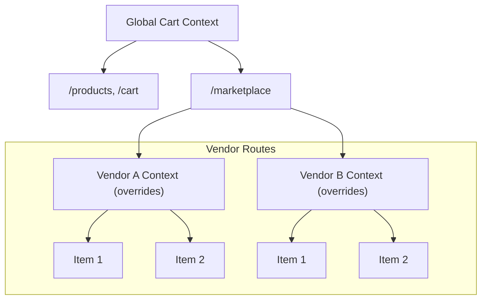

<script>
  import Callout from '$lib/components/Callout.svelte';
</script>

<!-- <Callout type="info" title="Working Implementation">

**Complete Source Code**: All code examples in this article are fully implemented and tested. You can view the complete working implementation in:

- Cart implementation: `src/lib/cart/`
- Demo application: `src/routes/demo/`
- Product data: `src/lib/data/products.ts`

**Live Demo**: Visit `/demo` to interact with the working shopping cart and wishlist:

- **Main Store** (`/demo/products`): Browse products with cart and wishlist functionality
- **Wishlist** (`/demo/wishlist`): Save products for later with cross-context "Move to Cart" feature
- **Marketplace** (`/demo/marketplace`): Explore the multi-vendor architecture with vendor listing
- **Vendor Stores** (`/demo/marketplace/[vendor]`): Each vendor has isolated cart with custom settings
- **Cart Management** (`/demo/cart`): Full cart page with item management and checkout

**Key Implementation Fixes**:

1. **$state Syntax**: Corrected variable naming in `AddToCartButton.svelte` - changed `let state = $state('idle')` to `let buttonState = $state<ButtonState>('idle')` to avoid conflicts with the `$state` rune name.

2. **Vendor Type Safety**: Added proper TypeScript types with `+layout.server.ts` load function for vendor routes, eliminating the `"Property 'vendor' does not exist on type '{}'"` error.

3. **Complete Components**: Implemented all referenced components including Header, CartIcon, QuantitySelector, CartSummary, and CartDrawer.

</Callout> -->

## Introduction

A shopping cart stresses state management: many pages read and write it, totals must stay reactive, and persistence must be reliable. Context gives you a clean, scalable model, but only if you avoid the naive global-store trap that breaks SSR isolation, multi-tenant scoping, and test reliability.

In this article, you'll build a production-ready cart with variants, reactive totals, persistence, discount validation, and scoped isolation, then extend it with server sync and performance patterns using `$state`, `$derived`, and `$effect`.


## Why Context for Carts?

Shopping carts seem like a perfect case for global state. Every page needs access, right? But here's what experience teaches: **global cart state creates more problems than it solves**.

Consider these real scenarios:

- **Marketplace platforms**: Multiple vendors, each with their own checkout flow
- **Multi-site e-commerce**: One app serves several storefronts
- **B2B portals**: Different departments with separate budgets
- **Wishlist vs cart**: Different "bags" with similar behavior
- **Server rendering**: Request isolation is mandatory

Context gives you scoped, isolated cart state that scales to these complexities. Let's build it properly.

---

## The Problem with Global Stores

Before diving into context, let's understand why global state, a seemingly natural choice for something as universal as a shopping cart, creates significant problems in production applications.

```
Global Store Problems:
═══════════════════════

┌──────────────────────────────────────────────────────────────────┐
│                      Global Cart Store                           │
│                                                                  │
│  Problem 1: SSR State Bleed                                      │
│  ┌────────────────────────────────────────────────────────────┐  │
│  │  Request A: User adds Widget to cart                       │  │
│  │  Request B: Different user sees Widget in their cart! 💥   │  │
│  │                                                            │  │
│  │  On the server, module-level state persists across         │  │
│  │  requests. Without request isolation, users see each       │  │
│  │  other's data.                                             │  │
│  └────────────────────────────────────────────────────────────┘  │
│                                                                  │
│  Problem 2: No Isolation                                         │
│  ┌────────────────────────────────────────────────────────────┐  │
│  │  Marketplace with multiple vendors:                        │  │
│  │  - Storefront A: Electronics                               │  │
│  │  - Storefront B: Groceries                                 │  │
│  │  Same cart? Different carts? Global stores can't scope. 💥 │  │
│  └────────────────────────────────────────────────────────────┘  │
│                                                                  │
│  Problem 3: Testing Nightmares                                   │
│  ┌────────────────────────────────────────────────────────────┐  │
│  │  Test 1: Adds item, expects count = 1 ✓                    │  │
│  │  Test 2: Runs next, cart already has item from Test 1 💥   │  │
│  │                                                            │  │
│  │  Tests must manually reset state, creating fragile         │  │
│  │  test suites that break in unexpected ways.                │  │
│  └────────────────────────────────────────────────────────────┘  │
│                                                                  │
└──────────────────────────────────────────────────────────────────┘
```

Context solves all three problems through its fundamental design:

**SSR Safety**: Each server request creates a fresh component tree with its own context instances. State cannot leak between requests because each request gets isolated context.

**Scoped Isolation**: Context flows downward through the component tree. Different sections of your app can have completely different cart contexts by nesting providers with different configurations.

**Test Independence**: Each test can render its own component tree with its own cart context. No shared state means no test pollution.

---

### Cart Patterns in the Wild

The most common cart pattern used in Marketplace is **unified** cart. Why? This is a simpler mental model that simplifies the user experience and backend processing by consolidating all items into a single cart. It's the default for most e-commerce sites and platforms like Shopify, Magento, and WooCommerce.

However, for this demo is intentionally chosen the **per-vendor** cart example to showcase **scoped context isolation**. In this demo, the app has a global cart context, and vendor routes override it with a vendor-specific context. Nested providers override parent contexts, so each vendor subtree gets its own cart instance while the rest of the app keeps the main cart.



You can see this pattern in action on platforms like DoorDash, Uber Eats, and Instacart, where each restaurant or store has its own cart and checkout flow, minimum order requirements, payment processing etc.

#### When it makes sense:

- **Food delivery:** You cannot order from McDonald's and Burger King in one delivery
- **Different fulfillment**: Each vendor ships separately with incompatible logistics
- **Different payment processors**: Each vendor handles their own payments
- **B2B wholesale:** Different terms, contracts, minimum orders per supplier
- **White-label storefronts:** Each vendor is essentially their own branded store

---

## Cart Architecture Overview

A well-architected cart system separates concerns cleanly. Here's how the pieces fit together:

```
Cart System Architecture:
═════════════════════════

┌──────────────────────────────────────────────────────────────────┐
│                          App Root                                │
│  ┌────────────────────────────────────────────────────────────┐  │
│  │                     CartProvider                           │  │
│  │  ┌──────────────────────────────────────────────────────┐  │  │
│  │  │  Reactive State ($state)                             │  │  │
│  │  │  ├── items: CartItem[]                               │  │  │
│  │  │  ├── appliedDiscount: AppliedDiscount | null         │  │  │
│  │  │  └── isLoading: boolean                              │  │  │
│  │  └──────────────────────────────────────────────────────┘  │  │
│  │                           │                                │  │
│  │                           ▼                                │  │
│  │  ┌──────────────────────────────────────────────────────┐  │  │
│  │  │  Derived Calculations ($derived)                     │  │  │
│  │  │  ├── itemCount, totalQuantity                        │  │  │
│  │  │  ├── subtotal, discountAmount                        │  │  │
│  │  │  ├── shipping, tax                                   │  │  │
│  │  │  └── total, isEmpty, summary                         │  │  │
│  │  └──────────────────────────────────────────────────────┘  │  │
│  │                           │                                │  │
│  │                           ▼                                │  │
│  │  ┌──────────────────────────────────────────────────────┐  │  │
│  │  │  Side Effects ($effect)                              │  │  │
│  │  │  └── Persistence to localStorage                     │  │  │
│  │  └──────────────────────────────────────────────────────┘  │  │
│  │                                                            │  │
│  │  Context API (actions):                                    │  │
│  │  ├── addItem(product, quantity, options)                   │  │
│  │  ├── updateQuantity(itemId, quantity)                      │  │
│  │  ├── removeItem(itemId)                                    │  │
│  │  ├── applyDiscount(code) → Promise<Result>                 │  │
│  │  ├── removeDiscount()                                      │  │
│  │  └── clearCart()                                           │  │
│  │                                                            │  │
│  │  ┌──────────────────────────────────────────────────────┐  │  │
│  │  │                   Consumer Components                │  │  │
│  │  │  ┌─────────────┐  ┌─────────────┐  ┌─────────────┐   │  │  │
│  │  │  │ ProductPage │  │  CartIcon   │  │  Checkout   │   │  │  │
│  │  │  │ addItem()   │  │ itemCount   │  │ totals      │   │  │  │
│  │  │  └─────────────┘  └─────────────┘  └─────────────┘   │  │  │
│  │  │  ┌─────────────┐  ┌─────────────┐  ┌─────────────┐   │  │  │
│  │  │  │  MiniCart   │  │ CartDrawer  │  │CartSummary  │   │  │  │
│  │  │  │ items, qty  │  │ full cart   │  │ breakdown   │   │  │  │
│  │  │  └─────────────┘  └─────────────┘  └─────────────┘   │  │  │
│  │  └──────────────────────────────────────────────────────┘  │  │
│  └────────────────────────────────────────────────────────────┘  │
└──────────────────────────────────────────────────────────────────┘
```

The architecture follows a clear data flow: `$state` holds the source of truth, `$derived` computes all secondary values, `$effect` handles side effects like persistence, and the context API exposes both state and actions to consumer components.

---

## Planning the Cart System

Before writing code, let's define what a production shopping cart needs to handle. Thinking through requirements upfront leads to better API design.

### Core Requirements

| Category             | Operations                     | Description                                       |
| -------------------- | ------------------------------ | ------------------------------------------------- |
| **Item Management**  | Add, update, remove            | Handle products with variants (size, color)       |
| **Quantity Control** | Increment, decrement, set      | Respect stock limits, validate ranges             |
| **Calculations**     | Subtotal, tax, shipping, total | Reactive, automatic recalculation                 |
| **Discounts**        | Apply, validate, remove        | Server-validated promotional codes                |
| **Persistence**      | Save, load, sync               | Survive page refreshes, optionally sync to server |
| **Queries**          | Check contents, get quantities | Efficient lookups for UI state                    |

### Data Modeling Decisions

Several decisions affect how we model cart data:

**Item Identity**: A product ID alone isn't sufficient when the same product has variants. A blue t-shirt in size Large is a different cart line than the same t-shirt in Medium. We generate composite identifiers from product ID plus variant options.

**Price Storage**: Storing prices in cents as integers avoids floating-point precision issues. A price of `$19.99` becomes `1999` cents. All calculations use integers, and we format to currency only for display.

**Stock Limits**: The cart enforces `maxQuantity` limits. Adding items beyond available stock fails gracefully with a typed error result.

**Calculations**: All derived values, subtotals, taxes, shipping, compute through `$derived`. Every component sees consistent, automatically synchronized values.

**Result Objects**: Cart operations return typed result objects instead of throwing errors. This makes error handling explicit and type-safe.

---

## Type Definitions

Comprehensive type definitions serve as documentation and enable TypeScript to catch errors during development. Create a types file that defines the complete cart contract:

```typescript
// src/lib/cart/types.ts

/**
 * Product information required for cart operations.
 * This is the minimum data needed to add an item.
 */
export interface CartProduct {
	/** Unique product identifier from your catalog */
	id: string

	/** Display name for the product */
	name: string

	/** Price per unit in cents (e.g., 1999 = $19.99) */
	price: number

	/** URL to product image for display in cart */
	image?: string

	/** SKU for inventory tracking */
	sku?: string

	/** Maximum allowed quantity (stock limit) */
	maxQuantity?: number
}

/**
 * Options/variants for a cart item.
 * Supports arbitrary key-value pairs for flexibility.
 */
export interface CartItemOptions {
	size?: string
	color?: string
	[key: string]: string | undefined
}

/**
 * A single item in the shopping cart.
 * Each item tracks a specific product variant and quantity.
 */
export interface CartItem {
	/** Unique identifier for this cart entry (product + options) */
	id: string

	/** Reference to the original product data */
	product: CartProduct

	/** How many of this item the user wants */
	quantity: number

	/** Selected options/variants for this item */
	options: CartItemOptions

	/** When this item was added to the cart */
	addedAt: Date

	/** Computed: price × quantity for this line */
	lineTotal: number
}

/**
 * Applied discount/coupon information.
 */
export interface AppliedDiscount {
	/** The discount code used */
	code: string

	/** Type of discount calculation */
	type: 'percentage' | 'fixed'

	/** The discount value (percentage or cents) */
	value: number

	/** The actual amount discounted in cents */
	appliedAmount: number
}

/**
 * Calculated summary of the cart's current state.
 * All monetary values are in cents.
 */
export interface CartSummary {
	/** Number of unique items (different products/variants) */
	itemCount: number

	/** Total number of units across all items */
	totalQuantity: number

	/** Sum of (price × quantity) for all items */
	subtotal: number

	/** Discount amount if a code is applied */
	discount: number

	/** Calculated tax amount */
	tax: number

	/** Shipping cost (may be zero for free shipping) */
	shipping: number

	/** Final total: subtotal - discount + tax + shipping */
	total: number
}

/**
 * Result of attempting to add an item to the cart.
 * Operations return result objects rather than throwing errors.
 */
export interface AddItemResult {
	success: boolean
	error?: 'MAX_QUANTITY_EXCEEDED' | 'INVALID_QUANTITY' | 'INVALID_PRODUCT'
	item?: CartItem
	message?: string
}

/**
 * Result of attempting to update an item's quantity.
 */
export interface UpdateQuantityResult {
	success: boolean
	error?: 'ITEM_NOT_FOUND' | 'MAX_QUANTITY_EXCEEDED' | 'INVALID_QUANTITY'
	message?: string
}

/**
 * Result of attempting to apply a discount code.
 */
export interface DiscountResult {
	success: boolean
	discount?: AppliedDiscount
	error?: string
}

/**
 * Configuration options for the cart provider.
 */
export interface CartOptions {
	/** Storage key for persistence (default: 'cart') */
	storageKey?: string

	/** Currency code (default: 'USD') */
	currency?: string

	/** Tax rate as a decimal (default: 0.08 for 8%) */
	taxRate?: number

	/** Subtotal threshold for free shipping in cents (default: 5000) */
	freeShippingThreshold?: number

	/** Standard shipping cost in cents (default: 599) */
	shippingCost?: number

	/** Custom shipping calculation function */
	calculateShipping?: (subtotal: number, itemCount: number) => number

	/** API endpoint for coupon validation */
	couponEndpoint?: string
}

/**
 * The public API of the cart context.
 * This interface documents everything components can do with the cart.
 */
export interface CartContext {
	// Reactive state (readonly to consumers)
	readonly items: CartItem[]
	readonly summary: CartSummary
	readonly isEmpty: boolean
	readonly isLoading: boolean
	readonly appliedDiscount: AppliedDiscount | null
	readonly currency: string

	// Convenience accessors
	readonly itemCount: number
	readonly totalQuantity: number

	// Item operations
	addItem(product: CartProduct, quantity?: number, options?: CartItemOptions): AddItemResult

	updateQuantity(id: string, quantity: number): UpdateQuantityResult
	removeItem(id: string): void
	clearCart(): void

	// Queries
	getItem(productId: string, options?: CartItemOptions): CartItem | undefined
	hasItem(productId: string, options?: CartItemOptions): boolean
	getQuantity(productId: string, options?: CartItemOptions): number

	// Discounts
	applyDiscount(code: string): Promise<DiscountResult>
	removeDiscount(): void
}
```

### Why Result Objects?

Notice that operations like `addItem` and `updateQuantity` return result objects instead of throwing errors or returning booleans. This pattern has several advantages:

**Explicit Error Handling**: Callers must acknowledge that operations can fail. A boolean return value doesn't explain why something failed, and thrown exceptions require try/catch blocks that obscure the main logic flow.

**Type-Safe Errors**: The `error` field has a union type of specific error codes. TypeScript ensures you handle all possible error cases, and your IDE can autocomplete the available errors.

**Additional Data**: Successful results can include useful data, like the created cart item or the updated state.

**No Try/Catch Needed**: Synchronous operations don't require exception handling, keeping component code cleaner and more readable.

---

## Implementing the Cart Context

Now let's implement the cart context. This is where Svelte 5's reactive primitives shine, `$state` tracks the items, `$derived` calculates totals, and `$effect` handles persistence.

```typescript
// src/lib/cart/cart-context.svelte.ts

import { setContext, getContext, hasContext, onMount } from 'svelte'
import { browser } from '$app/environment'
import type {
	CartItem,
	CartProduct,
	CartItemOptions,
	CartSummary,
	CartContext,
	CartOptions,
	AddItemResult,
	UpdateQuantityResult,
	DiscountResult,
	AppliedDiscount
} from './types'

/**
 * Symbol key ensures no collisions with other contexts.
 */
const CART_KEY = Symbol('cart')

/**
 * Creates and provides the cart context.
 * Call this in your root layout or a dedicated CartProvider component.
 *
 * @param options - Configuration for storage, tax, and shipping
 * @returns The created CartContext
 */
export function createCartContext(options: CartOptions = {}): CartContext {
	const {
		storageKey = 'cart',
		currency = 'USD',
		taxRate = 0.08,
		freeShippingThreshold = 5000,
		shippingCost = 599,
		calculateShipping,
		couponEndpoint = '/api/coupons/validate'
	} = options

	// ─────────────────────────────────────────────────────────────
	// State Initialization
	// ─────────────────────────────────────────────────────────────

	// Core reactive state
	let items = $state<CartItem[]>([])
	let appliedDiscount = $state<AppliedDiscount | null>(null)
	let isLoading = $state(false)
	let isInitialized = $state(false)

	// ─────────────────────────────────────────────────────────────
	// Persistence - Load on Mount
	// ─────────────────────────────────────────────────────────────

	/**
	 * Loads cart data from localStorage.
	 * Called once on mount, handles corrupted data gracefully.
	 */
	function loadFromStorage(): void {
		if (!browser) return

		try {
			const stored = localStorage.getItem(storageKey)
			if (!stored) {
				isInitialized = true
				return
			}

			const data = JSON.parse(stored)

			// Validate the stored data structure
			if (!data || !Array.isArray(data.items)) {
				isInitialized = true
				return
			}

			// Restore items with proper Date objects
			items = data.items.map((item: CartItem) => ({
				...item,
				addedAt: new Date(item.addedAt)
			}))

			// Restore discount if present
			if (data.discount) {
				appliedDiscount = data.discount
			}

			isInitialized = true
		} catch (error) {
			console.warn('Failed to load cart from storage:', error)
			isInitialized = true
		}
	}

	// Load on mount (client-side only)
	onMount(() => {
		loadFromStorage()
	})

	// ─────────────────────────────────────────────────────────────
	// Derived Calculations
	// ─────────────────────────────────────────────────────────────

	/**
	 * Number of unique items in the cart.
	 * A cart with 2 t-shirts and 3 hats has itemCount of 2.
	 */
	let itemCount = $derived(items.length)

	/**
	 * Total units across all items.
	 * A cart with 2 t-shirts and 3 hats has totalQuantity of 5.
	 */
	let totalQuantity = $derived(items.reduce((sum, item) => sum + item.quantity, 0))

	/**
	 * Sum of price × quantity for all items, before discounts.
	 */
	let subtotal = $derived(items.reduce((sum, item) => sum + item.lineTotal, 0))

	/**
	 * Discount amount based on the applied discount code.
	 * Percentage discounts are calculated from subtotal.
	 * Fixed discounts cannot exceed subtotal.
	 */
	let discountAmount = $derived.by(() => {
		if (!appliedDiscount) return 0

		if (appliedDiscount.type === 'fixed') {
			return Math.min(appliedDiscount.value, subtotal)
		}

		// Percentage discount
		return Math.round(subtotal * (appliedDiscount.value / 100))
	})

	/**
	 * Subtotal after discount is applied.
	 */
	let afterDiscount = $derived(Math.max(0, subtotal - discountAmount))

	/**
	 * Shipping cost calculation.
	 * Uses custom function if provided, otherwise standard logic.
	 */
	let shipping = $derived.by(() => {
		if (calculateShipping) {
			return calculateShipping(afterDiscount, itemCount)
		}
		return afterDiscount >= freeShippingThreshold ? 0 : shippingCost
	})

	/**
	 * Tax calculated on the discounted subtotal.
	 */
	let tax = $derived(Math.round(afterDiscount * taxRate))

	/**
	 * Final total the customer pays.
	 */
	let total = $derived(afterDiscount + shipping + tax)

	/**
	 * Whether the cart has no items.
	 */
	let isEmpty = $derived(items.length === 0)

	/**
	 * Complete summary object for convenient access.
	 */
	let summary = $derived<CartSummary>({
		itemCount,
		totalQuantity,
		subtotal,
		discount: discountAmount,
		tax,
		shipping,
		total
	})

	// ─────────────────────────────────────────────────────────────
	// Persistence Effect
	// ─────────────────────────────────────────────────────────────

	/**
	 * Automatically saves cart to localStorage whenever items or discount change.
	 * Only runs after initial load to avoid overwriting stored data.
	 */
	$effect(() => {
		if (!browser || !isInitialized) return

		const data = {
			items,
			discount: appliedDiscount,
			updatedAt: Date.now()
		}

		try {
			localStorage.setItem(storageKey, JSON.stringify(data))
		} catch (error) {
			console.warn('Failed to save cart to storage:', error)
		}
	})

	// ─────────────────────────────────────────────────────────────
	// Helper Functions
	// ─────────────────────────────────────────────────────────────

	/**
	 * Generates a unique ID for a cart item based on product and options.
	 * Same product with different options = different cart lines.
	 */
	function generateItemId(productId: string, options: CartItemOptions): string {
		const optionsKey = Object.entries(options)
			.filter(([_, v]) => v !== undefined)
			.sort(([a], [b]) => a.localeCompare(b))
			.map(([k, v]) => `${k}:${v}`)
			.join('|')

		return optionsKey ? `${productId}__${optionsKey}` : productId
	}

	/**
	 * Finds an item by its cart ID.
	 */
	function findItemById(id: string): CartItem | undefined {
		return items.find((item) => item.id === id)
	}

	/**
	 * Finds an item by product ID and optional variant options.
	 */
	function findItemByProduct(
		productId: string,
		options: CartItemOptions = {}
	): CartItem | undefined {
		const targetId = generateItemId(productId, options)
		return items.find((item) => item.id === targetId)
	}

	/**
	 * Finds the index of an item by its cart ID.
	 */
	function findItemIndex(id: string): number {
		return items.findIndex((item) => item.id === id)
	}

	// ─────────────────────────────────────────────────────────────
	// Context Object
	// ─────────────────────────────────────────────────────────────

	const context: CartContext = {
		// Reactive getters
		get items() {
			return items
		},
		get summary() {
			return summary
		},
		get isEmpty() {
			return isEmpty
		},
		get isLoading() {
			return isLoading
		},
		get appliedDiscount() {
			return appliedDiscount
		},
		get currency() {
			return currency
		},
		get itemCount() {
			return itemCount
		},
		get totalQuantity() {
			return totalQuantity
		},

		/**
		 * Adds an item to the cart or increases quantity if already present.
		 * Validates quantity and respects stock limits.
		 */
		addItem(product: CartProduct, quantity = 1, options: CartItemOptions = {}): AddItemResult {
			// Validate product
			if (!product?.id || !product?.name || typeof product.price !== 'number') {
				return {
					success: false,
					error: 'INVALID_PRODUCT',
					message: 'Product must have id, name, and price'
				}
			}

			// Validate quantity
			if (quantity < 1 || !Number.isInteger(quantity)) {
				return {
					success: false,
					error: 'INVALID_QUANTITY',
					message: 'Quantity must be a positive integer'
				}
			}

			const itemId = generateItemId(product.id, options)
			const existing = findItemById(itemId)

			if (existing) {
				// Update quantity of existing item
				const newQuantity = existing.quantity + quantity
				const maxQty = product.maxQuantity ?? Infinity

				if (newQuantity > maxQty) {
					return {
						success: false,
						error: 'MAX_QUANTITY_EXCEEDED',
						message: `Maximum ${maxQty} allowed`
					}
				}

				existing.quantity = newQuantity
				existing.lineTotal = newQuantity * existing.product.price
				return { success: true, item: existing }
			}

			// Add new item
			const effectiveQty = product.maxQuantity ? Math.min(quantity, product.maxQuantity) : quantity

			if (product.maxQuantity && quantity > product.maxQuantity) {
				return {
					success: false,
					error: 'MAX_QUANTITY_EXCEEDED',
					message: `Maximum ${product.maxQuantity} allowed`
				}
			}

			const newItem: CartItem = {
				id: itemId,
				product,
				quantity: effectiveQty,
				options,
				addedAt: new Date(),
				lineTotal: effectiveQty * product.price
			}

			items.push(newItem)
			return { success: true, item: newItem }
		},

		/**
		 * Updates the quantity of a specific cart item.
		 * Setting quantity to 0 or less removes the item.
		 */
		updateQuantity(id: string, quantity: number): UpdateQuantityResult {
			// Validate quantity
			if (!Number.isInteger(quantity)) {
				return {
					success: false,
					error: 'INVALID_QUANTITY',
					message: 'Quantity must be an integer'
				}
			}

			const item = findItemById(id)

			if (!item) {
				return {
					success: false,
					error: 'ITEM_NOT_FOUND',
					message: 'Item not found in cart'
				}
			}

			// Quantity 0 or less means remove
			if (quantity <= 0) {
				this.removeItem(id)
				return { success: true }
			}

			// Check stock limit
			const maxQty = item.product.maxQuantity ?? Infinity
			if (quantity > maxQty) {
				return {
					success: false,
					error: 'MAX_QUANTITY_EXCEEDED',
					message: `Maximum ${maxQty} allowed`
				}
			}

			item.quantity = quantity
			item.lineTotal = quantity * item.product.price
			return { success: true }
		},

		/**
		 * Removes an item from the cart entirely.
		 */
		removeItem(id: string): void {
			const index = findItemIndex(id)
			if (index !== -1) {
				items.splice(index, 1)
			}
		},

		/**
		 * Empties the cart and removes any applied discount.
		 */
		clearCart(): void {
			items.length = 0
			appliedDiscount = null
		},

		/**
		 * Gets a cart item by product ID and options.
		 */
		getItem(productId: string, options: CartItemOptions = {}): CartItem | undefined {
			return findItemByProduct(productId, options)
		},

		/**
		 * Checks if a product is in the cart.
		 */
		hasItem(productId: string, options: CartItemOptions = {}): boolean {
			return findItemByProduct(productId, options) !== undefined
		},

		/**
		 * Gets the quantity of a product in the cart.
		 * Returns 0 if the product is not in the cart.
		 */
		getQuantity(productId: string, options: CartItemOptions = {}): number {
			const item = findItemByProduct(productId, options)
			return item?.quantity ?? 0
		},

		/**
		 * Applies a discount code to the cart.
		 * Validates the code with your backend API.
		 */
		async applyDiscount(code: string): Promise<DiscountResult> {
			if (!code.trim()) {
				return {
					success: false,
					error: 'Please enter a discount code'
				}
			}

			isLoading = true

			try {
				const response = await fetch(couponEndpoint, {
					method: 'POST',
					headers: { 'Content-Type': 'application/json' },
					body: JSON.stringify({
						code: code.trim().toUpperCase(),
						subtotal
					})
				})

				const data = await response.json()

				if (!response.ok) {
					return {
						success: false,
						error: data.message ?? 'Invalid discount code'
					}
				}

				// Apply the validated discount
				appliedDiscount = {
					code: data.code,
					value: data.value,
					type: data.type,
					appliedAmount: data.appliedAmount
				}

				return { success: true, discount: appliedDiscount }
			} catch (error) {
				console.error('Discount validation error:', error)
				return {
					success: false,
					error: 'Unable to validate discount code. Please try again.'
				}
			} finally {
				isLoading = false
			}
		},

		/**
		 * Removes the currently applied discount.
		 */
		removeDiscount(): void {
			appliedDiscount = null
		}
	}

	return setContext(CART_KEY, context)
}

/**
 * Retrieves the cart context.
 * Must be called from a component inside a CartProvider.
 */
export function getCartContext(): CartContext {
	if (!hasContext(CART_KEY)) {
		throw new Error(
			'Cart context not found. ' +
				'Ensure your component is inside a CartProvider or the root layout.'
		)
	}
	return getContext(CART_KEY)
}

/**
 * Checks if cart context is available.
 * Useful for components that may render outside the cart context.
 */
export function hasCartContext(): boolean {
	return hasContext(CART_KEY)
}
```

### Understanding the Reactive Flow

Let's trace through what happens when a user adds an item to their cart:

1. **Action**: User clicks "Add to Cart" and component calls `cart.addItem(product, 1, { size: 'Large' })`

2. **Validation**: The method validates the product and quantity, generates a unique ID from product + options

3. **State Update**: Either updates an existing item's quantity or pushes a new item onto the `items` array

4. **Derived Updates**: Because `items` changed, all `$derived` values recalculate automatically:

   - `itemCount` increases
   - `totalQuantity` increases by the added quantity
   - `subtotal` increases by the item's price × quantity
   - `shipping`, `tax`, and `total` update accordingly
   - `summary` reflects all new values

5. **Effect Runs**: The persistence `$effect` detects the change and saves to localStorage

6. **UI Updates**: Any component reading from the cart context re-renders with new data

All of this happens automatically. You don't need to manually trigger updates or call setState, the reactive system handles everything.

---

## Setting Up the Provider

Create a provider component that wraps the context creation with configurable options:

```svelte
<!-- src/lib/cart/CartProvider.svelte -->
<script lang="ts">
	import { createCartContext, type CartOptions } from './cart-context.svelte'
	import type { Snippet } from 'svelte'

	interface Props extends CartOptions {
		/** Child content */
		children: Snippet
	}

	let {
		storageKey,
		currency,
		taxRate,
		freeShippingThreshold,
		shippingCost,
		calculateShipping,
		couponEndpoint,
		children
	}: Props = $props()

	// Create the cart context with provided options
	createCartContext({
		storageKey,
		currency,
		taxRate,
		freeShippingThreshold,
		shippingCost,
		calculateShipping,
		couponEndpoint
	})
</script>

{@render children()}
```

Add it to your root layout:

```svelte
<!-- src/routes/+layout.svelte -->
<script lang="ts">
	import CartProvider from '$lib/cart/CartProvider.svelte'
	import Header from '$lib/components/Header.svelte'

	let { children } = $props()
</script>

<CartProvider taxRate={0.08} freeShippingThreshold={7500} currency="USD">
	<Header />
	<main>
		{@render children()}
	</main>
</CartProvider>
```

---

## Building Cart Components

With the context in place, let's build the UI components that interact with the cart. Each component uses `getCartContext()` to access cart state and actions.

### Cart Icon with Badge

The cart icon appears in the header and shows the current item count:

```svelte
<!-- src/lib/cart/CartIcon.svelte -->
<script lang="ts">
	import { getCartContext } from './cart-context.svelte'

	interface Props {
		/** Click handler (e.g., to open cart drawer) */
		onclick?: () => void
	}

	let { onclick }: Props = $props()

	const cart = getCartContext()

	// Format badge for display (cap at 99+)
	let badgeText = $derived(cart.totalQuantity > 99 ? '99+' : String(cart.totalQuantity))
</script>

<button
	type="button"
	class="cart-icon"
	{onclick}
	aria-label="Shopping cart with {cart.totalQuantity} items"
>
	<svg
		viewBox="0 0 24 24"
		fill="none"
		stroke="currentColor"
		stroke-width="2"
		stroke-linecap="round"
		stroke-linejoin="round"
		aria-hidden="true"
	>
		<circle cx="9" cy="21" r="1" />
		<circle cx="20" cy="21" r="1" />
		<path d="M1 1h4l2.68 13.39a2 2 0 0 0 2 1.61h9.72a2 2 0 0 0 2-1.61L23 6H6" />
	</svg>

	{#if cart.totalQuantity > 0}
		<span class="badge" aria-hidden="true">
			{badgeText}
		</span>
	{/if}
</button>

<style>
	.cart-icon {
		position: relative;
		display: flex;
		align-items: center;
		justify-content: center;
		width: 44px;
		height: 44px;
		padding: 0;
		border: none;
		background: transparent;
		cursor: pointer;
		color: var(--color-foreground, #1e293b);
		transition: color 0.2s;
	}

	.cart-icon:hover {
		color: var(--color-primary, #3b82f6);
	}

	.cart-icon svg {
		width: 24px;
		height: 24px;
	}

	.badge {
		position: absolute;
		top: 4px;
		right: 4px;
		min-width: 18px;
		height: 18px;
		padding: 0 5px;
		font-size: 11px;
		font-weight: 600;
		line-height: 18px;
		text-align: center;
		color: white;
		background-color: var(--color-primary, #3b82f6);
		border-radius: 9px;
	}
</style>
```

### Add to Cart Button

This button handles adding products with loading states, error handling, and visual feedback:

```svelte
<!-- src/lib/cart/AddToCartButton.svelte -->
<script lang="ts">
	import { getCartContext } from './cart-context.svelte'
	import type { CartProduct, CartItemOptions } from './types'

	interface Props {
		/** Product data to add */
		product: CartProduct

		/** Quantity to add (default: 1) */
		quantity?: number

		/** Selected variant options */
		options?: CartItemOptions

		/** Additional CSS classes */
		class?: string
	}

	let { product, quantity = 1, options = {}, class: className = '' }: Props = $props()

	const cart = getCartContext()

	// Button states
	// IMPORTANT: Cannot use 'state' as variable name when using $state rune
	// The variable name would conflict with the rune itself
	type ButtonState = 'idle' | 'adding' | 'added' | 'error'
	let buttonState = $state<ButtonState>('idle')
	let errorMessage = $state('')

	// Check if this product/variant is already in the cart
	let isInCart = $derived(cart.hasItem(product.id, options))
	let cartQuantity = $derived(cart.getQuantity(product.id, options))

	/**
	 * Handles the add to cart action with visual feedback.
	 */
	async function handleAdd() {
		buttonState = 'adding'

		// Small delay for visual feedback
		await new Promise((resolve) => setTimeout(resolve, 200))

		const result = cart.addItem(product, quantity, options)

		if (result.success) {
			buttonState = 'added'

			// Reset to idle after showing success
			setTimeout(() => {
				buttonState = 'idle'
			}, 2000)
		} else {
			buttonState = 'error'
			errorMessage = result.message ?? 'Could not add to cart'

			// Reset to idle after showing error
			setTimeout(() => {
				buttonState = 'idle'
				errorMessage = ''
			}, 3000)
		}
	}
</script>

<button
	type="button"
	class="add-to-cart {className}"
	class:adding={buttonState === 'adding'}
	class:added={buttonState === 'added'}
	class:error={buttonState === 'error'}
	class:in-cart={isInCart && buttonState === 'idle'}
	onclick={handleAdd}
	disabled={buttonState === 'adding'}
>
	{#if buttonState === 'adding'}
		<span class="spinner" aria-hidden="true"></span>
		<span>Adding...</span>
	{:else if buttonState === 'added'}
		<svg viewBox="0 0 24 24" fill="none" stroke="currentColor" stroke-width="2" aria-hidden="true">
			<polyline points="20 6 9 17 4 12" />
		</svg>
		<span>Added!</span>
	{:else if buttonState === 'error'}
		<span>{errorMessage}</span>
	{:else if isInCart}
		<span>In Cart ({cartQuantity})</span>
	{:else}
		<span>Add to Cart</span>
	{/if}
</button>

<style>
	.add-to-cart {
		display: inline-flex;
		align-items: center;
		justify-content: center;
		gap: 0.5rem;
		padding: 0.75rem 1.5rem;
		min-width: 140px;
		font-size: 0.9375rem;
		font-weight: 500;
		color: white;
		background-color: var(--color-primary, #3b82f6);
		border: none;
		border-radius: 8px;
		cursor: pointer;
		transition: all 0.2s ease;
	}

	.add-to-cart:hover:not(:disabled) {
		background-color: var(--color-primary-hover, #2563eb);
	}

	.add-to-cart:disabled {
		cursor: not-allowed;
		opacity: 0.8;
	}

	.add-to-cart.added {
		background-color: var(--color-success, #16a34a);
	}

	.add-to-cart.error {
		background-color: var(--color-error, #dc2626);
	}

	.add-to-cart.in-cart {
		background-color: var(--color-muted, #64748b);
	}

	.add-to-cart svg {
		width: 18px;
		height: 18px;
	}

	.spinner {
		width: 18px;
		height: 18px;
		border: 2px solid rgba(255, 255, 255, 0.3);
		border-top-color: white;
		border-radius: 50%;
		animation: spin 0.8s linear infinite;
	}

	@keyframes spin {
		to {
			transform: rotate(360deg);
		}
	}
</style>
```

### Quantity Selector

A reusable component for adjusting item quantities:

```svelte
<!-- src/lib/cart/QuantitySelector.svelte -->
<script lang="ts">
	interface Props {
		/** Current quantity */
		value: number

		/** Minimum allowed (default: 1) */
		min?: number

		/** Maximum allowed (optional stock limit) */
		max?: number

		/** Called when quantity changes */
		onchange: (quantity: number) => void

		/** Disable all controls */
		disabled?: boolean

		/** Compact size variant */
		compact?: boolean
	}

	let { value, min = 1, max, onchange, disabled = false, compact = false }: Props = $props()

	let canDecrement = $derived(value > min && !disabled)
	let canIncrement = $derived((!max || value < max) && !disabled)

	function decrement() {
		if (canDecrement) {
			onchange(value - 1)
		}
	}

	function increment() {
		if (canIncrement) {
			onchange(value + 1)
		}
	}

	function handleInput(event: Event) {
		const input = event.target as HTMLInputElement
		let newValue = parseInt(input.value, 10)

		// Clamp to valid range
		if (isNaN(newValue) || newValue < min) {
			newValue = min
		} else if (max && newValue > max) {
			newValue = max
		}

		onchange(newValue)
	}
</script>

<div class="quantity-selector" class:disabled class:compact>
	<button
		type="button"
		class="qty-btn"
		onclick={decrement}
		disabled={!canDecrement}
		aria-label="Decrease quantity"
	>
		<svg viewBox="0 0 24 24" fill="none" stroke="currentColor" stroke-width="2">
			<line x1="5" y1="12" x2="19" y2="12" />
		</svg>
	</button>

	<input
		type="number"
		class="qty-input"
		{value}
		{min}
		{max}
		{disabled}
		oninput={handleInput}
		aria-label="Quantity"
	/>

	<button
		type="button"
		class="qty-btn"
		onclick={increment}
		disabled={!canIncrement}
		aria-label="Increase quantity"
	>
		<svg viewBox="0 0 24 24" fill="none" stroke="currentColor" stroke-width="2">
			<line x1="12" y1="5" x2="12" y2="19" />
			<line x1="5" y1="12" x2="19" y2="12" />
		</svg>
	</button>
</div>

<style>
	.quantity-selector {
		display: inline-flex;
		align-items: center;
		border: 1px solid var(--color-border, #e2e8f0);
		border-radius: 8px;
		overflow: hidden;
	}

	.quantity-selector.disabled {
		opacity: 0.5;
	}

	.qty-btn {
		display: flex;
		align-items: center;
		justify-content: center;
		width: 36px;
		height: 36px;
		padding: 0;
		border: none;
		background: var(--color-surface, #f8fafc);
		cursor: pointer;
		transition: background-color 0.2s;
	}

	.compact .qty-btn {
		width: 28px;
		height: 28px;
	}

	.qty-btn:hover:not(:disabled) {
		background: var(--color-surface-hover, #e2e8f0);
	}

	.qty-btn:disabled {
		cursor: not-allowed;
		opacity: 0.4;
	}

	.qty-btn svg {
		width: 16px;
		height: 16px;
		color: var(--color-foreground, #1e293b);
	}

	.compact .qty-btn svg {
		width: 12px;
		height: 12px;
	}

	.qty-input {
		width: 48px;
		height: 36px;
		padding: 0;
		border: none;
		border-left: 1px solid var(--color-border, #e2e8f0);
		border-right: 1px solid var(--color-border, #e2e8f0);
		text-align: center;
		font-size: 0.9375rem;
		font-weight: 500;
		background: white;
		-moz-appearance: textfield;
	}

	.compact .qty-input {
		width: 36px;
		height: 28px;
		font-size: 0.8125rem;
	}

	.qty-input::-webkit-outer-spin-button,
	.qty-input::-webkit-inner-spin-button {
		-webkit-appearance: none;
		margin: 0;
	}

	.qty-input:focus {
		outline: none;
		background: var(--color-primary-ring, rgba(59, 130, 246, 0.1));
	}
</style>
```

### Discount Code API Endpoint

Before building the UI, create the server endpoint that validates discount codes. For this demo, we'll include several test codes that users can discover through hints in the UI:

```typescript
// src/routes/api/coupons/validate/+server.ts

import { json } from '@sveltejs/kit'
import type { RequestHandler } from './$types'

/**
 * Demo discount codes
 * In a real app, these would come from a database
 */
const DISCOUNT_CODES: Record<
	string,
	{
		type: 'percentage' | 'fixed'
		value: number
		minOrder?: number
		description: string
	}
> = {
	SAVE10: {
		type: 'percentage',
		value: 10,
		description: '10% off your order'
	},
	SAVE20: {
		type: 'percentage',
		value: 20,
		minOrder: 5000, // $50 minimum
		description: '20% off orders over $50'
	},
	FLAT5: {
		type: 'fixed',
		value: 500, // $5 off
		description: '$5 off your order'
	},
	WELCOME: {
		type: 'percentage',
		value: 15,
		description: '15% off for new customers'
	},
	FREESHIP: {
		type: 'fixed',
		value: 599, // Covers standard shipping
		description: 'Free shipping ($5.99 value)'
	}
}

export const POST: RequestHandler = async ({ request }) => {
	try {
		const { code, subtotal } = await request.json()

		if (!code || typeof code !== 'string') {
			return json({ message: 'Please enter a discount code' }, { status: 400 })
		}

		const normalizedCode = code.trim().toUpperCase()
		const discount = DISCOUNT_CODES[normalizedCode]

		if (!discount) {
			return json(
				{ message: 'Invalid discount code. Try: SAVE10, SAVE20, FLAT5, WELCOME, or FREESHIP' },
				{ status: 400 }
			)
		}

		// Check minimum order requirement
		if (discount.minOrder && subtotal < discount.minOrder) {
			const minOrderFormatted = (discount.minOrder / 100).toFixed(2)
			return json(
				{ message: `This code requires a minimum order of ${minOrderFormatted}` },
				{ status: 400 }
			)
		}

		// Calculate the applied amount
		let appliedAmount: number
		if (discount.type === 'percentage') {
			appliedAmount = Math.round(subtotal * (discount.value / 100))
		} else {
			appliedAmount = Math.min(discount.value, subtotal)
		}

		return json({
			code: normalizedCode,
			type: discount.type,
			value: discount.value,
			appliedAmount,
			description: discount.description
		})
	} catch {
		return json({ message: 'Failed to validate discount code' }, { status: 500 })
	}
}
```

#### Available Demo Codes

The API includes these test discount codes for the demo:

| Code       | Type       | Value     | Requirement   |
| ---------- | ---------- | --------- | ------------- |
| `SAVE10`   | Percentage | 10% off   | None          |
| `SAVE20`   | Percentage | 20% off   | Min $50 order |
| `FLAT5`    | Fixed      | $5 off    | None          |
| `WELCOME`  | Percentage | 15% off   | None          |
| `FREESHIP` | Fixed      | $5.99 off | None          |

### Cart Summary Panel

Displays the cart totals with a complete breakdown and discount input. To make the demo more discoverable, we include a "Show demo codes" toggle that reveals clickable code chips users can apply directly:

```svelte
<!-- src/lib/cart/CartSummary.svelte -->
<script lang="ts">
	import { getCartContext } from './cart-context.svelte'

	interface Props {
		/** Show shipping row */
		showShipping?: boolean

		/** Show discount input */
		showDiscountInput?: boolean

		/** Show item breakdown */
		showBreakdown?: boolean

		/** Show discount code hints */
		showHints?: boolean
	}

	let {
		showShipping = true,
		showDiscountInput = true,
		showBreakdown = true,
		showHints = true
	}: Props = $props()

	const cart = getCartContext()

	// Discount code input state
	let discountCode = $state('')
	let discountError = $state('')
	let showAllHints = $state(false)

	// Demo discount codes for hints
	const discountHints = [
		{ code: 'SAVE10', description: '10% off' },
		{ code: 'SAVE20', description: '20% off orders $50+' },
		{ code: 'FLAT5', description: '$5 off' },
		{ code: 'WELCOME', description: '15% off' },
		{ code: 'FREESHIP', description: 'Free shipping' }
	]

	/**
	 * Formats cents as a currency string.
	 */
	function formatPrice(cents: number): string {
		return new Intl.NumberFormat('en-US', {
			style: 'currency',
			currency: cart.currency
		}).format(cents / 100)
	}

	/**
	 * Handles discount code submission.
	 */
	async function handleApplyDiscount() {
		discountError = ''

		const result = await cart.applyDiscount(discountCode)

		if (result.success) {
			discountCode = ''
		} else {
			discountError = result.error ?? 'Invalid code'
		}
	}

	/**
	 * Apply a hint code directly
	 */
	function applyHintCode(code: string) {
		discountCode = code
		handleApplyDiscount()
	}
</script>

<div class="cart-summary">
	<h2 class="summary-title">Order Summary</h2>

	<dl class="summary-rows">
		{#if showBreakdown}
			<div class="summary-row">
				<dt>Subtotal ({cart.summary.totalQuantity} items)</dt>
				<dd>{formatPrice(cart.summary.subtotal)}</dd>
			</div>
		{/if}

		{#if cart.appliedDiscount}
			<div class="summary-row discount-row">
				<dt>
					Discount
					<span class="discount-code">({cart.appliedDiscount.code})</span>
					<button
						type="button"
						class="remove-discount"
						onclick={() => cart.removeDiscount()}
						aria-label="Remove discount"
					>
						×
					</button>
				</dt>
				<dd class="discount-amount">-{formatPrice(cart.summary.discount)}</dd>
			</div>
		{/if}

		{#if showShipping}
			<div class="summary-row">
				<dt>Shipping</dt>
				<dd>
					{#if cart.summary.shipping === 0}
						<span class="free-shipping">Free</span>
					{:else}
						{formatPrice(cart.summary.shipping)}
					{/if}
				</dd>
			</div>
		{/if}

		{#if showBreakdown}
			<div class="summary-row">
				<dt>Tax</dt>
				<dd>{formatPrice(cart.summary.tax)}</dd>
			</div>
		{/if}

		<div class="summary-row total-row">
			<dt>Total</dt>
			<dd class="total-amount">{formatPrice(cart.summary.total)}</dd>
		</div>
	</dl>

	{#if showDiscountInput && !cart.appliedDiscount}
		<div class="discount-form">
			<label for="discount-code" class="visually-hidden"> Discount code </label>

			<div class="discount-input-group">
				<input
					type="text"
					id="discount-code"
					bind:value={discountCode}
					placeholder="Discount code"
					disabled={cart.isLoading}
				/>
				<button
					type="button"
					onclick={handleApplyDiscount}
					disabled={cart.isLoading || !discountCode.trim()}
				>
					{cart.isLoading ? 'Applying...' : 'Apply'}
				</button>
			</div>

			{#if discountError}
				<p class="discount-error" role="alert">{discountError}</p>
			{/if}

			{#if showHints}
				<div class="discount-hints">
					<button type="button" class="hints-toggle" onclick={() => (showAllHints = !showAllHints)}>
						<span class="hints-icon">💡</span>
						{showAllHints ? 'Hide' : 'Show'} demo codes
					</button>

					{#if showAllHints}
						<div class="hints-list">
							{#each discountHints as hint (hint.code)}
								<button type="button" class="hint-chip" onclick={() => applyHintCode(hint.code)}>
									<span class="hint-code">{hint.code}</span>
									<span class="hint-desc">{hint.description}</span>
								</button>
							{/each}
						</div>
					{/if}
				</div>
			{/if}
		</div>
	{/if}
</div>

<style>
	.cart-summary {
		background: var(--color-surface, #f8fafc);
		border-radius: 12px;
		padding: 1.5rem;
	}

	.summary-title {
		font-size: 1.125rem;
		font-weight: 600;
		margin: 0 0 1rem;
	}

	.summary-rows {
		margin: 0;
	}

	.summary-row {
		display: flex;
		justify-content: space-between;
		padding: 0.625rem 0;
		border-bottom: 1px solid var(--color-border, #e2e8f0);
	}

	.summary-row:last-child {
		border-bottom: none;
	}

	.summary-row dt {
		color: var(--color-muted, #64748b);
		display: flex;
		align-items: center;
		gap: 0.5rem;
	}

	.summary-row dd {
		margin: 0;
		font-weight: 500;
	}

	.discount-row {
		color: var(--color-success, #16a34a);
	}

	.discount-code {
		font-size: 0.8125rem;
		text-transform: uppercase;
	}

	.remove-discount {
		padding: 0 0.25rem;
		border: none;
		background: transparent;
		font-size: 1.125rem;
		line-height: 1;
		cursor: pointer;
		opacity: 0.6;
		transition: opacity 0.2s;
	}

	.remove-discount:hover {
		opacity: 1;
	}

	.discount-amount {
		color: var(--color-success, #16a34a);
	}

	.free-shipping {
		color: var(--color-success, #16a34a);
		font-weight: 500;
	}

	.total-row {
		padding-top: 1rem;
		margin-top: 0.5rem;
		border-top: 2px solid var(--color-border, #e2e8f0);
		border-bottom: none;
	}

	.total-row dt {
		font-weight: 600;
		color: var(--color-foreground, #1e293b);
	}

	.total-amount {
		font-size: 1.25rem;
		font-weight: 700;
		color: var(--color-foreground, #1e293b);
	}

	.discount-form {
		margin-top: 1.25rem;
		padding-top: 1.25rem;
		border-top: 1px solid var(--color-border, #e2e8f0);
	}

	.discount-input-group {
		display: flex;
		gap: 0.5rem;
	}

	.discount-input-group input {
		flex: 1;
		padding: 0.625rem 0.875rem;
		border: 1px solid var(--color-border, #e2e8f0);
		border-radius: 6px;
		font-size: 0.9375rem;
	}

	.discount-input-group input:focus {
		outline: none;
		border-color: var(--color-primary, #3b82f6);
		box-shadow: 0 0 0 3px var(--color-primary-ring, rgba(59, 130, 246, 0.2));
	}

	.discount-input-group button {
		padding: 0.625rem 1rem;
		background: var(--color-foreground, #1e293b);
		color: white;
		border: none;
		border-radius: 6px;
		font-weight: 500;
		cursor: pointer;
		transition: background-color 0.2s;
	}

	.discount-input-group button:hover:not(:disabled) {
		background: var(--color-foreground-hover, #334155);
	}

	.discount-input-group button:disabled {
		opacity: 0.6;
		cursor: not-allowed;
	}

	.discount-error {
		margin: 0.5rem 0 0;
		font-size: 0.8125rem;
		color: var(--color-error, #dc2626);
	}

	.visually-hidden {
		position: absolute;
		width: 1px;
		height: 1px;
		padding: 0;
		margin: -1px;
		overflow: hidden;
		clip: rect(0, 0, 0, 0);
		border: 0;
	}

	.discount-hints {
		margin-top: 0.75rem;
	}

	.hints-toggle {
		display: inline-flex;
		align-items: center;
		gap: 0.375rem;
		padding: 0;
		border: none;
		background: none;
		font-size: 0.8125rem;
		color: var(--color-muted, #64748b);
		cursor: pointer;
		transition: color 0.2s;
	}

	.hints-toggle:hover {
		color: var(--color-primary, #3b82f6);
	}

	.hints-icon {
		font-size: 0.875rem;
	}

	.hints-list {
		display: flex;
		flex-wrap: wrap;
		gap: 0.5rem;
		margin-top: 0.75rem;
	}

	.hint-chip {
		display: flex;
		flex-direction: column;
		align-items: flex-start;
		gap: 0.125rem;
		padding: 0.5rem 0.75rem;
		background: white;
		border: 1px solid var(--color-border, #e2e8f0);
		border-radius: 6px;
		cursor: pointer;
		transition: all 0.2s;
		text-align: left;
	}

	.hint-chip:hover {
		border-color: var(--color-primary, #3b82f6);
		background: #eff6ff;
	}

	.hint-code {
		font-family: 'SF Mono', 'Fira Code', monospace;
		font-size: 0.75rem;
		font-weight: 600;
		color: var(--color-primary, #3b82f6);
	}

	.hint-desc {
		font-size: 0.6875rem;
		color: var(--color-muted, #64748b);
	}
</style>
```

The hints feature displays clickable code chips that users can click to auto-apply demo discount codes. This makes the demo more discoverable and helps users understand the discount functionality without having to guess at codes.

### Mini Cart Dropdown

A compact cart preview for the header:

```svelte
<!-- src/lib/cart/MiniCart.svelte -->
<script lang="ts">
	import { getCartContext } from './cart-context.svelte'

	const cart = getCartContext()

	let isOpen = $state(false)

	function formatPrice(cents: number): string {
		return new Intl.NumberFormat('en-US', {
			style: 'currency',
			currency: cart.currency
		}).format(cents / 100)
	}

	function close() {
		isOpen = false
	}
</script>

<div class="mini-cart">
	<button
		class="cart-toggle"
		onclick={() => (isOpen = !isOpen)}
		aria-expanded={isOpen}
		aria-haspopup="dialog"
	>
		<span class="cart-icon">🛒</span>
		{#if cart.itemCount > 0}
			<span class="badge">{cart.totalQuantity}</span>
		{/if}
	</button>

	{#if isOpen}
		<!-- svelte-ignore a11y_no_static_element_interactions -->
		<div class="backdrop" onclick={close}></div>

		<div class="cart-dropdown" role="dialog" aria-label="Shopping cart preview">
			<header class="dropdown-header">
				<h3>Your Cart</h3>
				<button type="button" class="close-btn" onclick={close} aria-label="Close cart preview">
					×
				</button>
			</header>

			{#if cart.isEmpty}
				<div class="empty-state">
					<p>Your cart is empty</p>
					<a href="/products" onclick={close}>Browse products</a>
				</div>
			{:else}
				<ul class="items">
					{#each cart.items as item (item.id)}
						<li class="item">
							{#if item.product.image}
								
							{/if}

							<div class="item-details">
								<span class="item-name">{item.product.name}</span>
								{#if Object.keys(item.options).length > 0}
									<span class="item-options">
										{Object.values(item.options).filter(Boolean).join(', ')}
									</span>
								{/if}
								<span class="item-qty">Qty: {item.quantity}</span>
							</div>

							<span class="item-price">{formatPrice(item.lineTotal)}</span>

							<button
								type="button"
								class="remove-btn"
								onclick={() => cart.removeItem(item.id)}
								aria-label="Remove {item.product.name}"
							>
								×
							</button>
						</li>
					{/each}
				</ul>

				<div class="dropdown-footer">
					<div class="totals">
						<span>Subtotal</span>
						<span class="subtotal">{formatPrice(cart.summary.subtotal)}</span>
					</div>

					<a href="/cart" class="view-cart-btn" onclick={close}> View Cart </a>

					<a href="/checkout" class="checkout-btn" onclick={close}> Checkout </a>
				</div>
			{/if}
		</div>
	{/if}
</div>

<style>
	.mini-cart {
		position: relative;
	}

	.cart-toggle {
		position: relative;
		background: none;
		border: none;
		font-size: 1.5rem;
		cursor: pointer;
		padding: 0.5rem;
	}

	.badge {
		position: absolute;
		top: 0;
		right: 0;
		background-color: var(--color-primary, #3b82f6);
		color: white;
		font-size: 0.75rem;
		padding: 0.125rem 0.375rem;
		border-radius: 999px;
		font-weight: 600;
	}

	.backdrop {
		position: fixed;
		inset: 0;
		z-index: 40;
	}

	.cart-dropdown {
		position: absolute;
		top: 100%;
		right: 0;
		width: 340px;
		background-color: white;
		border: 1px solid var(--color-border, #e2e8f0);
		border-radius: 12px;
		box-shadow: 0 10px 25px -5px rgb(0 0 0 / 0.1);
		z-index: 50;
		overflow: hidden;
	}

	.dropdown-header {
		display: flex;
		justify-content: space-between;
		align-items: center;
		padding: 1rem;
		border-bottom: 1px solid var(--color-border, #e2e8f0);
	}

	.dropdown-header h3 {
		margin: 0;
		font-size: 1rem;
		font-weight: 600;
	}

	.close-btn {
		background: none;
		border: none;
		font-size: 1.5rem;
		cursor: pointer;
		opacity: 0.5;
		transition: opacity 0.2s;
	}

	.close-btn:hover {
		opacity: 1;
	}

	.empty-state {
		padding: 2rem;
		text-align: center;
		color: var(--color-muted, #64748b);
	}

	.empty-state a {
		color: var(--color-primary, #3b82f6);
		text-decoration: none;
		font-weight: 500;
	}

	.items {
		list-style: none;
		padding: 0;
		margin: 0;
		max-height: 300px;
		overflow-y: auto;
	}

	.item {
		display: grid;
		grid-template-columns: 56px 1fr auto auto;
		align-items: center;
		gap: 0.75rem;
		padding: 0.875rem 1rem;
		border-bottom: 1px solid var(--color-border, #e2e8f0);
	}

	.item:last-child {
		border-bottom: none;
	}

	.item-image {
		width: 56px;
		height: 56px;
		object-fit: cover;
		border-radius: 6px;
		background: var(--color-surface, #f8fafc);
	}

	.item-details {
		display: flex;
		flex-direction: column;
		min-width: 0;
	}

	.item-name {
		font-weight: 500;
		font-size: 0.875rem;
		white-space: nowrap;
		overflow: hidden;
		text-overflow: ellipsis;
	}

	.item-options {
		font-size: 0.75rem;
		color: var(--color-muted, #64748b);
	}

	.item-qty {
		font-size: 0.75rem;
		color: var(--color-muted, #64748b);
	}

	.item-price {
		font-weight: 600;
		font-size: 0.875rem;
	}

	.remove-btn {
		background: none;
		border: none;
		color: var(--color-muted, #64748b);
		cursor: pointer;
		font-size: 1.25rem;
		padding: 0.25rem;
		opacity: 0.6;
		transition: opacity 0.2s;
	}

	.remove-btn:hover {
		opacity: 1;
		color: var(--color-error, #dc2626);
	}

	.dropdown-footer {
		padding: 1rem;
		background: var(--color-surface, #f8fafc);
		border-top: 1px solid var(--color-border, #e2e8f0);
	}

	.totals {
		display: flex;
		justify-content: space-between;
		margin-bottom: 1rem;
		font-weight: 500;
	}

	.subtotal {
		font-weight: 700;
	}

	.view-cart-btn,
	.checkout-btn {
		display: block;
		text-align: center;
		padding: 0.75rem;
		border-radius: 8px;
		text-decoration: none;
		font-weight: 500;
		transition: background-color 0.2s;
	}

	.view-cart-btn {
		margin-bottom: 0.5rem;
		background: white;
		border: 1px solid var(--color-border, #e2e8f0);
		color: var(--color-foreground, #1e293b);
	}

	.view-cart-btn:hover {
		background: var(--color-surface-hover, #f1f5f9);
	}

	.checkout-btn {
		background-color: var(--color-primary, #3b82f6);
		color: white;
	}

	.checkout-btn:hover {
		background-color: var(--color-primary-hover, #2563eb);
	}
</style>
```

### Full Cart Drawer

A slide-out panel for the complete cart view:

```svelte
<!-- src/lib/cart/CartDrawer.svelte -->
<script lang="ts">
	import { getCartContext } from './cart-context.svelte'
	import QuantitySelector from './QuantitySelector.svelte'
	import CartSummary from './CartSummary.svelte'

	interface Props {
		open: boolean
		onclose: () => void
	}

	let { open, onclose }: Props = $props()

	const cart = getCartContext()

	function formatPrice(cents: number): string {
		return new Intl.NumberFormat('en-US', {
			style: 'currency',
			currency: cart.currency
		}).format(cents / 100)
	}

	function handleQuantityChange(itemId: string, quantity: number) {
		if (quantity <= 0) {
			cart.removeItem(itemId)
		} else {
			cart.updateQuantity(itemId, quantity)
		}
	}
</script>

{#if open}
	<!-- svelte-ignore a11y_no_static_element_interactions -->
	<div class="drawer-backdrop" onclick={onclose}></div>

	<!-- svelte-ignore a11y_no_noninteractive_element_to_interactive_role -->
	<aside class="cart-drawer" role="dialog" aria-label="Shopping cart" aria-modal="true">
		<header class="drawer-header">
			<h2>Your Cart ({cart.totalQuantity})</h2>
			<button type="button" class="close-btn" onclick={onclose} aria-label="Close cart">
				<svg viewBox="0 0 24 24" fill="none" stroke="currentColor" stroke-width="2">
					<line x1="18" y1="6" x2="6" y2="18" />
					<line x1="6" y1="6" x2="18" y2="18" />
				</svg>
			</button>
		</header>

		{#if cart.isEmpty}
			<div class="empty-cart">
				<div class="empty-icon">🛒</div>
				<p>Your cart is empty</p>
				<a href="/products" class="browse-btn" onclick={onclose}> Browse Products </a>
			</div>
		{:else}
			<ul class="cart-items">
				{#each cart.items as item (item.id)}
					<li class="cart-item">
						<div class="item-image-wrapper">
							{#if item.product.image}
								
							{:else}
								<div class="item-image-placeholder">
									{item.product.name.charAt(0)}
								</div>
							{/if}
						</div>

						<div class="item-content">
							<div class="item-header">
								<h3 class="item-name">{item.product.name}</h3>
								<button
									type="button"
									class="remove-btn"
									onclick={() => cart.removeItem(item.id)}
									aria-label="Remove {item.product.name} from cart"
								>
									<svg viewBox="0 0 24 24" fill="none" stroke="currentColor" stroke-width="2">
										<line x1="18" y1="6" x2="6" y2="18" />
										<line x1="6" y1="6" x2="18" y2="18" />
									</svg>
								</button>
							</div>

							{#if Object.keys(item.options).length > 0}
								<p class="item-options">
									{Object.entries(item.options)
										.filter(([_, v]) => v)
										.map(([k, v]) => `${k}: ${v}`)
										.join(' • ')}
								</p>
							{/if}

							<p class="item-price">{formatPrice(item.product.price)} each</p>

							<div class="item-footer">
								<QuantitySelector
									value={item.quantity}
									max={item.product.maxQuantity}
									onchange={(qty) => handleQuantityChange(item.id, qty)}
									compact
								/>

								<span class="line-total">
									{formatPrice(item.lineTotal)}
								</span>
							</div>
						</div>
					</li>
				{/each}
			</ul>

			<div class="drawer-footer">
				<CartSummary showBreakdown={false} showDiscountInput={false} />

				<div class="footer-actions">
					<a href="/cart" class="view-cart-btn" onclick={onclose}> View Full Cart </a>

					<a href="/checkout" class="checkout-btn" onclick={onclose}> Proceed to Checkout </a>
				</div>

				<button type="button" class="clear-btn" onclick={() => cart.clearCart()}>
					Clear Cart
				</button>
			</div>
		{/if}
	</aside>
{/if}

<style>
	.drawer-backdrop {
		position: fixed;
		inset: 0;
		background: rgba(0, 0, 0, 0.5);
		z-index: 40;
		animation: fadeIn 0.2s ease;
	}

	@keyframes fadeIn {
		from {
			opacity: 0;
		}
		to {
			opacity: 1;
		}
	}

	.cart-drawer {
		position: fixed;
		top: 0;
		right: 0;
		bottom: 0;
		width: 100%;
		max-width: 440px;
		background: white;
		box-shadow: -4px 0 20px rgba(0, 0, 0, 0.15);
		z-index: 50;
		display: flex;
		flex-direction: column;
		animation: slideIn 0.3s ease;
	}

	@keyframes slideIn {
		from {
			transform: translateX(100%);
		}
		to {
			transform: translateX(0);
		}
	}

	.drawer-header {
		display: flex;
		align-items: center;
		justify-content: space-between;
		padding: 1rem 1.5rem;
		border-bottom: 1px solid var(--color-border, #e2e8f0);
		flex-shrink: 0;
	}

	.drawer-header h2 {
		margin: 0;
		font-size: 1.25rem;
		font-weight: 600;
	}

	.close-btn {
		width: 36px;
		height: 36px;
		display: flex;
		align-items: center;
		justify-content: center;
		border: none;
		background: transparent;
		cursor: pointer;
		border-radius: 6px;
		transition: background-color 0.2s;
	}

	.close-btn svg {
		width: 20px;
		height: 20px;
	}

	.close-btn:hover {
		background: var(--color-surface, #f1f5f9);
	}

	.empty-cart {
		flex: 1;
		display: flex;
		flex-direction: column;
		align-items: center;
		justify-content: center;
		gap: 1rem;
		padding: 2rem;
		text-align: center;
	}

	.empty-icon {
		font-size: 4rem;
		opacity: 0.3;
	}

	.empty-cart p {
		color: var(--color-muted, #64748b);
		margin: 0;
	}

	.browse-btn {
		padding: 0.75rem 1.5rem;
		background: var(--color-primary, #3b82f6);
		color: white;
		text-decoration: none;
		border-radius: 8px;
		font-weight: 500;
		transition: background-color 0.2s;
	}

	.browse-btn:hover {
		background: var(--color-primary-hover, #2563eb);
	}

	.cart-items {
		flex: 1;
		overflow-y: auto;
		padding: 0;
		margin: 0;
		list-style: none;
	}

	.cart-item {
		display: flex;
		gap: 1rem;
		padding: 1rem 1.5rem;
		border-bottom: 1px solid var(--color-border, #e2e8f0);
	}

	.item-image-wrapper {
		flex-shrink: 0;
	}

	.item-image {
		width: 80px;
		height: 80px;
		object-fit: cover;
		border-radius: 8px;
		background: var(--color-surface, #f1f5f9);
	}

	.item-image-placeholder {
		width: 80px;
		height: 80px;
		display: flex;
		align-items: center;
		justify-content: center;
		background: var(--color-surface, #f1f5f9);
		border-radius: 8px;
		font-size: 1.5rem;
		font-weight: 600;
		color: var(--color-muted, #64748b);
	}

	.item-content {
		flex: 1;
		min-width: 0;
	}

	.item-header {
		display: flex;
		justify-content: space-between;
		align-items: flex-start;
		gap: 0.5rem;
	}

	.item-name {
		margin: 0;
		font-size: 0.9375rem;
		font-weight: 600;
	}

	.remove-btn {
		padding: 0.25rem;
		border: none;
		background: transparent;
		cursor: pointer;
		opacity: 0.4;
		transition: opacity 0.2s;
	}

	.remove-btn svg {
		width: 16px;
		height: 16px;
	}

	.remove-btn:hover {
		opacity: 1;
		color: var(--color-error, #dc2626);
	}

	.item-options {
		margin: 0.25rem 0 0;
		font-size: 0.8125rem;
		color: var(--color-muted, #64748b);
	}

	.item-price {
		margin: 0.25rem 0 0;
		font-size: 0.8125rem;
		color: var(--color-muted, #64748b);
	}

	.item-footer {
		display: flex;
		justify-content: space-between;
		align-items: center;
		margin-top: 0.75rem;
	}

	.line-total {
		font-weight: 600;
	}

	.drawer-footer {
		padding: 1.5rem;
		border-top: 1px solid var(--color-border, #e2e8f0);
		background: var(--color-surface, #f8fafc);
		flex-shrink: 0;
	}

	.footer-actions {
		display: flex;
		gap: 0.75rem;
		margin-top: 1rem;
	}

	.view-cart-btn,
	.checkout-btn {
		flex: 1;
		padding: 0.875rem;
		text-align: center;
		text-decoration: none;
		font-weight: 600;
		border-radius: 8px;
		transition: background-color 0.2s;
	}

	.view-cart-btn {
		background: white;
		border: 1px solid var(--color-border, #e2e8f0);
		color: var(--color-foreground, #1e293b);
	}

	.view-cart-btn:hover {
		background: var(--color-surface-hover, #f1f5f9);
	}

	.checkout-btn {
		background: var(--color-primary, #3b82f6);
		color: white;
	}

	.checkout-btn:hover {
		background: var(--color-primary-hover, #2563eb);
	}

	.clear-btn {
		display: block;
		width: 100%;
		padding: 0.625rem;
		margin-top: 0.75rem;
		background: transparent;
		border: none;
		color: var(--color-muted, #64748b);
		font-size: 0.875rem;
		cursor: pointer;
		transition: color 0.2s;
	}

	.clear-btn:hover {
		color: var(--color-error, #dc2626);
	}
</style>
```

---

## Scoped Cart Isolation

Here's where context truly shines. Different parts of your application can have completely separate carts by nesting providers with different configurations. This pattern is essential for marketplaces, multi-tenant platforms, and any application where different sections require isolated cart state.

### Multi-Vendor Marketplace

Consider a marketplace where each vendor has their own checkout flow:

```svelte
<!-- src/routes/+layout.svelte -->
<script>
	import CartProvider from '$lib/cart/CartProvider.svelte'

	let { children } = $props()
</script>

<!-- Main site cart for direct purchases -->
<CartProvider storageKey="main-cart" currency="USD">
	{@render children()}
</CartProvider>
```

```typescript
// src/routes/marketplace/[vendor]/+layout.server.ts

import { error } from '@sveltejs/kit'
import { getVendor } from '$lib/data/products'
import type { LayoutServerLoad } from './$types'

export const load: LayoutServerLoad = ({ params }) => {
	const vendor = getVendor(params.vendor)

	if (!vendor) {
		throw error(404, `Vendor "${params.vendor}" not found`)
	}

	return {
		vendor
	}
}
```

```svelte
<!-- src/routes/marketplace/[vendor]/+layout.svelte -->
<script lang="ts">
	import CartProvider from '$lib/cart/CartProvider.svelte'
	import type { LayoutData } from './$types'

	let { data, children }: { data: LayoutData; children: any } = $props()

	// ✓ FIXED: Vendor property now properly typed via LayoutData from load function
	const vendor = data.vendor
</script>

<!-- Vendor-specific cart (nested, overrides parent cart context) -->
<CartProvider
	storageKey="vendor-{vendor.id}-cart"
	currency={vendor.currency}
	taxRate={vendor.taxRate}
	shippingCost={vendor.shippingCost}
>
	{@render children()}
</CartProvider>
```

```
Cart Isolation Architecture:
════════════════════════════

App Root
├── CartProvider (key: "main-cart", USD, 8% tax)
│   ├── /products → uses main cart
│   ├── /cart → shows main cart items
│   │
│   └── /marketplace
│       ├── /marketplace/vendor-apple
│       │   └── CartProvider (key: "vendor-apple-cart", USD, 9.5% tax)
│       │       ├── /products → uses apple cart
│       │       └── /cart → shows apple cart items
│       │
│       └── /marketplace/vendor-banana
│           └── CartProvider (key: "vendor-banana-cart", EUR, 19% tax)
│               ├── /products → uses banana cart
│               └── /cart → shows banana cart items

Each cart has:
- Its own items array
- Its own persistence key
- Its own currency and tax settings
- Complete isolation from other carts
```

Components don't know or care which cart they're using, they simply call `getCartContext()` and get the nearest one. This is the power of context's hierarchical nature.

### Vendor Header Component

Each vendor page needs navigation and cart/wishlist icons that reflect the vendor-specific context:

```svelte
<!-- src/lib/components/VendorHeader.svelte -->
<script lang="ts">
	import CartIcon from '$lib/cart/CartIcon.svelte'
	import WishlistIcon from '$lib/wishlist/WishlistIcon.svelte'
	import type { Vendor } from '$lib/data/products'

	interface Props {
		vendor: Vendor
	}

	let { vendor }: Props = $props()
</script>

<header class="vendor-header">
	<div class="header-content">
		<div class="header-left">
			<a href="/demo/marketplace" class="back-link">
				<svg viewBox="0 0 24 24" fill="none" stroke="currentColor" stroke-width="2">
					<polyline points="15 18 9 12 15 6" />
				</svg>
				Marketplace
			</a>
			<span class="divider">/</span>
			<span class="vendor-name">{vendor.name}</span>
		</div>

		<nav class="header-nav">
			<a href="/demo/marketplace/{vendor.id}" class="nav-link">Products</a>
			<a href="/demo/marketplace/{vendor.id}/cart" class="nav-link">Cart</a>
			<a href="/demo/marketplace/{vendor.id}/wishlist" class="nav-link">Wishlist</a>
		</nav>

		<div class="header-actions">
			<WishlistIcon
				onclick={() => (window.location.href = `/demo/marketplace/${vendor.id}/wishlist`)}
			/>
			<CartIcon onclick={() => (window.location.href = `/demo/marketplace/${vendor.id}/cart`)} />
		</div>
	</div>
</header>

<style>
	.vendor-header {
		background: white;
		border-bottom: 1px solid var(--color-border, #e2e8f0);
		position: sticky;
		top: 0;
		z-index: 30;
	}

	.header-content {
		max-width: 1280px;
		margin: 0 auto;
		padding: 0 1.5rem;
		display: flex;
		align-items: center;
		justify-content: space-between;
		height: 64px;
	}

	.header-left {
		display: flex;
		align-items: center;
		gap: 0.75rem;
	}

	.back-link {
		display: flex;
		align-items: center;
		gap: 0.25rem;
		color: var(--color-muted, #64748b);
		text-decoration: none;
		font-size: 0.875rem;
		font-weight: 500;
		transition: color 0.2s;
	}

	.back-link:hover {
		color: var(--color-primary, #3b82f6);
	}

	.back-link svg {
		width: 16px;
		height: 16px;
	}

	.divider {
		color: var(--color-border, #e2e8f0);
	}

	.vendor-name {
		font-weight: 700;
		color: var(--color-foreground, #1e293b);
	}

	.header-nav {
		display: flex;
		gap: 1.5rem;
	}

	.nav-link {
		color: var(--color-muted, #64748b);
		text-decoration: none;
		font-weight: 500;
		font-size: 0.9375rem;
		transition: color 0.2s;
	}

	.nav-link:hover {
		color: var(--color-foreground, #1e293b);
	}

	.header-actions {
		display: flex;
		align-items: center;
		gap: 0.5rem;
	}

	@media (max-width: 640px) {
		.header-nav {
			display: none;
		}
	}
</style>
```

The vendor layout now includes both providers and the header:

```svelte
<!-- src/routes/demo/marketplace/[vendor]/+layout.svelte -->
<script lang="ts">
	import CartProvider from '$lib/cart/CartProvider.svelte'
	import WishlistProvider from '$lib/wishlist/WishlistProvider.svelte'
	import VendorHeader from '$lib/components/VendorHeader.svelte'
	import type { LayoutData } from './$types'

	let { data, children }: { data: LayoutData; children: any } = $props()
</script>

<!-- Vendor-specific cart AND wishlist (nested, overrides parent contexts) -->
<CartProvider
	storageKey="{data.vendor.id}-cart"
	currency={data.vendor.currency}
	taxRate={data.vendor.taxRate}
	shippingCost={data.vendor.shippingCost}
>
	<WishlistProvider storageKey="{data.vendor.id}-wishlist">
		<VendorHeader vendor={data.vendor} />
		{@render children()}
	</WishlistProvider>
</CartProvider>
```

### Global Visibility for Per-Vendor Carts

With per-vendor carts, users can lose track of what they've saved across different vendors. The solution is to provide **global visibility** by reading all vendor carts from localStorage, even outside vendor contexts.

```typescript
// src/lib/cart/vendor-carts.svelte.ts

import { browser } from '$app/environment'
import { vendors, type Vendor } from '$lib/data/products'
import type { CartItem } from './types'
import type { WishlistItem } from '$lib/wishlist/types'

/**
 * Summary of a vendor's cart/wishlist from localStorage
 */
export interface VendorSummary {
	vendor: Vendor
	cart: {
		items: CartItem[]
		itemCount: number
		totalQuantity: number
		subtotal: number
	}
	wishlist: {
		items: WishlistItem[]
		count: number
	}
}

/**
 * Reads all vendor carts and wishlists from localStorage.
 * This is a reactive state that updates when localStorage changes.
 *
 * Use this on pages outside vendor context (like marketplace index)
 * to show what users have saved across all vendors.
 */
export function createVendorSummaries() {
	let summaries = $state<VendorSummary[]>([])
	let isLoaded = $state(false)

	function loadFromStorage() {
		if (!browser) return

		const result: VendorSummary[] = []

		for (const vendor of Object.values(vendors)) {
			// Read cart
			let cartItems: CartItem[] = []
			try {
				const cartData = localStorage.getItem(`${vendor.id}-cart`)
				if (cartData) {
					const parsed = JSON.parse(cartData)
					cartItems = Array.isArray(parsed.items) ? parsed.items : []
				}
			} catch {
				// Invalid data, ignore
			}

			// Read wishlist
			let wishlistItems: WishlistItem[] = []
			try {
				const wishlistData = localStorage.getItem(`${vendor.id}-wishlist`)
				if (wishlistData) {
					wishlistItems = JSON.parse(wishlistData) || []
				}
			} catch {
				// Invalid data, ignore
			}

			// Calculate cart totals
			const totalQuantity = cartItems.reduce((sum, item) => sum + item.quantity, 0)
			const subtotal = cartItems.reduce((sum, item) => sum + item.lineTotal, 0)

			result.push({
				vendor,
				cart: {
					items: cartItems,
					itemCount: cartItems.length,
					totalQuantity,
					subtotal
				},
				wishlist: {
					items: wishlistItems,
					count: wishlistItems.length
				}
			})
		}

		summaries = result
		isLoaded = true
	}

	// Load initially
	if (browser) {
		loadFromStorage()

		// Listen for storage changes (from other tabs or vendor pages)
		window.addEventListener('storage', loadFromStorage)
	}

	return {
		get summaries() {
			return summaries
		},
		get isLoaded() {
			return isLoaded
		},
		get totalCartItems() {
			return summaries.reduce((sum, s) => sum + s.cart.totalQuantity, 0)
		},
		get totalWishlistItems() {
			return summaries.reduce((sum, s) => sum + s.wishlist.count, 0)
		},
		get vendorsWithItems() {
			return summaries.filter((s) => s.cart.itemCount > 0 || s.wishlist.count > 0)
		},
		refresh: loadFromStorage
	}
}
```

Now the marketplace index can show activity badges on vendor cards:

```svelte
<!-- Marketplace page showing vendor activity -->
<script lang="ts">
	import { createVendorSummaries } from '$lib/cart/vendor-carts.svelte'
	import { onMount } from 'svelte'

	const allVendors = createVendorSummaries()

	onMount(() => {
		allVendors.refresh()
	})
</script>

<!-- Global Summary Banner -->
{#if allVendors.totalCartItems > 0 || allVendors.totalWishlistItems > 0}
	<div class="global-summary">
		<h3>Your Activity Across Vendors</h3>
		<div class="summary-stats">
			{#if allVendors.totalCartItems > 0}
				<span>🛒 {allVendors.totalCartItems} items in carts</span>
			{/if}
			{#if allVendors.totalWishlistItems > 0}
				<span>💝 {allVendors.totalWishlistItems} wishlisted</span>
			{/if}
		</div>
		<a href="/demo/marketplace/all-carts">View All Carts →</a>
	</div>
{/if}

<!-- Vendor cards with activity badges -->
{#each allVendors.summaries as summary (summary.vendor.id)}
	{@const hasItems = summary.cart.itemCount > 0 || summary.wishlist.count > 0}

	<a href="/demo/marketplace/{summary.vendor.id}" class="vendor-card" class:has-items={hasItems}>
		<h3>{summary.vendor.name}</h3>

		{#if hasItems}
			<div class="vendor-activity">
				{#if summary.cart.totalQuantity > 0}
					<span class="activity-badge cart">
						🛒 {summary.cart.totalQuantity} in cart
					</span>
				{/if}
				{#if summary.wishlist.count > 0}
					<span class="activity-badge wishlist">
						💝 {summary.wishlist.count} saved
					</span>
				{/if}
			</div>
		{/if}
	</a>
{/each}
```

### All Carts Summary Page

For a complete overview, create an "All Carts" page that shows everything across vendors:

```svelte
<!-- src/routes/demo/marketplace/all-carts/+page.svelte -->
<script lang="ts">
	import { createVendorSummaries } from '$lib/cart/vendor-carts.svelte'
	import { onMount } from 'svelte'

	const allVendors = createVendorSummaries()

	onMount(() => {
		allVendors.refresh()
	})

	function formatPrice(cents: number, currency: string): string {
		return new Intl.NumberFormat('en-US', {
			style: 'currency',
			currency
		}).format(cents / 100)
	}

	let grandTotalItems = $derived(allVendors.totalCartItems)
	let grandTotalWishlist = $derived(allVendors.totalWishlistItems)
</script>

<div class="all-carts-page">
	<h1>All Vendor Carts & Wishlists</h1>
	<p>Overview of your items across all vendors. Each vendor has independent checkout.</p>

	<!-- Summary Stats -->
	<div class="summary-stats">
		<div class="stat-card">
			<div class="stat-icon">🛒</div>
			<div class="stat-value">{grandTotalItems}</div>
			<div class="stat-label">Total Cart Items</div>
		</div>
		<div class="stat-card">
			<div class="stat-icon">💝</div>
			<div class="stat-value">{grandTotalWishlist}</div>
			<div class="stat-label">Wishlisted Items</div>
		</div>
		<div class="stat-card">
			<div class="stat-icon">🏪</div>
			<div class="stat-value">{allVendors.vendorsWithItems.length}</div>
			<div class="stat-label">Active Vendors</div>
		</div>
	</div>

	<!-- Vendor Sections -->
	{#if allVendors.vendorsWithItems.length === 0}
		<div class="empty-state">
			<p>No items yet. Browse vendors and add items to your carts or wishlists.</p>
			<a href="/demo/marketplace">Browse Marketplace</a>
		</div>
	{:else}
		{#each allVendors.summaries as summary (summary.vendor.id)}
			{@const hasItems = summary.cart.itemCount > 0 || summary.wishlist.count > 0}

			{#if hasItems}
				<div class="vendor-section">
					<h2>{summary.vendor.name}</h2>

					{#if summary.cart.itemCount > 0}
						<div class="section-block">
							<h3>🛒 Cart ({summary.cart.totalQuantity} items)</h3>
							<div class="items-grid">
								{#each summary.cart.items as item (item.id)}
									<div class="item-card">
										<span class="item-name">{item.product.name}</span>
										<span class="item-qty">Qty: {item.quantity}</span>
										<span class="item-price">
											{formatPrice(item.lineTotal, summary.vendor.currency)}
										</span>
									</div>
								{/each}
							</div>
							<div class="section-footer">
								<span>Subtotal: {formatPrice(summary.cart.subtotal, summary.vendor.currency)}</span>
								<a href="/demo/marketplace/{summary.vendor.id}/cart">Go to Cart →</a>
							</div>
						</div>
					{/if}

					{#if summary.wishlist.count > 0}
						<div class="section-block wishlist">
							<h3>💝 Wishlist ({summary.wishlist.count} items)</h3>
							<div class="items-grid">
								{#each summary.wishlist.items as item (item.product.id)}
									<div class="item-card">
										<span class="item-name">{item.product.name}</span>
										<span class="item-price">
											{formatPrice(item.product.price, summary.vendor.currency)}
										</span>
									</div>
								{/each}
							</div>
							<a href="/demo/marketplace/{summary.vendor.id}/wishlist">Go to Wishlist →</a>
						</div>
					{/if}
				</div>
			{/if}
		{/each}
	{/if}

	<!-- Note about separate checkouts -->
	<div class="info-banner">
		<strong>Note:</strong> Each vendor has independent checkout, shipping, and payment processing. This
		is common in marketplace apps like food delivery services where you can't combine orders from different
		restaurants.
	</div>
</div>
```

This pattern provides users with a unified view of all their saved items while maintaining the architectural benefits of scoped cart isolation.

---

## Multiple Independent Contexts: Wishlist Implementation

Sometimes you need different "bag" behaviors beyond the main shopping cart: wishlists, save-for-later lists, comparison lists. These share similar patterns but different purposes. The key insight is that **multiple contexts can coexist independently**, each with its own state, persistence, and business rules.

Let's implement a complete wishlist system to demonstrate how multiple contexts work together. The wishlist will be simpler than the cart (no quantities, no complex calculations), but it will show the full pattern of creating, providing, and using a second independent context alongside the shopping cart.

### Wishlist Type Definitions

Start with types that define the wishlist's data structure and API:

```typescript
// src/lib/wishlist/types.ts

import type { CartProduct } from '$lib/cart/types'

/**
 * Wishlist is simpler than cart - just tracks products without quantities.
 */
export interface WishlistItem {
	/** The product in the wishlist */
	product: CartProduct

	/** When this product was added to the wishlist */
	addedAt: Date
}

/**
 * The public API of the wishlist context.
 */
export interface WishlistContext {
	// Reactive state (readonly to consumers)
	readonly items: WishlistItem[]
	readonly count: number
	readonly isEmpty: boolean

	// Operations
	add(product: CartProduct): void
	remove(productId: string): void
	has(productId: string): boolean
	clear(): void
	toggle(product: CartProduct): void
}
````

Notice how much simpler the wishlist types are compared to the cart. No variants, no quantities, no complex calculations. This demonstrates an important principle: **each context should match its domain's complexity**.

### Wishlist Context Implementation

The wishlist context follows the same reactive patterns as the cart but with simpler logic:

```typescript
// src/lib/wishlist/wishlist-context.svelte.ts

import { setContext, getContext, hasContext, onMount } from 'svelte'
import { browser } from '$app/environment'
import type { CartProduct } from '$lib/cart/types'
import type { WishlistItem, WishlistContext } from './types'

/**
 * Symbol key ensures no collisions with cart context.
 */
const WISHLIST_KEY = Symbol('wishlist')

export function createWishlistContext(storageKey = 'wishlist'): WishlistContext {
	// State Initialization
	let items = $state<WishlistItem[]>([])
	let isInitialized = $state(false)

	// Persistence - Load on Mount
	function loadFromStorage(): void {
		if (!browser) return

		try {
			const stored = localStorage.getItem(storageKey)
			if (stored) {
				const data = JSON.parse(stored)
				items = data.map((item: WishlistItem) => ({
					...item,
					addedAt: new Date(item.addedAt)
				}))
			}
			isInitialized = true
		} catch (error) {
			console.warn('Failed to load wishlist:', error)
			isInitialized = true
		}
	}

	onMount(() => {
		loadFromStorage()
	})

	// Derived Values
	let count = $derived(items.length)
	let isEmpty = $derived(items.length === 0)

	// Persistence Effect
	$effect(() => {
		if (!browser || !isInitialized) return
		localStorage.setItem(storageKey, JSON.stringify(items))
	})

	// Context Object
	const context: WishlistContext = {
		get items() {
			return items
		},
		get count() {
			return count
		},
		get isEmpty() {
			return isEmpty
		},

		add(product: CartProduct): void {
			if (!items.some((i) => i.product.id === product.id)) {
				items.push({ product, addedAt: new Date() })
			}
		},

		remove(productId: string): void {
			const index = items.findIndex((i) => i.product.id === productId)
			if (index !== -1) {
				items.splice(index, 1)
			}
		},

		has(productId: string): boolean {
			return items.some((i) => i.product.id === productId)
		},

		toggle(product: CartProduct): void {
			if (this.has(product.id)) {
				this.remove(product.id)
			} else {
				this.add(product)
			}
		},

		clear(): void {
			items.length = 0
		}
	}

	return setContext(WISHLIST_KEY, context)
}

export function getWishlistContext(): WishlistContext {
	if (!hasContext(WISHLIST_KEY)) {
		throw new Error('Wishlist context not found.')
	}
	return getContext(WISHLIST_KEY)
}
```

### Wishlist Provider Component

The provider component wraps context creation just like `CartProvider`:

```svelte
<!-- src/lib/wishlist/WishlistProvider.svelte -->
<script lang="ts">
	import { createWishlistContext } from './wishlist-context.svelte'
	import type { Snippet } from 'svelte'

	interface Props {
		/** localStorage key for persistence (default: 'wishlist') */
		storageKey?: string

		/** Child content */
		children: Snippet
	}

	let { storageKey = 'wishlist', children }: Props = $props()

	createWishlistContext(storageKey)
</script>

{@render children()}
```

### Using Multiple Contexts Together

Here's the crucial part: **nest providers to make both contexts available**. The order matters, outer context is available to inner provider's code:

```svelte
<!-- src/routes/demo/+layout.svelte -->
<script lang="ts">
	import CartProvider from '$lib/cart/CartProvider.svelte'
	import WishlistProvider from '$lib/wishlist/WishlistProvider.svelte'
	import Header from '$lib/components/Header.svelte'

	let { children } = $props()
</script>

<!-- Multiple independent contexts: Cart and Wishlist -->
<CartProvider taxRate={0.08} freeShippingThreshold={7500} currency="USD">
	<WishlistProvider storageKey="demo-wishlist">
		<Header />
		<main class="demo-layout">
			{@render children()}
		</main>
	</WishlistProvider>
</CartProvider>
```

Now any component inside this layout can access **both** contexts independently.

### Wishlist Button Component

A heart icon button that toggles products in/out of the wishlist:

```svelte
<!-- src/lib/wishlist/WishlistButton.svelte -->
<script lang="ts">
	import { getWishlistContext } from './wishlist-context.svelte'
	import type { CartProduct } from '$lib/cart/types'

	interface Props {
		product: CartProduct
		showLabel?: boolean
	}

	let { product, showLabel = false }: Props = $props()

	const wishlist = getWishlistContext()

	let isInWishlist = $derived(wishlist.has(product.id))
</script>

<button
	type="button"
	class="wishlist-btn"
	class:active={isInWishlist}
	onclick={() => wishlist.toggle(product)}
	aria-label={isInWishlist ? 'Remove from wishlist' : 'Add to wishlist'}
>
	<!-- Heart SVG icon -->
	<svg
		viewBox="0 0 24 24"
		fill={isInWishlist ? 'currentColor' : 'none'}
		stroke="currentColor"
		stroke-width="2"
	>
		<path
			d="M20.84 4.61a5.5 5.5 0 0 0-7.78 0L12 5.67l-1.06-1.06a5.5 5.5 0 0 0-7.78 7.78l1.06 1.06L12 21.23l7.78-7.78 1.06-1.06a5.5 5.5 0 0 0 0-7.78z"
		/>
	</svg>

	{#if showLabel}
		<span>{isInWishlist ? 'Saved' : 'Save'}</span>
	{/if}
</button>

<style>
	.wishlist-btn {
		display: inline-flex;
		align-items: center;
		gap: 0.5rem;
		padding: 0.5rem;
		border: 1px solid #e2e8f0;
		background: white;
		border-radius: 8px;
		cursor: pointer;
		color: #64748b;
		transition: all 0.2s;
	}

	.wishlist-btn:hover,
	.wishlist-btn.active {
		color: #dc2626;
		border-color: #dc2626;
		background: #fef2f2;
	}

	.wishlist-btn svg {
		width: 20px;
		height: 20px;
	}
</style>
```

### Cross-Context Interaction

Components can consume **both contexts** and have them interact. Here's a wishlist page that allows moving items to cart:

```svelte
<!-- src/routes/demo/wishlist/+page.svelte -->
<script lang="ts">
	import { getWishlistContext } from '$lib/wishlist/wishlist-context.svelte'
	import { getCartContext } from '$lib/cart/cart-context.svelte'

	const wishlist = getWishlistContext()
	const cart = getCartContext()

	function formatPrice(cents: number): string {
		return new Intl.NumberFormat('en-US', {
			style: 'currency',
			currency: 'USD'
		}).format(cents / 100)
	}

	/**
	 * Moves an item from wishlist to cart.
	 * This demonstrates cross-context operations.
	 */
	function moveToCart(productId: string) {
		const item = wishlist.items.find((i) => i.product.id === productId)
		if (item) {
			// Add to cart
			cart.addItem(item.product)
			// Remove from wishlist
			wishlist.remove(productId)
		}
	}
</script>

<div class="wishlist-page">
	<h1>My Wishlist ({wishlist.count})</h1>

	{#if wishlist.isEmpty}
		<div class="empty-state">
			<p>Your wishlist is empty</p>
			<a href="/demo/products">Browse Products</a>
		</div>
	{:else}
		<div class="wishlist-grid">
			{#each wishlist.items as { product } (product.id)}
				<div class="wishlist-item">
					<h3>{product.name}</h3>
					<p class="price">{formatPrice(product.price)}</p>

					<div class="actions">
						<button onclick={() => moveToCart(product.id)}> Move to Cart </button>

						<button onclick={() => wishlist.remove(product.id)}> Remove </button>
					</div>
				</div>
			{/each}
		</div>
	{/if}
</div>
```

### Why This Pattern Works

**Independent State**: Cart and wishlist maintain completely separate state. Adding to the cart doesn't affect the wishlist and vice versa. Each context has its own `$state` arrays, its own persistence, its own everything.

**Different Persistence**: Each uses its own localStorage key (`"cart"` vs `"wishlist"`). The cart might sync to the server while the wishlist stays local-only. You can configure each independently.

**Simplified Logic**: Wishlist doesn't need quantities, variants, shipping calculations, or discount codes. It's a simpler context for a simpler purpose. No need to shoehorn wishlist into cart logic or create a mega-context that handles everything.

**Cross-Context Actions**: The `moveToCart` function demonstrates how contexts can interact. Operations span both contexts, but each maintains its own integrity. One context's operations don't break another's invariants.

**Scalability**: Need a comparison list? A save-for-later list? Each gets its own context with appropriate business logic. The pattern scales to any number of independent "bags."

**Type Safety**: Each context has its own TypeScript types. `CartContext` and `WishlistContext` are completely separate interfaces. Components that use both get full type checking for both.

### Multi-Context Architecture

```
Application State:
═════════════════

App Root
├── CartProvider (Symbol('cart'))
│   └── creates cart context with:
│       ├── items: CartItem[] ($state)
│       ├── Complex calculations ($derived)
│       ├── Discount logic
│       └── Shipping & tax
│
└── WishlistProvider (Symbol('wishlist'))
    └── creates wishlist context with:
        ├── items: WishlistItem[] ($state)
        ├── Simple count ($derived)
        └── Toggle logic

Components can access:
├── cart = getCartContext()      // From nearest CartProvider
├── wishlist = getWishlistContext()  // From nearest WishlistProvider
└── Both contexts work independently

Each context:
├── Own state
├── Own persistence
├── Own business rules
└── Own lifecycle
```

This multi-context architecture mirrors real e-commerce applications where users might have items in their cart, saved in a wishlist, and selected for comparison, **all at the same time with different behaviors for each**.

---

## Server-Side Cart Synchronization

For logged-in users, you'll want to synchronize the cart with your backend. This enables cross-device cart persistence and abandoned cart recovery:

```typescript
// Enhanced cart context with server sync

import { browser } from '$app/environment'

interface SyncOptions {
	userId?: string | null
	syncEndpoint?: string
	debounceMs?: number
}

export function createSyncedCartContext(
	cartOptions: CartOptions = {},
	syncOptions: SyncOptions = {}
): CartContext {
	const { userId, syncEndpoint = '/api/cart', debounceMs = 1000 } = syncOptions

	// ... existing cart implementation ...

	// Debounced server sync
	let syncTimeout: ReturnType<typeof setTimeout> | null = null

	$effect(() => {
		if (!browser || !userId) return

		// Track items and discount for sync
		const currentItems = items
		const currentDiscount = appliedDiscount

		// Cancel pending sync
		if (syncTimeout) {
			clearTimeout(syncTimeout)
		}

		// Debounce sync to server
		syncTimeout = setTimeout(async () => {
			try {
				await fetch(syncEndpoint, {
					method: 'POST',
					headers: { 'Content-Type': 'application/json' },
					body: JSON.stringify({
						items: currentItems,
						discount: currentDiscount
					})
				})
			} catch (error) {
				console.error('Failed to sync cart to server:', error)
			}
		}, debounceMs)
	})

	// Load from server on mount (for logged-in users)
	$effect(() => {
		if (!browser || !userId) return

		async function loadServerCart() {
			try {
				const response = await fetch(syncEndpoint)
				if (response.ok) {
					const serverCart = await response.json()
					mergeServerCart(serverCart)
				}
			} catch (error) {
				console.error('Failed to load cart from server:', error)
			}
		}

		loadServerCart()
	})

	function mergeServerCart(serverCart: { items: CartItem[]; discount?: AppliedDiscount | null }) {
		// Strategy: Server wins for conflicts, keep local-only items
		const serverIds = new Set(serverCart.items.map((i) => i.id))
		const localOnly = items.filter((i) => !serverIds.has(i.id))

		items = [
			...serverCart.items.map((item) => ({
				...item,
				addedAt: new Date(item.addedAt)
			})),
			...localOnly
		]

		if (serverCart.discount) {
			appliedDiscount = serverCart.discount
		}
	}

	// ... rest of context implementation ...
}
```

The merge strategy is important. When a user logs in, they might have items in their local cart that aren't on the server (added while logged out) and items on the server that aren't local (added from another device). The merge strategy above keeps both, with server winning for conflicts.

---

## Common Mistakes and Anti-Patterns

### 1: Using product ID alone as cart item ID

```typescript
// ❌ Wrong: Same product with different options overwrites
items.push({
	id: product.id, // Collision when same product, different size!
	product,
	options: { size: 'Large' },
	quantity: 1
})
```

```typescript
// ✓ Correct: Generate unique ID from product + options
const itemId = generateItemId(product.id, options)
// "shirt-123__size:Large|color:Blue"
```

### 2: Mutating product objects

```typescript
// ❌ Wrong: Mutates the original product
function addItem(product) {
	product.quantity = 1 // Modifies original!
	product.addedAt = new Date()
	items.push(product)
}
```

```typescript
// ✓ Correct: Store product as reference, metadata separately
function addItem(product) {
	items.push({
		id: generateItemId(product.id, {}),
		product, // Reference only
		quantity: 1,
		addedAt: new Date(),
		lineTotal: product.price
	})
}
```

### 3: Manual total tracking

```typescript
// ❌ Wrong: Manual tracking gets out of sync
let total = $state(0)

function addItem(product) {
	items.push(product)
	total += product.price // Breaks when quantity changes!
}

function removeItem(id) {
	// Forgot to update total here!
	items = items.filter((i) => i.id !== id)
}
```

```typescript
// ✓ Correct: Use $derived for all computed values
let total = $derived(items.reduce((sum, item) => sum + item.lineTotal, 0))
// Automatically correct, always
```

### 4: Ignoring stock limits

```typescript
// ❌ Wrong: No validation
function addItem(product, quantity) {
	items.push({ product, quantity }) // User adds 1000 items!
}
```

```typescript
// ✓ Correct: Validate against maxQuantity
function addItem(product, quantity) {
	const maxQty = product.maxQuantity ?? Infinity
	if (quantity > maxQty) {
		return { success: false, error: 'MAX_QUANTITY_EXCEEDED' }
	}
	// ...
}
```

### 5: Overwriting storage before loading

```typescript
// ❌ Wrong: Persists empty cart, overwriting saved data
let items = $state<CartItem[]>([])

$effect(() => {
	if (browser) {
		// Runs immediately with empty items!
		localStorage.setItem('cart', JSON.stringify(items))
	}
})
```

```typescript
// ✓ Correct: Track initialization state
let items = $state<CartItem[]>([])
let isInitialized = $state(false)

onMount(() => {
	items = loadFromStorage()
	isInitialized = true
})

$effect(() => {
	if (browser && isInitialized) {
		localStorage.setItem('cart', JSON.stringify(items))
	}
})
```

---

## Performance Considerations

Shopping carts can grow large, and poorly optimized implementations cause performance issues. Here are strategies to keep your cart fast:

### Minimize Re-renders

Derived values compute only when dependencies change. Structure your code to avoid unnecessary dependency chains:

```typescript
// ❌ Inefficient: Every item change recalculates everything
let summary = $derived({
	itemCount: items.length,
	total: items.reduce((sum, i) => sum + i.lineTotal, 0)
	// ... more calculations
})

// ✓ Better: Separate derived values for independent concerns
let itemCount = $derived(items.length)
let subtotal = $derived(items.reduce((sum, i) => sum + i.lineTotal, 0))
let shipping = $derived(subtotal >= threshold ? 0 : shippingCost)
// Components only re-render when their specific values change
```

### Debounce Persistence

Don't save to localStorage on every keystroke in quantity inputs:

```typescript
// Debounced persistence effect
let saveTimeout: ReturnType<typeof setTimeout> | null = null

$effect(() => {
	if (!browser || !isInitialized) return

	const data = { items, discount: appliedDiscount }

	if (saveTimeout) clearTimeout(saveTimeout)

	saveTimeout = setTimeout(() => {
		localStorage.setItem(storageKey, JSON.stringify(data))
	}, 300)
})
```

### Virtualize Large Item Lists

For carts with many items, virtualize the item list to render only visible items:

```svelte
<!-- For large item lists, consider virtualization -->
{#each visibleItems as item (item.id)}
	<CartItem {item} />
{/each}
```

### Lazy Load Cart Drawer

Don't render the cart drawer until it's opened:

```svelte
{#if drawerOpen}
	<!-- Only renders when needed -->
	<CartDrawer onclose={() => (drawerOpen = false)} />
{/if}
```

---

## Conclusion

The shopping cart exemplifies how context transforms complex state management into something manageable and intuitive. A cart touches nearly every part of an e-commerce application, product pages need to add items, headers need to display counts, product cards need "in cart" indicators, and checkout flows need the complete cart contents. Without context, you would thread cart data and update functions through dozens of intermediate components. With context, any component anywhere simply calls `getCartContext()` and gets everything it needs.

What makes this implementation powerful is the interplay between Svelte 5's reactive primitives. The `$state` rune holds the items array, making it reactive. The `$derived` rune computes totals, taxes, shipping, and discounts — values that recalculate automatically when items change and stay consistent across every component. The `$effect` rune handles persistence, saving to localStorage whenever the cart changes without requiring explicit save calls. Each primitive does one thing well, and together they create a system where changes propagate automatically from user actions through calculations to the UI and storage.

The result objects for operations deserve particular attention. Rather than throwing errors or returning simple booleans, methods like `addItem` return structured results with specific error codes. This makes error handling explicit, callers must acknowledge that operations can fail, and type-safe, TypeScript ensures all error cases are handled. The same pattern applies to any context with operations that can fail: validation errors, API failures, or business rule violations all benefit from explicit, typed results.

Context's hierarchical nature enables powerful patterns like scoped cart isolation. A marketplace can have completely separate carts for each vendor, each with its own storage key, currency, and tax configuration. Components don't know which cart they're in, they simply call `getCartContext()` and get the nearest one. This same pattern extends to multiple cart types (wishlist, compare lists), server synchronization, and any other variation your application requires.

---

## Key Takeaways

Building a shopping cart with context demonstrates how Svelte 5's reactivity system creates elegant, maintainable state management:

**Context over Global Stores**: Context provides SSR safety, request isolation, scoped state, and testability. Global stores leak state between requests and can't scope to different sections of your app.

**Reactive State with `$state`** holds the cart items and discount. When these change, everything that depends on them updates automatically, no manual synchronization required.

**Derived Calculations with `$derived`** compute totals, taxes, and shipping. These recalculate only when their dependencies change, and every component sees the same consistent values.

**Automatic Persistence with `$effect`** saves the cart to localStorage whenever items or discounts change. The effect tracks its own dependencies and runs when needed.

**Result Objects for Operations** make error handling explicit and type-safe. Stock limits, validation errors, and other failures return structured results that callers must handle.

**Scoped Isolation** through nested providers enables multi-vendor marketplaces, multi-tenant platforms, and any architecture requiring separate cart instances with different configurations.

Apply these same principles to any complex state you need to share across your application. The combination of reactive primitives and context creates systems that are both powerful and maintainable.

---

## Complete Working Demo

All code examples in this article are fully implemented and tested. The complete implementation includes:

**Cart System** (`src/lib/cart/`):

- `types.ts` - Complete TypeScript definitions
- `cart-context.svelte.ts` - Main cart context with all reactive logic
- `CartProvider.svelte` - Context provider component
- `AddToCartButton.svelte` - Button with loading states and error handling
- `QuantitySelector.svelte` - Quantity input with increment/decrement
- `CartSummary.svelte` - Order summary with discount code support and discoverable demo code hints
- `CartIcon.svelte` - Header cart icon with badge

**Demo Application** (`src/routes/demo/`):

- `/` - Demo home page with features overview and live cart stats
- `/products` - Main product catalog with cart and wishlist functionality
- `/wishlist` - Wishlist page with "Move to Cart" cross-context operations
- `/cart` - Full cart page with item management
- `/marketplace` - Marketplace landing page explaining multi-vendor architecture
- `/marketplace/[vendor]` - Vendor-specific stores with scoped cart contexts (Apple Store, Banana Market)

**Wishlist System** (`src/lib/wishlist/`):

- `types.ts` - Wishlist TypeScript definitions
- `wishlist-context.svelte.ts` - Wishlist context with reactive logic
- `WishlistProvider.svelte` - Wishlist provider component
- `WishlistButton.svelte` - Heart icon toggle button
- `WishlistIcon.svelte` - Header wishlist icon with badge

**Data** (`src/lib/data/products.ts`):

- Sample product catalog
- Vendor configurations
- Helper functions for product and vendor lookup

**Visit `/demo`** to interact with the live implementation, demonstrating:

- Real-time cart updates across all components
- Scoped cart isolation in multi-vendor marketplace
- Persistent storage with localStorage
- Type-safe operations with comprehensive error handling
- Reactive calculations for totals, taxes, and shipping
- Discount code validation with discoverable demo codes (SAVE10, SAVE20, FLAT5, WELCOME, FREESHIP)

---

## What's Next

Build a multi-step form experience in [Multi-Step Form Wizard with Context](/svelte/runtime/context-api/context-form-wizard), featuring step navigation, validation gates, progress tracking, and data persistence across steps.

---

## See Also

### Related Articles

- [Providing Context](/svelte/runtime/context-api/providing-context) — Context fundamentals
- [Reactive Context Fundamentals](/svelte/runtime/context-api/reactive-context-fundamentals) — Reactive patterns
- [Authentication System](/svelte/runtime/context-api/context-auth-system) — Auth context patterns
- [Multi-Tenant SaaS Context](/svelte/runtime/context-api/multi-tenant-saas-context) — Complete tenant isolation

### Svelte Documentation

- [$state](https://svelte.dev/docs/svelte/$state) — Reactive state
- [$derived](https://svelte.dev/docs/svelte/$derived) — Computed values
- [$effect](https://svelte.dev/docs/svelte/$effect) — Side effects
- [Context](https://svelte.dev/docs/svelte/context) — Context API

### E-commerce Resources

- [Stripe Integration](https://stripe.com/docs) — Payment processing
- [Web Storage API](https://developer.mozilla.org/en-US/docs/Web/API/Web_Storage_API) — localStorage persistence
